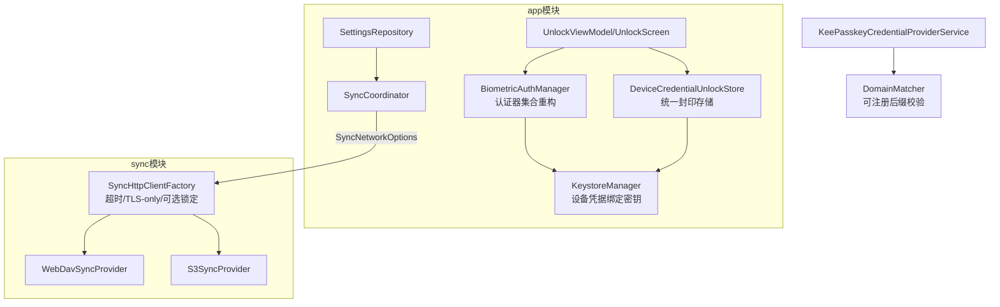

## 产品概述

基于 Context7 官方文档核验结论，对 KeePasskey 执行 Wave 12 安全整改，覆盖前期审查发现的全部 16 项问题（P0×4 / P1×3 / P2×9），使认证、授权、输入验证、数据加密、敏感信息处理与依赖管理对齐 Android 官方推荐做法。

## 核心功能

- **快速解锁重构**：以设备锁屏凭据（PIN/图案/密码）与强生物识别共同作为门槛，删除自研应用 PIN、PBKDF2 校验器与熔断逻辑；旧登记数据 fail-safe 失效，完整解锁后重新绑定。
- **解锁体验**：生物识别弹窗支持设备凭据回退，无生物识别设备可直接用锁屏凭据解锁；纯解锁场景免二次确认；正确落地"设备凭据替换负向按钮"的官方互斥约束。
- **依赖治理**：Biometric 升至 1.4.0 稳定版、Credentials 升至 1.6.0 稳定版，消除安全关键组件的 alpha 依赖。
- **传输加固**：**整体下线「允许明文流量」功能**（2026-09-06 用户决策：明文传输不安全）——删除设置项、UI 开关与全部接线，sync 全链路强制 TLS-only；OkHttp 显式超时；证书锁定仅作为用户可选项（遵循官方"勿强制"警示）。
- **授权收紧**：通行密钥创建分支强制 rp.id 为调用方 origin 可注册后缀（fail-closed），与断言分支同等防线。
- **输入验证**：KDBX XML/InnerHeader/附件长度与嵌套深度上限防解析炸弹；DomainMatcher 补齐 .co.uk 等多级公共后缀覆盖。
- **敏感信息卫生**：生物识别与 QuickUnlock 两套封印凭据体系统一为单一直连 Keystore AES-256-GCM 存储；GCM IV 唯一性测试断言；Autofill/凭据提供器填充后明文即时清理；主密码 String 残留全局清零。
- **文档交付**：AGENTS.md 更新 Wave 12 状态，记录 zxing 待办与 Dependabot/OWASP 供应链建议；全量测试回归后 Git 提交。

## 关键澄清

- AndroidX Security Crypto（EncryptedSharedPreferences）经 2026-08 官方 API 文档确认已弃用（官方建议直连 AndroidKeyStore），故不引入该库，统一存储沿用现有 Keystore 模式。
- 「允许明文流量」（cleartextTrafficPermitted）**不再修复为可用功能，而是整体移除**：前期审查发现该开关在 sync 模块与 Manifest 均无消费点（空实现），用户确认明文流量不安全——删除 SettingsViewModel/SettingsUiState/WebDavSyncScreen 中的开关与 RealSettingsRepository 持久化（含存量 SharedPreferences 键清理），OkHttp connectionSpecs 固定排除 CLEARTEXT，平台默认禁明文成为唯一行为。

## Tech Stack

- Kotlin + Jetpack Compose + Hilt + Coroutines（沿用现有栈，无新依赖）
- AndroidX Biometric 1.4.0 / Credentials 1.6.0（升级）
- OkHttp（现有，新增配置化构建，TLS-only）
- **不引入** androidx.security:security-crypto（官方已弃用）

## Implementation Approach

1. **设备凭据绑定密钥**：`KeystoreManager` 新增 `getOrCreateDeviceCredentialKey`，以 `setUserAuthenticationParameters(0, AUTH_BIOMETRIC_STRONG or AUTH_DEVICE_CREDENTIAL)` 生成（StrongBox 优先、TEE 回退）。密钥授权生成后不可变 → 既有 per-database 生物识别密钥必须重建，旧封印凭据失效（对齐 Wave 11 H4 fail-safe 迁移模式）。`setInvalidatedByBiometricEnrollment` 对含 DEVICE_CREDENTIAL 的密钥被官方忽略，须如实注释。
2. **解锁路径统一**：`BiometricAuthManager.authenticate` 参数化认证器集合与 `confirmationRequired`；含 `DEVICE_CREDENTIAL` 时禁止调用 `setNegativeButtonText`（官方互斥约束）。`QuickUnlockPinStore` 的 PIN 登记/校验/熔断整体删除，封印存储收敛进 `BiometricCredentialStorage` 同构的新统一存储，Unlock 三件套移除 `quickUnlockPin: String` 状态。
3. **传输加固**：sync 模块新增 `SyncNetworkOptions` 契约与 `SyncHttpClientFactory`——connectionSpecs 固定 TLS-only（排除 CLEARTEXT）、显式超时、可选 `CertificatePinner`；同步下线「允许明文流量」：删除 SettingsViewModel(803-804)/SettingsUiState(111)/WebDavSyncScreen(741-744, 910-935) 的开关与 RealSettingsRepository 持久化；app 层 SyncCoordinator 传入网络选项，维持 sync 不依赖 app 的单向依赖。
4. **rp.id 创建分支**：`DomainMatcher` 新增可注册后缀校验，创建分支缺省即拒绝（对齐断言分支与官方"rp.id 须为 origin 可注册后缀"）。
5. **解析防线**：database/crypto 模块 XML 字段长度、附件尺寸、嵌套深度上限，越界抛 `KdbxCorruptFileException`；`DomainMatcher` 扩充多级公共后缀最小集。
6. **性能**：删除 PBKDF2 120k 迭代使快速解锁路径少一次派生开销；OkHttp 客户端工厂复用避免每次同步新建；上限校验为 O(1) 常量检查，无热路径回归。

## Implementation Notes

- 写码前先读 `.codebuddy/rules/engineering-rules.md`；敏感数据 CharArray/ByteArray 显式清零，日志禁敏感明文。
- 解锁加密操作请求的认证器集合必须与密钥生成时一致（官方硬性要求），seal 与 unseal 使用同一集合。
- QuickUnlock 卡片 UI 文案随体系重构更新（strings.xml 同步）。
- 移除明文开关后，WebDavSyncScreen 中相关 UI 区块与字符串资源（sync_cleartext_title/sub）一并清理。
- 测试基线 315 个全绿不得回退；每项整改配齐单测。

## Architecture Design



## Directory Structure

```
app/build.gradle.kts                                    # [MODIFY] biometric→1.4.0、credentials→1.6.0
app/src/main/java/com/keepasskey/app/security/
├── KeystoreManager.kt                                  # [MODIFY] 新增设备凭据绑定密钥生成；清理非认证密钥路径
├── QuickUnlockPinStore.kt                              # [DELETE] PIN/PBKDF2/熔断体系整体移除
├── DeviceCredentialUnlockStore.kt                      # [NEW] 统一封印凭据存储（IV+密文，直连 Keystore AES-256-GCM）
├── BiometricCredentialStorage.kt                       # [MODIFY] 与新统一存储收敛，旧键迁移清理
└── BiometricAuthManager.kt                             # [MODIFY] 认证器集合/confirmationRequired 参数化，负向按钮互斥
app/src/main/java/com/keepasskey/app/ui/screens/unlock/
├── UnlockViewModel.kt                                  # [MODIFY] 删 PIN 流程，改统一快速解锁
├── UnlockScreen.kt                                     # [MODIFY] QuickUnlock 卡片改设备凭据入口
└── UnlockUiState.kt                                    # [MODIFY] 移除 quickUnlockPin:String
app/src/main/res/values/strings.xml                     # [MODIFY] 解锁相关文案；删除 sync_cleartext_* 字符串
app/src/main/java/com/keepasskey/app/sync/SyncCoordinator.kt  # [MODIFY] 传 SyncNetworkOptions（路径实现期定位）
app/src/main/java/com/keepasskey/app/data/repository/RealSettingsRepository.kt  # [MODIFY] 移除明文开关持久化（含存量键清理）
app/src/main/java/com/keepasskey/app/ui/screens/settings/SettingsViewModel.kt / SettingsUiState.kt / WebDavSyncScreen.kt  # [MODIFY] 删除明文开关；证书锁定配置接线
app/src/main/java/com/keepasskey/app/passkey/
├── KeePasskeyCredentialProviderService.kt              # [MODIFY] 创建分支 rp.id fail-closed
└── DomainMatcher.kt                                    # [MODIFY] 可注册后缀校验 + 多级公共后缀
app/src/main/java/com/keepasskey/app/autofill/KeePasskeyAutofillService.kt  # [MODIFY] 明文即时清理
sync/src/main/java/com/keepasskey/sync/
├── SyncHttpClientFactory.kt                            # [NEW] 超时/TLS-only connectionSpecs/可选 CertificatePinner
├── SyncNetworkOptions.kt                               # [NEW] 网络配置契约（超时+可选锁定，无明文字段）
├── webdav/WebDavSyncProvider.kt                        # [MODIFY] 弃用裸 OkHttpClient
└── s3/S3SyncProvider.kt                                # [MODIFY] 弃用裸 OkHttpClient
database/crypto 模块 KdbxXml 读写与 InnerHeader 解析文件   # [MODIFY] 长度/尺寸/深度上限（定位用 code-explorer）
app/src/test/...（DeviceCredentialUnlockStoreTest、DomainMatcherTest 扩充、KdfCapsTest、GCM IV 断言）  # [NEW/MODIFY]
docs/SECURITY_REVIEW_2026-09.md                         # [NEW] 16 项审查结论与官方文档对照存档
AGENTS.md                                               # [MODIFY] Wave 12 状态收口
```

## Key Code Structures

```
// KeystoreManager：设备凭据绑定密钥（授权生成后不可变，旧密钥须重建迁移）
fun getOrCreateDeviceCredentialKey(alias: String): SecretKey
// KeyGenParameterSpec: setUserAuthenticationParameters(0,
//     KeyProperties.AUTH_BIOMETRIC_STRONG or KeyProperties.AUTH_DEVICE_CREDENTIAL)

// BiometricAuthManager：认证器集合参数化；含 DEVICE_CREDENTIAL 时禁 setNegativeButtonText
fun authenticate(activity: FragmentActivity, authenticators: Int,
                 cipher: Cipher?, confirmationRequired: Boolean,
                 onResult: (BiometricResult) -> Unit)

// sync：网络配置契约（app 层组装传入，保持模块依赖单向；固定 TLS-only，无明文选项）
data class SyncNetworkOptions(
    val connectTimeoutMs: Long, val readTimeoutMs: Long, val writeTimeoutMs: Long,
    val pinnedHosts: Map<String, List<String>> = emptyMap() // 可选证书锁定
)
```

## Agent Extensions

### MCP

- **Context7**
- Purpose: 实现期核验官方文档——biometric 1.4.0 迁移要点、Credentials 1.6.0 变更、`setUserAuthenticationParameters` 与认证器集合一致性语义、OkHttp CertificatePinner 用法。
- Expected outcome: 关键 API 用法均出自官方文档，避免 alpha→stable 升级误用与互斥约束遗漏。

### SubAgent

- **code-explorer**
- Purpose: 定位 database/crypto 模块 KDBX XML 与 InnerHeader 解析的具体文件与行级插入点、SyncCoordinator→SyncProvider 的现有配置接线路径。
- Expected outcome: 产出精确修改点清单，避免路径猜测导致的返工。