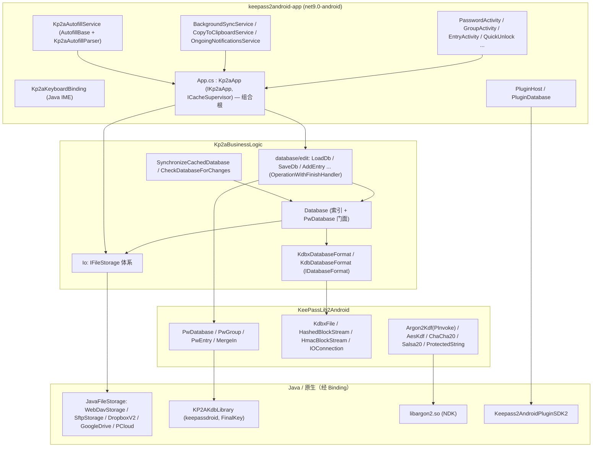

# keepass2android（Kp2a）架构分析

> 分析对象：`keepass2android-main`（GPL3 开源项目，Copyright Philipp Crocoll）
> 分析目的：为 KeePasskey（原生 Kotlin + Compose + Hilt）的 database / crypto / sync 模块设计提供实现思路参考。
> **声明：本文仅为架构描述与分析，未复制任何 Kp2a 源码入库；所有类名、文件路径均来自实际源码浏览。**

---

## 目录

1. [总体印象与技术形态](#1-总体印象与技术形态)
2. [架构总览图](#2-架构总览图)
3. [解决方案与工程全景](#3-解决方案与工程全景)
4. [KeePassLib2Android：kdbx 读写核心库](#4-keeplib2androidkdbx-读写核心库)
5. [文件存储抽象层（重点）](#5-文件存储抽象层重点)
6. [业务逻辑层（Kp2aBusinessLogic）](#6-业务逻辑层kp2abusinesslogic)

7. [App 层（keepass2android-app）](#7-app-层keepass2android-app)
8. [安全设计](#8-安全设计)
9. [对 KeePasskey 的借鉴要点](#9-对-keeypasskey-的借鉴要点)
10. [关键文件索引表](#10-关键文件索引表)

---

## 1. 总体印象与技术形态

keepass2android 是 Android 上最成熟的 Keepass 客户端之一，主体为 **C# / .NET for Android（原 Xamarin.Android）**，工程形式为：

- 所有 C# 工程均为 SDK 风格 `.csproj`，`TargetFramework = net9.0-android`（即 Xamarin.Android 的后继 "MAUI 单项目" 形态，但并未使用 MAUI UI 框架，UI 仍是传统的 Activity/XML 布局）。
- 密码学核心库 KeePassLib2Android 是 Windows 版 KeePassLib（C#）的移植改造版，完全保留 kdbx 格式兼容性。
- 云存储的协议实现在 **Java 侧**（`src/java/JavaFileStorage`），通过 **Android Binding 工程**（`JavaFileStorageBindings` 等）绑定进 C# 世界。
- 密钥派生（Argon2）通过 **NDK 原生库** `libargon2.so`（`src/java/argon2`，phc-winner-argon2 + JNI）+ P/Invoke 使用。
- 构建：根目录 `Makefile` 串起 native（NDK）→ java（Gradle）→ dotnet（MSBuild）三段式构建；支持 `Flavor=NoNet`（`EXCLUDE_JAVAFILESTORAGE` + `NoNet` 编译常量）产出无网络功能的离线版 APK。

整体分层（自下而上）：

```
keepass2android-app（Activity/Service/插件宿主/键盘桥）
        │
Kp2aBusinessLogic（Database、同步任务、文件存储抽象、编辑操作、搜索）
        │
KeePassLib2Android（PwDatabase/PwGroup/PwEntry、KdbxFile 序列化、密码学）
        │
Binding 工程（Java/原生桥）：JavaFileStorageBindings、KP2AKdbLibraryBinding、
TwofishCipher、ZlibAndroid、Dropbox/PCloud/PluginSdk/Keyboard/FileChooser Bindings
```

一个非常重要的架构事实：**Kp2a 的"同步"不是通用的双向同步引擎，而是"本地缓存 + 远端文件"两级版本比对模型**（详见第 5.4 节），冲突时依靠 KeePassLib 的 UUID 合并算法（`PwDatabase.MergeIn`）在数据库语义层解决，而不是在文件层解决。这是对 KeePasskey 最有借鉴价值的部分。

---

## 2. 架构总览图



ASCII 简图（依赖方向自上而下）：

```
+---------------------------------------------------------------+
| keepass2android-app                                           |
|  App.cs(Kp2aApp 组合根)  Activities  Services  Autofill  IME   |
+---------------------------------------------------------------+
           |                       |
+----------------+    +----------------------------+
| Kp2aBusiness   |    | Bindings: JavaFileStorage, |
| Logic          |--->| Dropbox, PCloud, PluginSdk,|
|  Io/ database/ |    | Keyboard, FileChooser ...  |
+----------------+    +----------------------------+
           |
+-----------------------------------------+   +------------------+
| KeePassLib2Android                      |<--| TwofishCipher    |
|  PwDatabase  KdbxFile  Crypto  Keys     |   | ZlibAndroid      |
+-----------------------------------------+   +------------------+
           |
+--------------------------+
| 原生: libargon2.so,      |
| KP2AKdbLibrary(libfinal- |
| key.so, kdb v1)          |
+--------------------------+
```

---

## 3. 解决方案与工程全景

`src/KeePass.sln` 共 14 个 C# 工程；另有若干绑定工程不在 sln 中（旧式 csproj，仍被引用）。

### 3.1 sln 内工程

| 工程 | 目标框架/类型 | 职责 | 主要依赖 |
|---|---|---|---|
| `ZlibAndroid` | net9.0-android 类库 | zlib/gzip/deflate 的纯 C# 移植（`ZlibCodec`、`DeflateStream` 等），供 kdbx 压缩使用 | 无 |
| `TwofishCipher` | net9.0-android 类库 | Twofish 分组密码实现 + `TwofishCipherEngine`（kdbx 可选加密算法），实现 KeePassLib 的 `ICipherEngine` | 无 |
| `KeePassLib2Android` | net9.0-android 类库 | kdbx/kdb 数据模型与序列化、密码学、组合密钥（见第 4 章） | KP2AKdbLibraryBinding |
| `KP2AKdbLibraryBinding` | Binding 工程 | 绑定 `java/KP2AKdbLibrary` 产出的 AAR（keepassdroid 的密码库：`NativeFinalKey`/`FinalKey`、`CipherFactory`、`NativeAESCipherSpi`），主要用于 kdb(v1) 格式的原生 AES 轮函数加速 | 绑定 AAR |
| `AndroidFileChooserBinding` | Binding 工程 | 绑定 `java/android-filechooser-AS`（本地文件选择器） | 绑定 AAR |
| `JavaFileStorageBindings` | Binding 工程 | 绑定 `java/JavaFileStorage`（WebDAV/SFTP/Dropbox v2/Google Drive/pCloud 的 Java 实现 + `UserInteractionRequiredException` 等），NoNet 版本中整组排除 | 绑定 AAR |
| `Kp2aBusinessLogic` | net9.0-android 类库 | 业务逻辑：`Database`、加载/保存/编辑操作、`Io/IFileStorage` 体系、同步任务、搜索、SPR 引擎 | KeePassLib2Android、KP2AKdbLibraryBinding、TwofishCipher、AndroidFileChooserBinding、JavaFileStorageBindings(条件) |
| `Kp2aAutofillParser` | 类库 | **可单测的** Autofill 解析模型（W3C autofill hint、视图结构抽象，不依赖 Android 类） | Newtonsoft.Json |
| `Kp2aAutofillParser.Tests` | 测试工程 | 用真实 App 视图树的 JSON 快照（chrome/firefox/citibank 等十余个 `.json` fixture）做解析回归测试 | xUnit/NUnit |
| `keepass2android-app` | net9.0-android **Exe** | 最终 APK：全部 Activity/Service、组合根 `App.cs`、插件宿主、TOTP、Yubikey 挑战等；内嵌 `libargon2.so`（arm64-v8a/armeabi-v7a/x86/x86_64 四个 ABI，见 csproj 中 `AndroidNativeLibrary` 条目） | 几乎全部工程 |
| `PluginSdkBinding` | Binding 工程 | 绑定 `java/Keepass2AndroidPluginSDK2`（插件协议：`AccessManager`、`Kp2aControl`、`PluginAccessBroadcastReceiver`、`PluginActionBroadcastReceiver`、`Strings`） | 绑定 AAR |
| `Kp2aKeyboardBinding` | Binding 工程 | 绑定 `java/KP2ASoftkeyboard_AS`（KP2A 专用软键盘：`kbbridge.KeyboardData`、`ImeSwitcher`、`AutoFillService`） | 绑定 AAR |
| `PCloudBindings` | Binding 工程 | pCloud 官方 SDK 绑定 | 绑定 AAR |
| `DropboxBinding` | Binding 工程 | Dropbox Android SDK v2 绑定 | 绑定 AAR |

### 3.2 不在 sln 中的绑定工程

| 工程 | 说明 |
|---|---|
| `kp2akeytransform` | 旧式 MonoAndroid 绑定工程：`EmbeddedJar`（kp2akeytransform.jar）+ 各 ABI 的 `libfinal-key.so`。对应 keepassdroid 的 `FinalKey`（kdb v1 的 AES 密钥变换原生加速）。因主 App 已重点支持 kdbx(v4)，该工程属于遗留兼容路径 |
| `AdalBindings` | OneDrive v1 所用的 Azure ADAL（OAuth）SDK 绑定 |
| `SamsungPass` | Samsung Pass 集成绑定 |

### 3.3 Java 工程（`src/java/`）

| 工程 | 说明 |
|---|---|
| `JavaFileStorage` | 云协议 Java 实现：`WebDavStorage.java`（787 行，OkHttp + PROPFIND + 分块上传 + MOVE 事务）、`SftpStorage.java`（802 行，JSch + SSH config CSV 解析）、`DropboxV2Storage`/`DropboxV2AppFolderStorage`、`GoogleDriveBase/Full/AppDataFileStorage`、`PCloudFileStorage`、基类 `JavaFileStorageBase`/`JavaFileStorage.java`（接口 `IJavaFileStorage`）、`UserInteractionRequiredException` |
| `KP2AKdbLibrary` | keepassdroid 密码库（AES Provider/FinalKey，原生 or BouncyCastle 可切换） |
| `argon2` | phc-winner-argon2 源码 + JNI（`Android.mk`/`Application.mk`），产出 `libargon2.so` |
| `KP2ASoftkeyboard_AS` | KP2A 专用输入法（键盘填充通道） |
| `Keepass2AndroidPluginSDK2` | 插件协议 SDK（第三方插件引用此库） |
| `PluginQR` | 官方 QR 插件示例 |
| `android-filechooser-AS` | 本地文件选择器 |
| `JavaFileStorageTest-AS` | 存储实现的测试壳 App |

### 3.4 对 Xamarin 形态的观察

- **双语言桥接成本高**：C#↔Java 异常翻译靠 `JavaFileStorage.LogAndConvertJavaException` 里**字符串匹配**（`e.ToString().Contains("keepass2android.javafilestorage.UserInteractionRequiredException")`）来重新抛出类型化异常——这是绑定式架构的典型痛点。
- `Nullable`/`ImplicitUsings` 已开启，代码在持续向现代 .NET 迁移（如 `Argon2Kdf.cs` 用 `[LibraryImport]` 源生成 P/Invoke）。
- NoNet flavor 通过编译常量裁剪全部网络存储，说明"离线版"是头等公民（隐私敏感用户群）。

---

## 4. KeePassLib2Android：kdbx 读写核心库

### 4.1 目录结构

```
KeePassLib2Android/
  PwDatabase.cs / PwGroup.cs / PwGroup.Search.cs / PwEntry.cs / PwUuid.cs
  PwEnums.cs / PwDefs.cs / PwDeletedObject.cs / PwCustomIcon.cs
  IDatabaseFormat.cs            <-- 相对原版的关键改造点
  Collections/ Delegates/ Interfaces/ Keys/ Security/ Serialization/
  Cryptography/
    Cipher/    StandardAesEngine, Salsa20Cipher, ChaCha20Cipher(+Engine),
               CtrBlockCipher, CipherPool, ICipherEngine
    KeyDerivation/  AesKdf.cs, Argon2Kdf.cs + Argon2Kdf.Core.cs, KdfEngine/KdfPool/KdfParameters
    CryptoRandom.cs, CryptoRandomStream.cs, HashingStreamEx.cs, HmacOtp.cs,
    PasswordGenerator/, QualityEstimation.cs, PopularPasswords.cs, SelfTest.cs
  Utility/   MemUtil, UrlUtil, MessageUtil ...
```

### 4.2 相对原版 KeePassLib 的改造点（实测确认）

1. **`PwDatabase.Open` 签名反转**：原版在库内直接 new `KdbxFile`；Kp2a 版改为
   `Open(Stream s, string fileNameWithoutPathAndExt, IOConnectionInfo ioSource, CompositeKey pwKey, IStatusLogger slLogger, IDatabaseFormat format)`
   内部仅调 `format.PopulateDatabaseFromStream(this, s, slLogger)`（`PwDatabase.cs` L617-656）。序列化格式被抽象为根目录的 `IDatabaseFormat` 接口，kdbx/kdb 的选择上移到业务层。
2. **`Save(Stream, IStatusLogger)` 面向流**：注释明确"写入给定流（即原始位置），从而支持云存储"，配合业务层的 `IWriteTransaction` 完成落盘（`PwDatabase.cs` L663-673）。
3. **`IDatabaseFormat` 能力描述接口**：`Kp2aBusinessLogic/database/KdbxDatabaseFormat.cs` 实现了 `CanWrite`、`CanHaveEntriesInRootGroup`、`SupportsTemplates`、`SupportsTags`、`CanRecycle`、`SupportsOverrideUrl` 等布尔能力位，供 UI 按格式禁用功能；`HashOfLastStream` 把"本次读到的文件哈希"带出库外，作为后续变更检测基线（见 5.4）。
4. **Android 适配**：
   - `ProtectedBinary` 内检测到 "Mono does not implement any encryption for ProtectedMemory"，因此 `ProtectedMemorySupported=false` 分支常驻（`Security/ProtectedBinary.cs` L85-121），内存保护退化为 Xorred/明文驻留（见第 8 章）。
   - csproj 引用 NuGet `System.Security.Cryptography.ProtectedData`。
   - `IOConnection.cs` 增加 `CertificateValidationCallback` 静态注入点（`BuiltInFileStorage` 构造时 `IOConnection.CertificateValidationCallback = app.CertificateValidationCallback`），让 App 层能弹出"接受自签名证书"交互。
5. **密码学**：kdbx4 全套——Argon2 通过 `[LibraryImport("argon2")] argon2_hash(...)` 调 NDK 库（`Argon2Kdf.cs` L185-221）；AES-Kdf 纯托管；ChaCha20/Salsa20 cipher 引擎；`HashingStreamEx` 边读写边算 SHA256（被缓存层大量复用）。
6. **合并引擎保留**：`PwDatabase.MergeIn(PwDatabase, PwMergeMethod, IStatusLogger)` 基于 `PwObjectPoolEx.FromGroup(root)` 构建 UUID 索引池，双向遍历 group/entry，按 `LastModificationTime` 决定胜负，并同步处理 `PwDeletedObject`（墓碑）。这是同步冲突最终裁决者。

### 4.3 序列化层（Serialization/）

| 类 | 作用 |
|---|---|
| `KdbxFile.cs`（617 行）+ `KdbxFile.Read.cs`（577 行）+ `KdbxFile.Read.Streamed.cs` | kdbx 头解析、密钥合成（CompositeKey + KDF 参数）、XML(PlainXml/Protobuf 变体) 解析、二进制附件流式读取；`KdbxFormat.{Default, ProtocolBuffers, PlainXml}` |
| `KdbxFile.Write.cs` | 写出 + `HashOfFileOnDisk` |
| `HashedBlockStream` / `HmacBlockStream` | kdbx 分块完整性（v3 哈希块 / v4 HMAC 块） |
| `IOConnection` / `IOConnectionInfo` / `IocProperties` | 统一"连接描述符"（见 5.1） |
| `FileTransactionEx` | 本地/HTTP 上的临时文件+替换事务 |
| `FileLock` | 本地文件锁 |

---

## 5. 文件存储抽象层（重点）

代码位置：`src/Kp2aBusinessLogic/Io/`（接口与实现）+ `src/keepass2android-app/app/App.cs`（组合根）+ `src/java/JavaFileStorage/`（Java 协议实现）+ `src/keepass2android-app/fileselect/`（选文件 UI 流程）。

### 5.1 IOConnectionInfo：一切文件的统一描述符

`KeePassLib/Serialization/IOConnectionInfo.cs`：包含 `Path`、`UserName`、`Password`、`CredSaveMode` 等字段的类。Kp2a 决定**让云存储也复用 IOConnectionInfo**（`IFileStorage.cs` 头部注释明说：好处是"最近文件"数据库等零改动）。协议由 Path 前缀表达：`file://`、`ftp://`、`http(s)://`、`dropbox://`、`gdrive://`、`onedrive://`、`sftp://`、`content://`、`pcloud://`、`mega://`、`smb://`、`owncloud://`、`nextcloud://`（后两者由 `WebDavFileStorage.Owncloud2Webdav` 归一化为 `https://host/remote.php/webdav/`）。

`IFileStorage.IocToPath(ioc)` 负责把 ioc 序列化为各实现可用的"路径字符串"（凭据内嵌），`GetDisplayName(ioc)` 反向给出人类可读显示名。

### 5.2 IFileStorage 接口（`Kp2aBusinessLogic/Io/IFileStorage.cs`）

单一巨型接口（约 25 个成员），核心成员分组：

**元信息与探测**
- `IEnumerable<string> SupportedProtocols` —— 协议 ID 列表（组合根据此路由）。
- `bool UserShouldBackup` —— 云端有版本备份（如 Dropbox）时为 false，否则提示用户开备份。
- `bool IsPermanentLocation(ioc)` —— 区分永久位置与临时 URI 授权（Android content URI 场景）。
- `bool IsReadOnly(ioc, out reason)` / `bool RequiresCredentials(ioc)` / `bool RequiresSetup(ioc)`。

**读写**
- `Stream OpenFileForRead(ioc)`。
- `IWriteTransaction OpenWriteTransaction(ioc, bool useFileTransaction)` —— `IWriteTransaction` 只有 `Stream OpenFile()` 与 `void CommitWrite()`，**写路径全部事务化**；`useFileTransaction` 只是"强制文件级事务"建议，自带事务语义的实现（如 WebDAV 的 temp+MOVE）可忽略。
- `bool CheckForFileChangeFast(ioc, previousFileVersion)` + `string GetCurrentFileVersionFast(ioc)` —— **廉价变更检测契约**：注释明确要求"快而便宜，禁止 hash 或下载整文件"；实现自由选择版本载体（本地存储用 `LastWriteTimeUtc`，返回 null 表示不支持）。二者成对使用：打开时记 `GetCurrentFileVersionFast` 的值，之后用它判断文件是否变过。

**目录/文件枚举**
- `ListContents` / `GetFileDescription`（返回 `FileDescription`：CanRead/CanWrite/DisplayName/IsDirectory/LastModified/Path/SizeInBytes）/ `CreateDirectory` / `GetParentPath` / `GetFilePath` / `CreateFilePath`。

**Android 交互（UI 生命周期回灌）**
- `StartSelectFile(IFileStorageSetupInitiatorActivity, isForSave, requestCode, protocolId)`。
- `PrepareFileUsage(IFileStorageSetupInitiatorActivity, ioc, requestCode, alwaysReturnSuccess)`（Activity 上下文，可弹 OAuth 授权页）与 `PrepareFileUsage(Context ctx, ioc)`（Service 上下文，无 UI，必要时抛 `UserInteractionRequiredException`）。
- `OnCreate/OnResume/OnStart/OnActivityResult(IFileStorageSetupActivity, ...)` —— 文件存储直接接管宿主 Activity 的生命周期来回灌 OAuth 流程（Dropbox/OneDrive/Google 登录），配套常量 `FileStorageSetupDefs`（`ProcessNameSelectfile="SELECT_FILE"`、`ProcessNameFileUsageSetup="FILE_USAGE_SETUP"`）与结果码枚举 `FileStorageResults{FullFilenameSelected, FileChooserPrepared, FileUsagePrepared}`。
- 两个配套接口：`IFileStorageSetupInitiatorActivity`（宿主侧回调：`StartSelectFileProcess`/`StartFileUsageProcess`/`OnImmediateResult`/`IocToIntent`/`PerformManualFileSelect`，定义于 `Io/FileStorageSetupInitiatorActivity.cs`）、`IFileStorageSetupActivity`（`Ioc`/`ProcessName`/`IsForSave`/`State`，定义于 `Io/FileStorageSetupActivity.cs`）。
- `IPermissionRequestingFileStorage`：运行时权限回调旁路（`OnRequestPermissionsResult`）。

### 5.3 实现矩阵

**继承结构：**

```
IFileStorage
├── BuiltInFileStorage（abstract，走 KeePassLib IOConnection/.NET WebRequest）
│     ├── LocalFileStorage            ("file")
│     ├── LegacyFtpStorage            ("ftp"，.NET 原生 FTP，遗留)
│     └── LegacyWebDavStorage         ("http(s)"，遗留)
├── JavaFileStorage（abstract，委托给绑定 IJavaFileStorage）
│     ├── WebDavFileStorage           ("http/https/owncloud/nextcloud")
│     ├── SftpFileStorage             ("sftp"，JSch)
│     ├── NetFtpFileStorage           ("ftp"，Java 侧新实现)
│     ├── DropboxFileStorage / DropboxAppFolderFileStorage
│     ├── GDriveFileStorage / GDriveAppDataFileStorage（需 Google Play Services）
│     ├── PCloudFileStorage / PCloudFileStorageAll
│     └── SmbFileStorage / MegaFileStorage
├── OneDrive2FileStorage 系（OneDrive2Full/MyFiles/AppFolder，MS Graph SDK，纯 C#）
├── OneDriveFileStorage（v1/ADAL，遗留）
├── AndroidContentStorage             ("content"，SAF/Storage Access Framework)
└── 装饰器：
    ├── OfflineSwitchableFileStorage（离线开关）
    └── CachingFileStorage（本地缓存 + 三哈希同步状态机，见 5.4）
```

要点速记：

- **BuiltInFileStorage**（526 行）：把 `WebException` 翻译成 `FileNotFoundException`/证书错误消息；写事务包 `FileTransactionEx`；`PrepareFileUsage` 处理外置存储运行时权限；`IsReadOnly` 细分"只读标志 / KitKat 限制 / 本地备份文件"三种原因（`OptionalOut<UiStringKey> reason`）。`CheckForFileChangeFast` 用 `File.GetLastWriteTimeUtc` 与上次版本差 >1 秒判断。
- **JavaFileStorage**（394 行）：模板方法——读/写/枚举转调 `_jfs`（绑定接口），统一做 Java 异常翻译；`JavaFileStorageWriteTransaction` 先写 `MemoryStream`，`CommitWrite()` 时一次性 `UploadFile(path, data, useFileTransaction)`（写路径天然"全量替换"模型）。`GetFilePath` 靠 `ListContents` 线性找文件名（对含 file-id 的协议较昂贵——这正是 5.4 中 `.filepath` 缓存要解决的问题）。
- **WebDavFileStorage**（115 行，C# 侧很薄）：真正的协议逻辑在 `java/JavaFileStorage/.../WebDavStorage.java`——OkHttp 实现、PROPFIND 探测存在性、**分块上传**（chunkSize 由 App 偏好 `WebDavChunkedUploadSize` 下发）、**事务写 = 上传临时文件 + MOVE 覆盖**（MOVE 失败按状态码重试）；自签名证书经 `DecoratedTrustManager`/`DecoratedHostnameVerifier` + `ICertificateErrorHandler` 交互放行。
- **AndroidContentStorage**：SAF content URI 的读写与持久化授权（`IsPermanentLocation=false` 的典型来源）。
- **条件装配**：`DropboxFileStorage.IsConfigured`（App ID 已配置才注册）、Google Drive 检查 `GoogleApiAvailability`，注册表里可以放 null 再过滤（`App.cs` L993-1019）。

### 5.4 CachingFileStorage：缓存与同步状态机（对 KeePasskey 最有价值）

文件：`src/Kp2aBusinessLogic/Io/CachingFileStorage.cs`（665 行）。它是一个 **代理型 IFileStorage**：`CachingFileStorage(inner = 远端实现, context, ICacheSupervisor)`。

**磁盘布局**：内部私有目录 `OfflineCache/` 下，以 `SHA256(ioc.Path 的 Unicode 字节)` 为键：
- `<hash>.cache` —— 文件内容
- `<hash>.cache.version` —— **本地版本** = 最近一次写入缓存文件时的 SHA256
- `<hash>.cache.baseversion` —— **基准版本** = 本地与远端"最后一次一致"时的 SHA256
- `<hash>.cache.filepath` —— 对 id 型协议（OneDrive/Drive）缓存 "folder+filename → 真实 ioc.Path" 的解析结果，避免离线时无法反查文件路径
- 兼容旧缓存目录（`Context.CacheDir/OfflineCache`），存在则优先用。

**打开（`OpenFileForRead`）决策树**：

```
未缓存                        → 从远端下载 + 写缓存(.cache/.version/.baseversion)，
                                通知 UpdatedCachedFileOnLoad 或 LoadedFromRemoteInSync
已缓存且 local==base (无本地修改) → 重新拉远端刷新缓存
已缓存且 local!=base (有本地修改):
    base == 远端当前哈希       → 远端未变 → 自动上传本地（UpdatedRemoteFileOnLoad）
    base != 远端当前哈希       → 双方都改 → 冲突：通知 NotifyOpenFromLocalDueToConflict，
                                打开本地缓存（用户数据优先，稍后由同步任务合并）
远端访问异常且有缓存           → 回退读缓存 + CouldntOpenFromRemote 通知（可配置是否告警）
```

**写入（`CachedWriteTransaction`）**：`OpenFile()` 给 MemoryStream；`CommitWrite()` 时①写缓存文件并算新哈希→更新 `.version`；②若已缓存，**允许**远端更新失败（`TryUpdateRemoteFile`，失败通知 `CouldntSaveToRemote`，下次再试——本地已安全）；③若**未**缓存（首次保存到新远端），远端失败直接抛（否则凭据错误永远不暴露）。注意代码注释：commit 可能覆盖远端/本地未同步修改，"假定同步检查已在前面做过"。

**离线开关（`OfflineSwitchableFileStorage` + `IOfflineSwitchable`）**：装饰器持有 `IsOffline`；离线时 `OpenFileForRead/OpenWriteTransaction` 抛 `OfflineModeException`、`PrepareFileUsage` 直接返回成功、`RequiresSetup=false`。CachingFileStorage 内部包一层 `_cachedStorage = new OfflineSwitchableFileStorage(inner)`，因此 `App.Kp2a.OfflineMode` 一开，全链路只碰缓存。

**缓存监督者 `ICacheSupervisor`**（同文件 L34-71）——把"缓存层发生的所有异常事件"外抛给 UI：
`CouldntSaveToRemote` / `CouldntOpenFromRemote` / `UpdatedCachedFileOnLoad` / `UpdatedRemoteFileOnLoad` / `NotifyOpenFromLocalDueToConflict` / `LoadedFromRemoteInSync`。App 层由 `Kp2aApp` 实现（显示 Snackbar/通知）；OTP 辅助文件用 `OtpAuxCacheSupervisor`（`app/OtpAuxCacheSupervisor.cs`）。

**组合根（`App.cs` L938-1023）**：

```csharp
public IFileStorage GetFileStorage(IOConnectionInfo iocInfo, bool allowCache)
{
    if (iocInfo.IsLocalFile()) fileStorage = new LocalFileStorage(this);
    else {
        IFileStorage innerFileStorage = GetCloudFileStorage(iocInfo); // 按协议前缀线性匹配 FileStorages
        if (DatabaseCacheEnabled && allowCache)
            fileStorage = new CachingFileStorage(innerFileStorage, ..., this);
        else fileStorage = innerFileStorage;
    }
    // 把 OfflineMode 灌进 IOfflineSwitchable
}
```

### 5.5 同步与冲突处理（数据库任务层）

**同步入口**：`Kp2aBusinessLogic/database/SynchronizeCachedDatabase.cs`（`OperationWithFinishHandler` 子类）。前提：`GetFileStorage` 返回必须是 `CachingFileStorage`，否则抛"Cannot sync a non-cached database"。

决策表（远端哈希 vs `.baseversion`、本地是否有未上传修改）：

| 远端被修改？ | 本地有修改？ | 动作 |
|---|---|---|
| 否 | 否 | 结束（FilesInSync），更新 `LastSyncTime` |
| 否 | 是 | `cachingFileStorage.UpdateRemoteFile(ioc, useFileTransactions)` 上传 |
| 是 | 否 | `LoadDb` 用远端数据重载（`UpdateGlobals()` + `MarkAllGroupsAsDirty()` 刷新 UI） |
| 是 | 是 | **冲突 → 启动 `SaveDb`，把远端 `MemoryStream` 传入**：kdbx `MergeIn(PwMergeMethod.Synchronize)` 合并后整体保存上传；随后 `UpdateGlobals` + 标脏 |
| 远端 404 | 任意 | 视为远端丢失 → `UpdateRemoteFile` 恢复远端（RestoringRemoteFile） |

**"后台同步"加载模式**：`LoadDb.Run()`（`database/edit/LoadDB.cs` L97-112）——若偏好 `SyncInBackground` 开启且 `CachingFileStorage.IsCached(ioc)`，则临时把存储置 `IsOffline=true`、关掉回退告警，**直接从缓存秒开**，置 `RequiresSubsequentSync=true`，之后由 `SyncUtil.StartSynchronizeDatabase`（`keepass2android-app/SyncUtil.cs`）/`BackgroundSyncService`（前台服务，`ForegroundService.TypeDataSync`，带进度通知）补做同步。`Database` 上有配套状态位：`LastSyncTime` / `SynchronizationPending` / `SynchronizationRunning`。

**变更检测**：`Database.DidOpenFileChange()` = `GetFileStorage(ioc).CheckForFileChangeFast(ioc, LastFileVersion)`；`CheckDatabaseForChanges.cs` 在合适时机（如 Resume、恢复网络）探测远端变化并提示重载/同步。

**本地备份**：`Kp2aApp.LoadDatabase` 在加载成功前按 `CreateBackups` 偏好把文件字节拷贝到内部目录备份（文件名清洗后落盘），并禁止对"本地备份"文件再写（`BuiltInFileStorage.IsLocalBackup` 用偏好键 `is_local_backup` 判定并返回只读原因 `ReadOnlyReason_LocalBackup`）。

### 5.6 选文件与授权的 UI 编排

- `FileStorageSetupInitiatorActivity` / `FileStorageSetupActivity`（`keepass2android-app/fileselect/`）是通用宿主 Activity：把 `ProcessName`（SELECT_FILE / FILE_USAGE_SETUP）、ioc、`IsForSave` 塞进 Intent/Bundle，交给对应 `IFileStorage.OnCreate/OnResume/OnActivityResult` 完成授权闭环，结果经 `FileStorageResults` 返回调用方。
- `FileSelectActivity` + `FileDbHelper`（SQLite）维护"最近文件"列表（ioc + keyfile + 时间戳）；`SelectStorageLocationActivityBase`（业务层）统一"选一个新库放哪"的流程；`FileSelectHelper` / `FileSaveProcessManager` 处理保存流程的状态机。

---

## 6. 业务逻辑层（Kp2aBusinessLogic）

### 6.1 Database 与会话管理

`Kp2aBusinessLogic/database/Database.cs`（322 行）：

- 持有 `PwDatabase KpDatabase`（库本体）+ 冗余索引 `EntriesById` / `GroupsById`（`PwUuid` 字典）+ `Elements`（`HashSet<IStructureItem>`），加载后 `PopulateGlobals` 递归建索引（可检重 UUID，抛 `DuplicateUuidsException`），结构变更后 `UpdateGlobals()` 重建。
- `LoadData(...)`：从流（或由调用方预取的 `MemoryStream`）+ `CompositeKey` + `IDatabaseFormat` 打开库；`CanWrite = format.CanWrite && !fileStorage.IsReadOnly(ioc)`。
- `SaveData(IFileStorage)`：`fileStorage.OpenWriteTransaction(ioc, 偏好 UseFileTransactions)` → `DatabaseFormat.Save(KpDatabase, trans.OpenFile())` → `CommitWrite()`。
- `DidOpenFileChange()`：见 5.5。
- 每库指纹解锁偏好键：`kp2a_ioc_<ioc哈希>`（`GetFingerprintPrefKey`）。
- **多库会话**：`IKp2aApp` 定义 `CurrentDb` / `OpenDatabases`（`List<Database>`）/ `CloseDatabase` / `FindDatabaseForElement`；实现在 `Kp2aApp`（`app/App.cs` L198-280）：`LoadDatabase` 支持"替换同 ioc 的已开库"，并管理 `_openAttempts`、`QuickLocked` 等。子数据库（ConfigureChildDatabasesActivity）与"多库同时打开"是 Kp2a 的一大特性。

### 6.2 任务/操作模型

- 基类 `OperationWithFinishHandler`（`database/edit/OperationWithFinishHandler.cs` + `OnOperationFinishedHandler.cs`）：`Run()` + `Finish(success, message)`，携带 `StatusLogger`（`IKp2aStatusLogger`：`UpdateMessage/UpdateSubMessage/ContinueWork` 支持取消与进度两级消息）。
- 编辑操作皆为其子类（`database/edit/`）：`LoadDb`、`SaveDb`、`CreateDB`、`SetPassword`、`AddEntry`、`UpdateEntry`、`CopyEntry`、`DeleteEntry`、`DeleteMultipleItemsFromOneDatabase`、`AddGroup`、`EditGroup`、`DeleteGroup`、`MoveElements`、`DeleteRunnable`、`AddTemplateEntries`。完成回调 `OnOperationFinishedHandler` 分发回 Activity（App 侧 `PasswordActivity.AfterLoad` 等）。
- `BlockingOperationStarter.cs` 负责在后台线程跑操作、UI 线程回结果（对应 keepassdroid 时代的 ProgressTask 模式；App 侧另有 `Utils/LoadingDialog.cs` 的 AsyncTask 封装）。
- `IDatabaseModificationWatcher`（`DatabaseModificationWatcher.cs`）：`BeforeModifyDatabases/AfterModifyDatabases` 钩子——App 用它广播 `ActionLockDatabase` 类事件给插件与界面，是"库被替换"的唯一通知点。
- `DatabaseModificationWatcher` 之外的横切关注点用 `IKp2aApp` 抽象（`IKp2aApp.cs`：`Lock`、`LoadDatabase`、`DirtyGroups`/`MarkAllGroupsAsDirty`、偏好读取、`GetFileStorage`、`CertificateErrorHandler`…），使业务层可脱离 Android Application 单测。

### 6.3 快速解锁（QuickUnlock）

- `Kp2aApp.Lock(allowQuickUnlock, byTimeout)`（`app/App.cs` L128-176）：若启用了 QuickUnlock 且当前库主密钥含非空 `KcpPassword`，则 `QuickLocked = true`（**库保留在内存**，仅锁交互）；否则整体 `_openDatabases.Clear()` 完全卸载，并广播 `ActionCloseDatabase`。
- `QuickUnlock.cs`（539 行）：输入主密码**最后 N 个字素**（`_quickUnlockKeyLength`，`StringInfo.SubstringByTextElements` 按 Unicode 字素截取，规避 emoji 破坏），比对 `ExpectedPasswordPart`；支持两种模式：① 从主密码尾部截取；② `QuickUnlockFromDatabaseEnabled` 时从库内专门条目（`FindQuickUnlockEntry`）读密码。成功 → `App.Kp2a.UnlockDatabase()` +（可选）`SyncUtil` 同步。
- 指纹/生物识别：`BiometricModule.cs` + `IBiometricAuthCallback`；`FingerprintSetupActivity` 用 `KcpPassword` 做安全校验后以 Android Keystore 加密保存可用性（每库偏好键见 6.1）；另有 Challenge-Response（Yubikey：`KeeChallenge.cs`、`ChallengeXCKey`、`NfcOtpActivity`、OTP Key Provider `addons/OtpKeyProv/`，其辅助文件 `OtpAuxCachingFileStorage` 是 CachingFileStorage 的扩展示例）。

### 6.4 密码生成

- 库层：`KeePassLib2Android/Cryptography/PasswordGenerator/`（`PwProfile`、字符集/模式生成，基于 `CryptoRandom` 熵源）+ 质量评估 `QualityEstimation.cs`。
- App 层：`keepass2android-app/password/PasswordGenerator.cs` + `GeneratePasswordActivity`（profile 管理、随机熵用户混入等）。

### 6.5 插件体系（PluginSdk）

- 协议：`java/Keepass2AndroidPluginSDK2`（广播 Intent + 签名授权）。`AccessManager.java` 以插件 APK 签名指纹为身份发放 scope 授权；`Strings.java` 定义 scope（如 `ScopeDatabaseActions`、查询条目 scope）；`PluginAccessBroadcastReceiver`/`PluginActionBroadcastReceiver` 是双向通道。
- 宿主侧：`pluginhost/PluginHost.cs`（BroadcastReceiver，监听插件安装/卸载）、`PluginDatabase.cs`（每插件启用状态、scope 授权记录，`GetPluginsWithAcceptedScope(scope)`）、`pluginhost/PluginListActivity`/`PluginDetailsActivity`。
- 能力：插件可注册条目弹出菜单项（`EntryActivityClasses/PluginPopupMenuItem.cs`、`PluginMenuOption.cs`）、接收库开关广播（`App.BroadcastDatabaseAction` 逐插件定向发送）、经授权查询条目字段（宿主 `QueryCredentialsActivity.cs` 弹授权对话框）。
- `PluginSdkBinding` 把 SDK 的 Java 类绑定为 C# 可调用类型。

### 6.6 其他

- `Utils/Spr/`：SPR 占位符引擎（`{TITLE}`、`{URL}`、`{OTP}` 等字段引用展开），供键盘/剪贴板填充与 URL 打开。
- `DataExchange/Formats/`：CSV/KeePass XML 等导入导出格式。
- `SearchDbHelper.cs`：`Search(SearchParameters)` / `SearchForText` / `SearchForExactUrl` / `SearchForHost(allowSubdomains)` / `SearchForUuid` —— autofill 的主查询路径（`Kp2aAutofillService` 调 `ShareUrlResults.GetSearchResultsForUrl`）。
- `UiStringKey.cs`：全部用户可见文案集中为枚举键，业务层只报 `UiStringKey`（如 `IsReadOnly` 的 `OptionalOut<UiStringKey> reason`），由 App 层翻译——**业务层不持字符串**的设计值得注意。

---

## 7. App 层（keepass2android-app）

### 7.1 组合根与 Application

- `app/App.cs`（约 1800 行）包含两个类：`Kp2aApp : IKp2aApp, ICacheSupervisor`（状态核心：已开库列表、QuickLocked、离线模式、最近文件、文件存储注册表、错误消息映射、 ongoing 通知）与 `App : Application`（静态入口 `App.Kp2a`，注册广播 receiver：`DatabaseLocked`/`LockDatabaseByTimeout` 等）。**没有依赖注入容器**，一切 `new` 于 Kp2aApp 内。

### 7.2 Activity 结构

| 基类/Activity | 说明 |
|---|---|
| `LifecycleAwareActivity` → `LockingActivity` → `LockCloseActivity`/`LockCloseListActivity`/`LockingPreferenceActivity` 等 | 生命周期里统一调 `TimeoutHelper.Pause/Resume`（离 App 即启动锁屏 Alarm，回 App 检查超时）；`ILockCloseActivity` 标记锁库即关闭的界面 |
| `PasswordActivity`（2353 行） | 入口：选文件/输入主密码/密钥文件/OTP/生物识别 → `AfterLoad : OnOperationFinishedHandler` → 跳转 GroupActivity；`AppTask` 贯穿 |
| `GroupBaseActivity`/`GroupActivity` + `PwGroupListAdapter` + `views/PwGroupView`/`PwEntryView` | 条目/组列表（ListView 时代视图），支持多选（MoveElementsTask 等） |
| `EntryActivity` | 条目详情：字段复制（经 `CopyToClipboardService`）、TOTP（`Totp/UpdateTotpTimerTask`）、附件（`ImageViewActivity`、`AttachmentContentProvider`）、插件菜单、URL 打开（`EntryActivityClasses/GotoUrlMenuItem`） |
| `EntryEditActivity` + `KpEntryTemplatedEdit` | 编辑 + 模板条目支持 |
| `QuickUnlock` | 见 6.3 |
| `fileselect/FileSelectActivity`、`FileStorageSelectionActivity`、`CreateDatabaseActivity`、`SelectCurrentDbActivity` | 文件选择/建库/多库切换 |
| `SearchActivity`、`search/SearchProvider` | 应用内搜索 + 全局搜索 Provider |
| `Settings`（`settings/`：`AppSettingsActivity`、`Argon2Preference`、`RoundsPreference`…） | KDF 参数等设置 |

- **AppTask 机制**（`app/AppTask.cs`，约 1100 行）：把"跨 Activity 意图"（选中某条目返回给 autofill/键盘/分享流：`SelectEntryTask`、`SearchUrlTask`、`OpenSpecificEntryTask`、`CreateEntryThenCloseTask`、`MoveElementsTask`、`NavigateToFolder...`）序列化进 Intent extras，Activity 重建后恢复任务继续执行——Xamarin 时代的"类型安全导航参数"方案。

### 7.3 Autofill（Kp2aAutofillParser 的解析模型与测试）

**设计动机**：把"从 AssistStructure 解析表单"与"匹配条目"解耦，前者依赖 Android，后者做成可单测纯库。

- `Kp2aAutofillParser/AutofillParser.cs`（1014 行，纯 .NET，无 Android 依赖）：
  - `W3cHints`：WHATWG autofill 令牌全集（`username`、`current-password`、`new-password`、`cc-number`、section-/shipping-/home tel- 等前缀规则）及归类函数。
  - `InputField`（abstract）：**视图无关**的字段抽象（hint、textValue、autofillId 字符串、focused 等）——Android 侧实现为 `ViewNodeInputField`，测试侧 `TestInputField`。
  - `AutofillHintsHelper`：hint 规范化（大小写、分区索引 `GetPartitionIndex`）、支持集过滤、按分区切分表单（登录 vs 注册 vs 支付卡）。
  - `FilledAutofillFieldCollection<FieldT>`：字段集合（按 hint 分桶），供与条目匹配打分。
  - `StructureParserBase<FieldT>` / `AutofillView<TField>`：视图树 → `AutofillView` 的通用解析骨架。
- 测试：`Kp2aAutofillParser.Tests/AutofillTest.cs` + 十余个真实场景 JSON fixture（`chrome-android10-amazon-it.json`、`firefox-amazon-it.json`、`citibank.json`、`imdb.json`、无焦点场景 `com-servicenet-mobile-no-focus.json` 等），`TestDalSourceTrustAll : IKp2aDigitalAssetLinksDataSource` 信任所有 DAL 查询——**解析逻辑回归测试**是 Kp2a autofill 可靠性的关键投入。
- Android 侧：`services/AutofillBase/`（`AutofillServiceBase`：OnFillRequest/OnSaveRequest 主流程；`StructureParser<ViewNodeInputField>`：遍历 AssistStructure；`DomainParser`：从 web 域名/APP 包名取查询关键字；`Kp2aDigitalAssetLinksDataSource`：网站↔App 关联校验防钓鱼；`ChooseForAutofillActivityBase`：多候选项选择对话框）+ `services/Kp2aAutofill/Kp2aAutofillService.cs`（用 `SearchDbHelper.SearchForUrl` 系列取候选条目，未解锁返回空）。
- 亦有"跳过系统 autofill、走自家选择 Activity"的 Intent 流（`Kp2aAutofillIntentBuilder.cs`）。

### 7.4 键盘填充（Kp2aKeyboardBinding）

- 绑定 `java/KP2ASoftkeyboard_AS`：自带 KP2A 输入法，核心桥 `kbbridge/KeyboardData.java`（静态注册表）+ `KeyboardDataBuilder` + `StringForTyping`。
- App 侧流程：条目页把字段值写入 KeyboardData（进程内共享，无需剪贴板）→ 用户切到 KP2A 键盘逐字段"键入"密码（`SwitchImeActivity` 引导启用 IME）。**适用场景**：禁止 autofill/剪贴板的 App、Android 4.x 无 autofill 时代遗风。密码不经剪贴板即完成填充是它的安全优势。

### 7.5 搜索与条目列表

- 列表：GroupActivity 的 ListView + 适配器（`PwGroupListAdapter`），视图类在 `views/`；UI 刷新靠 `DirtyGroups`/`MarkAllGroupsAsDirty` + 广播（`DatabaseLocked` 等）驱动重载，非常"事件总线"风格。
- 搜索：`Database.Search*`（6.6）→ `SearchResults`/`SearchActivity` 展示；全局搜索经 `SearchProvider`（Android SearchManager）。
- `Kp2aShortHelpView`、`TextWithHelp` 等 view 组件内嵌新手提示。

### 7.6 后台服务

| 服务 | 说明 |
|---|---|
| `BackgroundSyncService` | 前台服务（TypeDataSync），承载耗时同步的进度通知（`IProgressUi`），完成后自停 |
| `CopyToClipboardService` | 剪贴板复制 + 定时清除（`ClearClipboardTask : TimerTask`）+ 通知栏快捷操作 |
| `OngoingNotificationsService` | 常驻通知：显示当前库/锁库/QuickUnlock 快捷按钮（QuickLocked 时从通知直接进 QuickUnlock） |
| `Kp2aAutofillService` | 见 7.3 |

---

## 8. 安全设计

### 8.1 主密钥派生

- **kdbx4**：`CompositeKey`（`Keys/CompositeKey.cs`：KcpPassword/KcpKeyFile/KcpUserAccount/KcpCustomKey 任意组合）→ `KdfParameters` →
  - Argon2：`Cryptography/KeyDerivation/Argon2Kdf.cs`，P/Invoke `argon2_hash`（`libargon2.so`，NDK 构建，覆盖 4 ABI）；
  - AES-Kdf：`AesKdf.cs` 纯托管实现（用 Aes + ECB 迭代加密 seed）。
- **kdb v1（遗留）**：`KP2AKdbLibraryBinding`（keepassdroid `FinalKey`）——Java 层可选 `NativeFinalKey`（`libfinal-key.so`，即 `kp2akeytransform` 绑定工程）或 BouncyCastle；Kp2a 用它兼容老的 .kdb。
- 加密引擎池：`CipherPool` 注册 AES/Salsa20/ChaCha20（`StandardAesEngine`、`Salsa20Cipher`、`ChaCha20Cipher` + `CtrBlockCipher`）；`TwofishCipher` 工程提供 Twofish（kdbx 允许的非标准算法，Kp2a 以独立工程隔离专利/许可顾虑）。
- 启动自检：`Cryptography/SelfTest.cs` 对加密/哈希做已知答案测试。

### 8.2 敏感内存处理

- `ProtectedString` / `ProtectedBinary` / `XorredBuffer`（`Security/`）：KeePassLib 的标准内存保护抽象。**关键现实**：Mono 未实现 `ProtectedMemory` 加密（`ProtectedBinary.cs` L97 注释），所以保护等级实际退化为"Xorred 或明文驻留 + GC 不可控"——Kp2a 的缓解是尽量缩短 `ReadString()` 的明文生命周期、UI/剪贴板用完即弃。
- 主密码输入：`SetPasswordDialog`/`PasswordActivity` 用 `EditText`（`Util.SetNoPersonalizedLearning` 关闭键盘个性化学习）；QuickUnlock 只需尾部 N 字素，避免完整密码再次出场。
- 日志统一走 `Kp2aLog`（`KeePassLib2Android/Kp2aLog.cs`），敏感值不落日志；异常消息映射（`ExceptionUtil`）避免把 ioc 凭据拼进 UI。

### 8.3 截屏保护

`keepass2android-app/Utils/Util.cs`（约 L868-900）：
- `MakeSecureDisplay(Activity)`：按偏好 `ViewDatabaseSecure_key`（默认开）给窗口加 `WindowManagerFlags.Secure`（FLAG_SECURE，禁截屏/缩略图/投屏录制）；
- `HasUnsecureDisplay`：遍历 `DisplayManager.GetDisplays()` 检查辅助屏是否 FLAG_PRESENTATION，异常时跳转 `NoSecureDisplayActivity`（防投屏/隐私屏泄露）。

### 8.4 App 锁 / 超时锁定

- `timeout/TimeoutHelper.cs`：离开 App（所有 Locking* Activity Pause）→ 读偏好（默认 5 分钟，`-1` 永不）→ `AlarmManager.Set(RTC)` 广播 `Intents.LockDatabaseByTimeout` + 同步记录 `App.Kp2a.TimeoutTime`；回 App 取消 Alarm 并 `CheckIfTimedOutWithoutAlarm` 兜底（注释明确"新 Android 上 Alarm 不可靠"）。广播由 `ApplicationBroadcastReceiver` 接住调 `Kp2aApp.Lock(...)`，`Lock` 后发 `DatabaseLocked` 广播刷新所有界面与插件。
- 生物识别 App 锁：每库 `kp2a_ioc_<hash>_mode` 偏好（`FingerprintUnlockMode`），QuickUnlock 页内联指纹验证；设备无安全锁屏时可强制禁用（`QuickUnlockBlockedWhenDeviceNotSecureWhenOpeningDatabase`）。
- 进程被杀兜底：`AppKilledInfo.cs` 提示上次被系统杀死。

### 8.5 其他

- 证书：WebDAV 自签名证书走 `ICertificateErrorHandler` 用户裁决（信任记忆），`BuiltInFileStorage` 把 `TrustFailure` 翻译为友好文案。
- 插件安全：scope 授权 + APK 签名绑定（`AccessManager`），防止第三方包冒名取数据。
- 剪贴板：超时清除 + 通知栏可控；键盘填充通道（7.4）作为不落剪贴板的替代。

---

## 9. 对 KeePasskey 的借鉴要点

KeePasskey：原生 Kotlin + Compose + Hilt，模块 `app → database → crypto → core`，规划 WebDAV 与 S3 同步，目标 Android 16+ / Credential Manager。

### 9.1 IFileStorage 抽象 → Kotlin 接口设计

**值得照搬的形状**：

```kotlin
// 建议放在 database 模块（依赖单向：app → database → crypto → core）
interface FileStorage {
    val supportedProtocols: Set<String>
    suspend fun openForRead(ioc: IoConnectionInfo): InputStream
    suspend fun openWriteTransaction(ioc: IoConnectionInfo, forceFileTransaction: Boolean): WriteTransaction
    // 廉价变更检测：返回 null 表示不支持；实现禁止整文件 hash/下载
    suspend fun currentFileVersionFast(ioc: IoConnectionInfo): String?
    suspend fun checkForFileChangeFast(ioc: IoConnectionInfo, previousFileVersion: String?): Boolean
    suspend fun listContents(ioc: IoConnectionInfo): List<FileDescription>
    suspend fun isReadOnly(ioc: IoConnectionInfo): ReadOnlyReason?
    // ...路径运算 getFilePath/getParentPath/createFilePath
}

interface WriteTransaction : AutoCloseable {
    fun openFile(): OutputStream
    suspend fun commitWrite()   // 事务提交；Kp2a 的写路径 100% 事务化，务必保留
}
```

**应当改进的**：

1. **拆分巨型接口**：Kp2a 的 `IFileStorage` 有 25 个成员，其中 UI 编排（`StartSelectFile`/`PrepareFileUsage`/`OnActivityResult`）占了近 1/3，导致每个实现都背着 Android Activity 语义。Kotlin 侧建议：
   - 核心读写接口保持纯 suspend + 不含 UI 类型；
   - OAuth/授权用独立能力接口（如 `interface InteractiveFileStorage { suspend fun prepareFileUsage(ctx): Result }` + Android `ActivityResultContract`/`CredentialManager` 风格），由 app 层注册 `InteractiveSessionHandler`，database 模块只声明回调接口（Hilt 多绑定注入），实现"依赖倒置"而不是 Kp2a 那种 Activity 生命周期直接灌进存储实现；
   - 目录浏览可再拆 `BrowsableFileStorage`（WebDAV/FTP/S3 支持而 content:// 不需要）。
2. **协议路由**：Kp2a 用"协议前缀字符串匹配 + 手写注册表（含 null 过滤）"。Kotlin/Hilt 下用 `@IntoMap` + `@StringKey("webdav")` 的 `Map<String, @JvmSuppressWildcards FileStorage>`，O(1) 且编译期校验。
3. **IoConnectionInfo**：Kp2a 复用 `IOConnectionInfo` 承载凭据（`IocToPath` 把用户名密码内嵌进 path 字符串）——历史债务，明文凭据在路径里流转太宽。KeePasskey 建议把凭据放 `EncryptedSharedPreferences`/Keystore，IoC 只持不含凭据的定位符 + 凭据引用 ID。
4. **错误模型**：Kp2a 靠异常类型（含 Java↔C# 字符串匹配的坑）。Kotlin 用 sealed `SyncError`/`StorageError`（`Result<T>`），并把"需要用户交互"做成独立类型（对应 `UserInteractionRequiredException`），而不是异常穿越层界。

### 9.2 同步冲突与缓存策略的取舍（最有价值的一节）

Kp2a 的模型可概括为：**"单主文件 + 本地缓存 + 三哈希状态机 + 数据库语义合并"**。对 KeePasskey 的 WebDAV/S3 实现建议：

1. **采纳三哈希状态机**（`.cache` / `.version` / `.baseversion` 的等价物）：
   - `localVersion`（本地最新写入的 SHA-256）、`baseVersion`（最后确认两端一致时的 SHA-256）、打开时实测远端 SHA-256。
   - 打开时：无本地修改 → 刷新缓存；本地有修改且 base==远端 → 自动上传（**"本地赢"自动解决，体验最好**）；base!=远端 → 冲突，**先打开本地**让用户能继续用，合并推迟到显式同步。
   - 写入时：先落缓存（本地数据安全第一），再尽力推远端，失败不丢数据只上报事件——Kp2a 的 `CachedWriteTransaction` 对"已缓存/未缓存"区分"允许失败/必须成功"的两级策略非常精巧，值得原样保留。
2. **冲突合并在数据库层做，而不是文件层**：kdbx 是自合并格式（UUID + LastModificationTime + 墓碑 `PwDeletedObject`）。Kp2a 的冲突路径 = 下载远端 → `MergeIn(Synchronize)` → 保存上传，用户无需处理冲突对话框。KeePasskey 在 crypto/database 模块实现 kdbx `MergeIn`（可参考 KeePassLib 的 `PwObjectPoolEx` 双池遍历算法）是同步功能的核心投资；S3 侧同理（S3 无 MOVE 事务，用 ETag/If-Match 条件写 + 版本桶更稳）。
3. **离线优先的加载**：`LoadDb` 的"偏好开启后台同步且已缓存 → 直接读缓存秒开 → 置 `RequiresSubsequentSync` → 前台服务补同步"模式，直接映射为 Kotlin 的"Cache-first + WorkManager/前台服务补偿同步"；`Database.SynchronizationPending/Running/LastSyncTime` 三状态位照抄。
4. **缓存监督事件**：`ICacheSupervisor` 六个回调（无法存远端/无法开远端/加载时更新了缓存/更新了远端/因冲突读本地/两端一致）是完美的 UI 事件面——KeePasskey 用 `SharedFlow<CacheEvent>` 替代接口回调即可。
5. **原子写细节**：本地用 temp+rename（`FileTransactionEx` 语义）；WebDAV 用 PUT temp + MOVE（`WebDavStorage.java`）；S3 用单对象 PUT 即原子，但**不要**分块追加。`useFileTransaction` 参数语义（"实现可忽略的建议"）保留。
6. **廉价变更检测契约**：`CheckForFileChangeFast` 的注释（"必须快，禁 hash/整文件下载"）值得写进 KeePasskey 的接口 KDoc：WebDAV 用 If-Modified-Since/ETag，S3 用 ETag/LastModified，本地用 mtime。
7. **文件路径解析缓存**：对"路径含 ID 的协议"（Kp2a 的 OneDrive/Drive，KeePasskey 未来若加 S3 对象 ARN 类似），离线反查路径会失败——Kp2a 用 `.filepath` 旁文件缓存解析结果，简单有效。
8. **远端文件丢失自愈**：同步时远端 404 → 自动用本地恢复远端（RestoringRemoteFile），不要把 404 当错误抛给用户。
9. **本地备份**：每次加载成功前把整库字节存内部私有目录（Kp2a `Kp2aApp.LoadDatabase` 的 backupCopy），并把这些备份文件标记为只读——kdbx 单文件方案的廉价灾备，强烈建议保留。

### 9.3 应避免的 Xamarin 遗留设计

| Kp2a 的做法 | 问题 | KeePasskey 的替代 |
|---|---|---|
| `App.cs` 静态单例 `App.Kp2a`（~1800 行，含存储注册表/锁状态/错误文案/通知/偏好读写） | 上帝类，不可测 | Hilt：`DatabaseSessionManager`、`VaultRepository`、`FileStorageRegistry` 各自模块化；`UiState + StateFlow` 单向数据流 |
| `IFileStorage` 内嵌 Activity 生命周期回调 | UI 语义污染领域层 | 能力接口 + app 层交互桥（见 9.1.1） |
| 异常字符串匹配做跨语言类型还原 | 脆弱 | 纯 Kotlin 栈无此问题，但同样要避免"异常当流程控制" |
| `PasswordActivity`（2353 行）/ `GroupActivity` 族巨型 Activity + ListView 手工适配 | 不可维护 | Compose + ViewModel，按 `engineering-rules.md` 的巨型类阈值拆分 |
| AppTask 序列化进 Intent extras 的"类型安全导航" | 手工序列化易错 | Navigation Compose 类型安全路由 / 显式 UiEvent |
| `DirtyGroups` + 全局广播刷新列表 | 事件总线穿透 UI | Flow 驱动的 diff 更新（`ModelList`/`LazyColumn` + key） |
| 巨型接口 + 线性扫描路由 + new 组合根 | 不可测、难扩展 | Hilt 多绑定 + Sealed 协议枚举 |
| 主密码以 `KcpPassword.Password.ReadString()` 常驻内存供 QuickUnlock 比对 | 明文驻留时间长 | QuickUnlock 派生专用校验值（如存 HMAC(masterKey, salt) 于 Keystore 加密区），或对比对逻辑放 `crypto` 模块统一走 `ByteArray` 用后清零（Kp2a 在 QuickLocked 期间主密码必须活着，这是其 QuickUnlock 设计的固有弱点，KeePasskey 若做类似功能建议存"可撤销的派生凭证"而非密码本体） |
| ProtectedMemory 不可用导致库内保护退化 | Android 平台现实 | 关键中间值用 `ByteArray` + `fill(0)`；用 Jetpack Security/Keystore 包一层；遵守"敏感数据铁律" |

### 9.4 其他值得吸收的具体机制

- **IDatabaseFormat 能力位**（`SupportsTags`/`CanRecycle`…）：若 KeePasskey 同时支持 kdbx3/kdbx4 或只读模式，用能力接口驱动 UI 而非散布 if。
- **`UiStringKey` 枚举文案键**：领域层报键、UI 层翻译，与 Compose `stringResource` 天然契合。
- **超时锁定双保险**（AlarmManager + Resume 时钟校验）在 Kotlin 同样适用（AlarmManager setExactAndAllowWhileIdle + `ProcessLifecycleOwner` RESUME 检查）。
- **Autofill 解析纯库化 + JSON fixture 回归测试**：KeePasskey 做 Credential Manager/passkey 时，把"表单/域匹配逻辑"抽成不依赖 Android 的纯 Kotlin 模块并配 fixture 测试，是 Kp2a 被验证过的正确姿势。
- **多库会话**（`OpenDatabases` + `FindDatabaseForElement`）与**子数据库**： KeePasskey 阶段 1 可不做，但 `Database` 索引（EntriesById/GroupsById）与 `UpdateGlobals()` 重建的模型可直接沿用。
- **NoNet 编译变体**：`EXCLUDE_JAVAFILESTORAGE` 的能力裁剪思路 → Gradle flavors（`noNet`）。

---

## 10. 关键文件索引表

| 主题 | 文件（相对 `参考项目/keepass2android-main/`） |
|---|---|
| 解决方案 | `src/KeePass.sln`（14 工程）；`Makefile`（native/java/dotnet 三段构建）；`src/build-scripts/build-*.sh` |
| 组合根 | `src/keepass2android-app/app/App.cs`（Kp2aApp：存储注册表 L993-1023、GetFileStorage L938-970、Lock L128-176） |
| 存储接口 | `src/Kp2aBusinessLogic/Io/IFileStorage.cs`、`FileStorageSetupActivity.cs`、`FileStorageSetupInitiatorActivity.cs` |
| 缓存与同步 | `src/Kp2aBusinessLogic/Io/CachingFileStorage.cs`（状态机核心）、`OfflineSwitchableFileStorage.cs`、`src/Kp2aBusinessLogic/database/SynchronizeCachedDatabase.cs`、`CheckDatabaseForChanges.cs` |
| 内置存储 | `src/Kp2aBusinessLogic/Io/BuiltInFileStorage.cs`（Local/LegacyFtp/LegacyWebDav）、`AndroidContentStorage.cs` |
| 云存储 | `src/Kp2aBusinessLogic/Io/WebDavFileStorage.cs`、`SftpFileStorage.cs`、`NetFtpFileStorage.cs`、`DropboxFileStorage.cs`、`GDriveFileStorage.cs`、`OneDrive2FileStorage.cs`、`PCloudFileStorage.cs`、`MegaFileStorage.cs`、`SmbFileStorage.cs`、适配层 `JavaFileStorage.cs` |
| Java 协议实现 | `src/java/JavaFileStorage/app/src/main/java/keepass2android/javafilestorage/WebDavStorage.java`（PROPFIND/分块/MOVE 事务）、`SftpStorage.java`、`DropboxV2Storage.java`、`GoogleDrive*FileStorage.java`、`PCloudFileStorage.java` |
| 库模型与合并 | `src/KeePassLib2Android/PwDatabase.cs`（Open L617、Save L663、MergeIn L685+）、`PwGroup.cs`、`PwEntry.cs` |
| 格式抽象 | `src/KeePassLib2Android/IDatabaseFormat.cs`、`src/Kp2aBusinessLogic/database/KdbxDatabaseFormat.cs`、`KdbDatabaseFormat.cs` |
| 序列化 | `src/KeePassLib2Android/Serialization/KdbxFile*.cs`、`HashedBlockStream.cs`、`HmacBlockStream.cs`、`FileTransactionEx.cs`、`IOConnection(.Info).cs` |
| 密码学 | `src/KeePassLib2Android/Cryptography/KeyDerivation/Argon2Kdf.cs`（P/Invoke L219-221）、`AesKdf.cs`、`Cryptography/Cipher/*.cs`、`Keys/CompositeKey.cs`、`Security/ProtectedString.cs`、`ProtectedBinary.cs`、`XorredBuffer.cs`；原生 `src/java/argon2/`；遗留 `src/kp2akeytransform/` |
| 任务模型 | `src/Kp2aBusinessLogic/database/edit/LoadDB.cs`、`SaveDB.cs`、`OperationWithFinishHandler.cs`、`OnOperationFinishedHandler.cs`、`DatabaseModificationWatcher.cs`、`src/Kp2aBusinessLogic/BlockingOperationStarter.cs` |
| Database 会话 | `src/Kp2aBusinessLogic/database/Database.cs`、`src/Kp2aBusinessLogic/IKp2aApp.cs` |
| QuickUnlock | `src/keepass2android-app/QuickUnlock.cs`（ExpectedPasswordPart L384+）、`BiometricModule.cs`、`FingerprintSetupActivity.cs` |
| Autofill | `src/Kp2aAutofillParser/AutofillParser.cs`（InputField L734、StructureParserBase L768）、`src/Kp2aAutofillParser.Tests/AutofillTest.cs` + JSON fixtures、`src/keepass2android-app/services/AutofillBase/StructureParser.cs`、`AutofillServiceBase.cs`、`DomainParser.cs`、`Kp2aDigitalAssetLinksDataSource.cs`、`services/Kp2aAutofill/Kp2aAutofillService.cs` |
| 键盘 | `src/Kp2aKeyboardBinding/`、`src/java/KP2ASoftkeyboard_AS/app/src/main/java/keepass2android/kbbridge/KeyboardData.java`、`src/keepass2android-app/SwitchImeActivity.cs` |
| 同步服务 | `src/keepass2android-app/SyncUtil.cs`、`services/BackgroundSyncService.cs`、`app/OtpAuxCacheSupervisor.cs`、`addons/OtpKeyProv/OtpAuxCachingFileStorage.cs` |
| 插件 | `src/keepass2android-app/pluginhost/PluginHost.cs`、`PluginDatabase.cs`、`src/PluginSdkBinding/`、`src/java/Keepass2AndroidPluginSDK2/`（AccessManager.java 等） |
| 安全 | `src/keepass2android-app/Utils/Util.cs`（MakeSecureDisplay L868+）、`timeout/TimeoutHelper.cs`、`services/CopyToClipboardService.cs`、`ApplicationBroadcastReceiver.cs`、`intents/Intents.cs` |
| UI 结构 | `src/keepass2android-app/PasswordActivity.cs`、`GroupActivity.cs`、`EntryActivity.cs`、`app/AppTask.cs`、`views/`、`fileselect/` |

---

*完*
