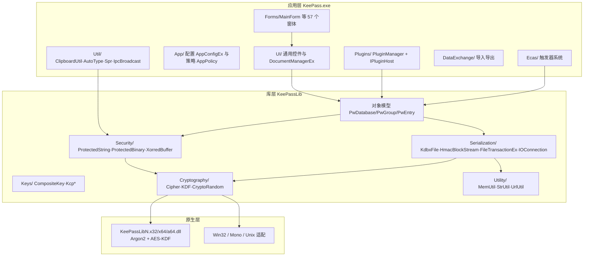

# KeePass 2.61.1 源码架构分析

> 分析对象：`KeePass-2.61.1-Source`（官方桌面版，C#/.NET + WinForms，GPL 许可证）
> 本文档基于对真实源码的浏览整理，仅供 KeePasskey（Kotlin/Compose Android 重实现）做架构借鉴；文中仅引用少量关键片段与"文件路径 + 类名 + 行号"，不复制项目代码入库。
> 文中所有行号均以 2.61.1 源码为准。

---

## 目录

1. [解决方案与工程结构](#1-解决方案与工程结构)
2. [总体架构分层](#2-总体架构分层)
3. [KeePassLib 分层剖析（重点）](#3-keepasslib-分层剖析重点)
4. [.kdbx v4 文件格式管线（重点）](#4-kdbx-v4-文件格式管线重点)
5. [UI 层架构](#5-ui-层架构)
6. [插件与扩展体系](#6-插件与扩展体系)
7. [安全实践](#7-安全实践)
8. [对 KeePasskey 的借鉴要点](#8-对-keepasskey-的借鉴要点)
9. [关键文件索引表](#9-关键文件索引表)

---

## 1. 解决方案与工程结构

### 1.1 解决方案组成

仓库根目录有三个解决方案文件：

| 解决方案 | 工程组成 | 说明 |
|---|---|---|
| `KeePass.sln` | `KeePass`、`KeePassLib`、`TrlUtil` | 主解决方案（VS2008 格式） |
| `KeePass_N35.sln` | `KeePass_N35`、`KeePassLib_N35`、`TrlUtil_N35` | .NET 3.5 显式版本 |
| `KeePass_N48.sln` | `KeePass_N48`、`KeePassLib_N48`、`TrlUtil_N48` | .NET 4.8 版本 |

另外两个工程拥有独立的解决方案/工程文件，不参与主解决方案构建：

| 工程 | 位置 | 语言/类型 | 职责 |
|---|---|---|---|
| `KeePassLibN` | `KeePassLibN/KeePassLibN.vcxproj`（自带 `.sln`） | C++/CLI，`ConfigurationType=DynamicLibrary` | 编译出 **原生 DLL** `KeePassLibN.x32.dll / .x64.dll / .a64.dll`（见 `KeePassLib/Native/NativeLib.cs:42-45` 的 `BaseName = "KeePassLibN"` 与 `DllFileX32/X64/A64`），内含 **Argon2 参考实现**（`KeePassLibN/Cryptography/Argon2/src/`，即 phc-winner-argon2 源码）与 **AES-KDF 加速实现**（`KeePassLibN/Cryptography/AesKdf/`），供 KeePassLib 通过 P/Invoke 调用（如 `NativeMethods.cs:110+` 的 `argon2_hash` 声明，支持 x86/x64/ARM64 三架构） |
| `ShInstUtil` | `ShInstUtil/ShInstUtil.cpp` 等 | C++ 原生工具 | 安装/卸载辅助程序（检测 .NET 环境、Shell 集成等），与库功能无关 |

> **注意一个容易误解的点**：`KeePassLibN` 不是"KeePassLib 的库版本"，而是 **原生（native）加速 DLL**；名字里的 N 指 Native。

### 1.2 各工程职责

- **KeePass**（`KeePass/KeePass.csproj`，`OutputType=WinExe`，主 csproj 目标 .NET 3.5）：完整桌面应用，WinForms UI、自动输入（Auto-Type）、触发器系统（ECAS）、数据导入导出、插件加载、配置管理。
- **KeePassLib**（`KeePassLib/KeePassLib.csproj`，`OutputType=Library`）：**纯库**，无 UI 依赖，实现对象模型、加密、KDF、KDBX 序列化、I/O 连接抽象。这是第三方插件开发者的链接目标。
- **TrlUtil**（`Translation/TrlUtil/`）：翻译/本地化工具，用于生成 `.lngx` 翻译包，依赖 KeePassLib 的 Translation 命名空间。

### 1.3 一个关键构建细节：KeePass.exe 是"单程序集"构建

`KeePass/KeePass.csproj` 中 **没有对 KeePassLib 的 ProjectReference**，而是通过 `<Compile Include="..\KeePassLib\..."><Link>...` 的方式把 **111 个 KeePassLib 源文件直接编译进 KeePass.exe**（发布版因此只有一个 exe）。`KeePassLib.csproj` 单独存在是为了给插件开发者提供可引用的 `KeePassLib.dll`。

**对 KeePasskey 的启示**：这解释了为什么 KeePass 的 UI 与库之间边界事实上很清晰——库源码被两种方式消费（exe 内联 / 独立 dll），倒逼库层不得反向依赖 UI。KeePasskey 的 `app → database → crypto → core` 单向依赖与此同构。

### 1.4 KeePass（WinForms 完整版）与 KeePassLib 的边界

| 维度 | KeePass（应用层） | KeePassLib（库层） |
|---|---|---|
| 命名空间 | `KeePass.*`（App/Forms/UI/Util/Ecas/DataExchange/Plugins/Native） | `KeePassLib.*` |
| 依赖方向 | 依赖 KeePassLib | 不依赖任何 UI 程序集 |
| 内容 | 窗体、菜单、自动输入、触发器、导入导出格式、配置（`AceApplication/...`）、插件宿主 | 对象模型、加密、KDF、流式序列化、ProtectedString/ProtectedBinary、IOConnection |
| 平台特定代码 | WinForms、Win32（`KeePass/Native/NativeMethods*.cs`） | 少量平台分支（`KeePassLib/Native/`、`NativeLib.IsUnix()` 等）与编译符号（`KeePassUAP`、`KeePassLibSD`，用于 UAP/智能设备精简构建） |

---

## 2. 总体架构分层



ASCII 依赖视图（等价）：

```
+---------------------------------------------------------------+
| KeePass.exe (WinForms 应用层)                                  |
|  Forms/  UI/  App/  Plugins/  Ecas/  DataExchange/  Util/      |
+------------------------------+--------------------------------+
                               |  仅向下依赖
+------------------------------v--------------------------------+
| KeePassLib (库层, 无 UI 依赖)                                  |
|  PwDatabase / PwGroup / PwEntry   (Collections/, Interfaces/)  |
|  Keys/ : CompositeKey + Kcp*                                   |
|  Serialization/ : KdbxFile(partial x3) + 流栈 + FileTransaction |
|  Security/ : ProtectedString / ProtectedBinary / XorredBuffer  |
|  Cryptography/ : Cipher(池) + KDF(池) + CryptoRandom(Stream)   |
|  Utility/ : MemUtil / StrUtil / TimeUtil / XmlUtilEx ...       |
+------------------------------+--------------------------------+
                               | P/Invoke
+------------------------------v--------------------------------+
| KeePassLibN.x32/x64/a64.dll (Argon2、AES-KDF) / OS API         |
+---------------------------------------------------------------+
```

---

## 3. KeePassLib 分层剖析（重点）

### 3.1 命名空间地图

| 命名空间 | 目录 | 核心类型 | 职责 |
|---|---|---|---|
| （根） | `KeePassLib/*.cs` | `PwDatabase`、`PwGroup`（partial，另含 `PwGroup.Search.cs`）、`PwEntry`、`PwUuid`、`PwDeletedObject`、`PwCustomIcon`、`PwDefs`（常量 + `MemoryProtectionConfig`）、`PwEnums` | 对象模型 |
| `KeePassLib.Collections` | `Collections/` | `PwObjectList<T>`、`PwObjectPool`、`ProtectedStringDictionary`、`ProtectedBinaryDictionary`、`ProtectedBinarySet`、`StringDictionaryEx`、`VariantDictionary`、`AutoTypeConfig` | 容器/字典；`VariantDictionary` 是 KDF 参数与 KDBX 4 公共自定义数据的 TLV 序列化载体 |
| `KeePassLib.Keys` | `Keys/` | `CompositeKey`、`IUserKey`、`KcpPassword`、`KcpKeyFile`（partial，`KcpKeyFile.Xml.cs` 处理 XML 密钥文件）、`KcpUserAccount`、`KcpCustomKey`、`KeyProvider(POOL)`、`KeyValidatorPool` | 复合主密钥体系 |
| `KeePassLib.Cryptography` | `Cryptography/` | `CryptoRandom`（CSPRNG 单例）、`CryptoRandomStream`、`CryptoUtil`、`SelfTest`、`HashingStreamEx`、`HmacOtp`、密码生成器（`PasswordGenerator/`）、质量估计 | 随机数/哈希/自测 |
| `KeePassLib.Cryptography.Cipher` | `Cryptography/Cipher/` | `ICipherEngine`/`ICipherEngine2`、`CipherPool`、`StandardAesEngine`、`ChaCha20Engine`/`ChaCha20Cipher`、`Salsa20Cipher`、`CtrBlockCipher` | 数据加密引擎（插件可扩展） |
| `KeePassLib.Cryptography.KeyDerivation` | `Cryptography/KeyDerivation/` | `KdfEngine`（抽象）、`KdfParameters`、`KdfPool`、`AesKdf`、`Argon2Kdf`（partial：`.Core.cs` 为托管 Argon2 实现） | 密钥派生 |
| `KeePassLib.Security` | `Security/` | `ProtectedString`、`ProtectedBinary`、`XorredBuffer` | 进程内内存保护 |
| `KeePassLib.Serialization` | `Serialization/` | `KdbxFile`（partial × 3）、`HashedBlockStream`、`HmacBlockStream`、`BinaryReaderEx`、`IOConnection(IOInfo)`、`FileTransactionEx`、`FileLock`、`OldFormatException`、`IocProperties` | KDBX 读写与 I/O |
| `KeePassLib.Interfaces` | `Interfaces/` | `IStatusLogger`、`IDeepCloneable<T>`、`ITimeLogger`、`IStructureItem`、`IUIOperations`、`IXmlSerializerEx` | 通用接口 |
| `KeePassLib.Utility` | `Utility/` | `MemUtil`（字节/清零/比较）、`StrUtil`、`TimeUtil`、`UrlUtil`、`XmlUtilEx`、`GfxUtil`、`MonoWorkarounds` | 工具 |
| `KeePassLib.Native` | `Native/` | `NativeLib`、`NativeMethods(.Unix)`、`NativeBufferEx`、`ClipboardU` | 平台调用封装（Argon2/AES-KDF 原生入口在此） |
| `KeePassLib.Translation` | `Translation/` | `KPTranslation`、`KPFormCustomization` 等 | 本地化（TrlUtil 的数据格式） |
| `KeePassLib.Resources` | `Resources/` | `KLRes`/`KSRes`（生成类） | 库层字符串资源 |

### 3.2 对象模型：PwDatabase / PwGroup / PwEntry / PwUuid

**`PwDatabase`**（`KeePassLib/PwDatabase.cs`，2224 行）——数据库门面 + 会话状态：

- 对象模型根：`RootGroup`（PwGroup）、`DeletedObjects`（`PwObjectList<PwDeletedObject>`，用于同步时的墓碑记录）。
- 格式相关配置：`DataCipherUuid`（默认 `StandardAesEngine.AesUuid`，见 `PwDatabase.cs:54`）、`Compression`（默认 GZip）、`KdfParameters`、`PublicCustomData`（KDBX 4 头部的明文自定义数据）。
- 元数据：名称/描述/默认用户名 + 各自 Changed 时间戳、回收站配置、条目模板组、历史维护参数（`HistoryMaxItems=10`、`HistoryMaxSize=6MB`，`PwDatabase.cs:47-48`）。
- 会话状态：`IsOpen`、`Modified` 脏标记、`MasterKey`（CompositeKey）、`IOConnectionInfo`、`HashOfFileOnDisk` / `HashOfLastIO`（用于检测"文件在磁盘上是否被别人改过"）、`UseFileTransactions` / `UseFileLocks`。
- 关键方法：
  - `Open(IOConnectionInfo, CompositeKey, IStatusLogger)`（`PwDatabase.cs:620`）：创建 KdbxFile → `IOConnection.OpenRead` → `kdbx.Load(...)`；失败时 `Clear()` 回滚。
  - `Save(IStatusLogger)`（`PwDatabase.cs:665`）：可选 `FileLock` → `FileTransactionEx`（事务性写盘）→ `kdbx.Save(...)` → 记录 `HashOfFileOnDisk` → 清除 Modified。
  - `MergeIn(...)`（`PwDatabase.cs:758`）：基于 `PwObjectPool` 的三方合并（同步的基础）。
  - `MaintainBackups()`：历史条目修剪。
- `MemoryProtectionConfig` 定义在 `KeePassLib/PwDefs.cs:475`：四个布尔（Title/UserName/Password/URL/Notes 是否在内存中保护 + PlainXml 场景的 `ProtectInMemory`）。

**`PwGroup`**（`KeePassLib/PwGroup.cs`，1537 行 + `PwGroup.Search.cs`）与 **`PwEntry`**（`KeePassLib/PwEntry.cs`，907 行）都实现 `IStructureItem + ITimeLogger + IDeepCloneable`：

- `PwEntry` 核心字段（`PwEntry.cs:46-49`）：
  - `Strings: ProtectedStringDictionary`（用户名/密码/URL 等标准字段名常量在 `PwDefs.cs`，如 `TitleField="Title"`、`PasswordField="Password"`）；
  - `Binaries: ProtectedBinaryDictionary`（附件）；
  - `AutoType: AutoTypeConfig`；
  - `History: PwObjectList<PwEntry>`（历史快照）。
- `PwGroup` 持有 `PwObjectList<PwGroup> Groups` 与 `PwObjectList<PwEntry> Entries`；树遍历用 `TraverseTree(TraversalMethod, GroupHandler, EntryHandler)`（委托定义在 `Delegates/Handlers.cs`），写 XML 与搜索都走该遍历。
- 搜索独立成 partial 文件 `PwGroup.Search.cs`（`SearchEntries(SearchParameters, ...)`，`PwGroup.Search.cs:91`），用 `SearchParameters` 封装搜索选项——**查询逻辑与模型分离**。

**`PwUuid`**（`KeePassLib/PwUuid.cs`）：16 字节 **不可变** 值对象（`UuidSize=16`，`PwUuid.cs:38`）；`PwUuid(true)` 用 `Guid.NewGuid()` 生成并拒绝全零（`PwUuid.cs:76-95`）；`Zero` 保留常量；缓存的 `GetHashCode`。**整个格式里所有对象身份（组/条目/图标/加密引擎/KDF）都用 PwUuid 标识**，这是同步与去重能工作的根基。

### 3.3 密钥体系：CompositeKey 与 Kcp*

`IUserKey`（`Keys/IUserKey.cs`）只有一个 `ProtectedBinary KeyData { get; }`。四种内置实现：

| 类型 | 文件 | KeyData 来源 |
|---|---|---|
| `KcpPassword` | `Keys/KcpPassword.cs` | UTF-8 密码先 SHA-256（`KcpPassword.cs:78`），再包成受保护的 ProtectedBinary；可选以 ProtectedString 记住原密码 |
| `KcpKeyFile` | `Keys/KcpKeyFile.cs`（+ `.Xml.cs`） | 密钥文件：32 字节原样 / 64 字节 hex / XML 密钥文件（含版本、UUID、数据），否则对整个文件 SHA-256（`LoadKeyFile`，`KcpKeyFile.cs:97-111`）；构造时防呆：拒绝把数据库文件当密钥文件（比对 KDBX 签名） |
| `KcpUserAccount` | `Keys/KcpUserAccount.cs` | Windows 当前用户凭据（DPAPI）派生 |
| `KcpCustomKey` | `Keys/KcpCustomKey.cs` | 外部 `KeyProvider` 插件提供的密钥 |

**`CompositeKey`**（`Keys/CompositeKey.cs`，356 行）：

- `CreateRawCompositeKey32()`（`CompositeKey.cs:167`）：把所有 `IUserKey.KeyData` 拼接后 SHA-256，过程中每个临时数组都 `MemUtil.ZeroByteArray` 清零。
- `GenerateKey32(KdfParameters)`（`CompositeKey.cs:235`）：raw32 → `KdfPool.Get(p.KdfUuid).Transform(raw32, p)` → 结果（如非 32 字节则再哈希）包装为受保护的 `ProtectedBinary`。
- `GenerateKey32Ex(p, IStatusLogger)`（`CompositeKey.cs:279`）：把 KDF 计算放到后台线程，周期性回调 `sl.ContinueWork()` 以支持 UI 取消——**长耗时 KDF 与进度/取消的协作模式**。

### 3.4 KDF 引擎：KdfEngine / AesKdf / Argon2Kdf

抽象（`Cryptography/KeyDerivation/KdfEngine.cs`）：

```
KdfEngine (abstract)
  +-- PwUuid Uuid        // 写入 KdfParameters、Header 的 KdfParameters 字段
  +-- string Name
  +-- KdfParameters GetDefaultParameters()
  +-- bool AreParametersWeak(KdfParameters)   // 弱参数告警
  +-- void Randomize(KdfParameters)           // 保存时生成新盐
  +-- byte[] Transform(byte[] pbMsg, KdfParameters p)
```

`KdfParameters : VariantDictionary`（`KdfParameters.cs:31`）——参数以字符串键 + 类型化值存储，自带 TLV 序列化（`SerializeExt/DeserializeExt`），因此 **新增 KDF 或新增参数无需改文件格式**。

**`AesKdf`**（`AesKdf.cs`，305 行）：

- UUID `C9D9F39A-...`；参数 `S`（32 字节种子）、`R`（轮数 UInt64，默认 `PwDefs.DefaultKeyEncryptionRounds` = 6 000 000）。
- `TransformKey`（`AesKdf.cs:116`）的三级降级链：原生 DLL（`NativeLib.TransformKey256`，AES-NI）→ GCrypt（Unix）→ **托管实现**（`TransformKeyManaged`，把 32 字节拆成两个 16 字节半块，各用一个工作线程 + 8192 块的大缓冲做 ECB 批量加密以摊薄开销，`AesKdf.cs:141-188`）；最后整体 SHA-256 一次。

**`Argon2Kdf`**（`Argon2Kdf.cs` + `Argon2Kdf.Core.cs`，partial）：

- 两个 UUID：Argon2d 与 Argon2id（`Argon2Kdf.cs:39-44`）。
- 参数：`S` 盐、`P` 并行度（默认 2）、`M` 内存（默认 64 MB）、`I` 迭代（默认 2）、`V` 版本、`K` secret key、`A` associated data（`Argon2Kdf.cs:46-52`）；参数上下限校验齐全（`Argon2Kdf.cs:54-72`）。
- 实现同样三级降级：原生 `argon2_hash`（KeePassLibN 里的 phc-winner-argon2）→ **托管 Argon2**（`Argon2Kdf.Core.cs`，纯 C# 参考实现，供无原生库平台）。

`KdfPool`（`KdfPool.cs`）注册 `AesKdf` 与两个 `Argon2Kdf`，按 UUID 取引擎——与 `CipherPool` 同构。

### 3.5 内存保护：ProtectedBinary / ProtectedString / XorredBuffer

**`ProtectedBinary`**（`Security/ProtectedBinary.cs`，456 行）——受保护字节块的基石，不可变、线程安全：

- 内部数据按 16 字节块对齐（`BlockSize=16`），存实际长度 `m_uDataLen`。
- 三种实际保护方式（枚举 `PbMemProt`，`ProtectedBinary.cs:74-80`）：
  1. `ProtectedMemory`（Windows DPAPI，`ProtectedMemory.Protect(..., SameProcess)`）；Mono/Linux 不可用（探测逻辑 `ProtectedBinary.cs:96-125`）；
  2. `ChaCha20`：进程级随机密钥 `g_pbKey32` + 以对象唯一 `m_lID` 派生 12 字节 nonce（`Encrypt()`，`ProtectedBinary.cs:247-289`）；
  3. `ExtCrypt`：插件可注入全局 `PbCryptDelegate ExtCrypt` 静态委托。
- `ReadData()`（`ProtectedBinary.cs:321`）：加锁 → 解密 → 拷贝出 **明文副本** → 重新加密；调用方负责清零副本。文档注释明确："返回的是副本，用完必须清理"。
- `ReadXorredData(CryptoRandomStream)`：读出后立即与随机流 XOR，用于序列化路径，避免明文副本长时间存在。

**`ProtectedString`**（`Security/ProtectedString.cs`，474 行）——不可变、线程安全的受保护字符串：

- 内部二选一：`ProtectedBinary m_pbUtf8`（受保护 UTF-8 字节）或 `string m_strPlainText`（明文）。**关键设计：一旦调过 `ReadString()`，明文 string 已不可避免地留在托管堆（string 不可覆写），就缓存明文并放弃保护**（`ReadString()`，`ProtectedString.cs:195-211`，注释解释了原因）。这比"假装保护"诚实。
- `ReadChars()` / `ReadUtf8()` 返回副本并要求调用方清零；`WithProtection()`、`Insert/Remove/Trim/operator+` 全部以"新建不可变实例 + finally 清零中间 char[]/byte[]"的方式实现。
- 顶部注释点名为什么不用 `SecureString`（64K 字符上限等）。

**`XorredBuffer`**（`Security/XorredBuffer.cs`）：持有"密文 + 一次性密码本"两个数组，只有 `ReadPlainText()` 时才合成明文——XML 解析路径中受保护值的标准中间形态（见 §4.2）。

### 3.6 随机数与哈希

- **`CryptoRandom`**（`Cryptography/CryptoRandom.cs`）：CSPRNG 单例（`Instance`，`CryptoRandom.cs:55`）。不只是透传 `RNGCryptoServiceProvider`：维护一个 64 字节 **熵池**（`ProtectedBinary` 保存），`AddEntropy()`（`CryptoRandom.cs:119`）把文件头中的 MasterSeed 等持续混入，`GenerateRandom256` 前触发 `GenerateRandom256Pre` 事件（供 UI 层再喂鼠标移动等熵）。另有 `NewWeakRandom()` 给非安全用途提供种子安全的 `Random`。
- **`CryptoRandomStream`**（`Cryptography/CryptoRandomStream.cs`，286 行）：确定性伪随机流（同种子同流），KDBX 内层保护流的抽象。支持三种算法（枚举 `CrsAlgorithm`，`CryptoRandomStream.cs:35-59`）：`ArcFourVariant`（仅兼容 KDBX 3 旧文件）、`Salsa20`（KDBX 3.1 写入默认，固定 8 字节 IV 常量）、`ChaCha20`（KDBX 4 默认，SHA-512(key) 前 32 字节做 key、后 12 字节做 nonce，`CryptoRandomStream.cs:101-115`）。
- **`CryptoUtil`**：SHA-256 帮助方法、`ResizeKey`（派生密钥扩展）、`CreateAes`（统一 FIPS 兼容的 AES 构造）、`DisposeIfPossible`。
- **`SelfTest`**（`Cryptography/SelfTest.cs`）：启动时对 AES/Salsa20/ChaCha20/SHA256/HMAC 等做已知答案测试（KAT），`Program.cs:351` 在 `--preload` 时执行，保证运行环境（尤其 Mono/FIPS）密码学行为正确。

### 3.7 序列化辅助类型

- **`HashingStreamEx`**（`Cryptography/HashingStreamEx.cs`）：透明计算经过字节的 SHA-256，读写共用——KDBX 头部哈希、`HashOfFileOnDisk` 都由它产生。
- **`HashedBlockStream`**（`Serialization/HashedBlockStream.cs`，KDBX 3.1 数据块）：1 MB 块 + `SHA-256(block)` 明文完整性（不防篡改），块索引显式存储。
- **`HmacBlockStream`**（`Serialization/HmacBlockStream.cs`，333 行，KDBX 4 数据块）：HMAC-SHA256 逐块认证（详见 §4）。
- **`BinaryReaderEx`**（`Serialization/BinaryReaderEx.cs`）：带 `ReadExceptionText`（统一"文件损坏"文案）、`CopyDataTo`（读头部时同步旁录原始字节，用于头部哈希）的二进制读取器。
- **`IOConnection` / `IOConnectionInfo`**（`Serialization/IOConnection.cs`）：把"本地文件 / HTTP(S)（WebDAV）/ FTP / 文件://"统一成 `OpenRead/OpenWrite/DeleteFile/...` 的连接抽象（协议分支见 `IOConnection.cs:671, 895-915`）；`IOConnectionInfo` 可序列化到 MRU/配置。这是 KeePass 支持网盘同步（配合插件可加 SFTP/云）的底座。
- **`FileTransactionEx`**（`Serialization/FileTransactionEx.cs`，543 行）：原子写盘（详见 §4.4）。
- **`FileLock`**（`Serialization/FileLock.cs:65`）：`.lock` 边车文件的协作式写锁。

---

## 4. .kdbx v4 文件格式管线（重点）

### 4.1 文件布局（KDBX 4）

依据 `KdbxFile.cs`（常量与枚举 `KdbxHeaderFieldID`、`KdbxInnerHeaderFieldID`，`KdbxFile.cs:241-272`）与读写代码：

```
+---------------------------------------------+
| 外层头（明文）                                |
|  签名1 0x9AA2D903  签名2 0xB54BFB67          |
|  版本 uint32 (0x00040001 = 4.1)              |
|  头字段循环: [1B ID][4B len][data]           |
|    2 CipherID / 3 Compression / 4 MasterSeed |
|    7 EncryptionIV / 11 KdfParameters(Variant)|
|    12 PublicCustomData / 0 EndOfHeader       |
+---------------------------------------------+
| 头部 SHA-256 (32B)                           |  <- 校验头完整性（不依赖密钥）
| 头部 HMAC-SHA256 (32B)                       |  <- 校验头真实 + 隐含验证密钥
+---------------------------------------------+
| HMAC 块流 (HmacBlockStream)                  |  <- 每块 [32B HMAC][4B size][data]
+---------------------------------------------+
| 数据加密流 (AES-256-CBC / ChaCha20)          |  <- CipherID 决定
+---------------------------------------------+
| 内层头（解密后、GZip 解压前）                 |
|  1 InnerRandomStreamID(=ChaCha20)            |
|  2 InnerRandomStreamKey(64B)                 |
|  3 Binary*(附件按引用去重, KdbxBinaryFlags)   |
|  0 EndOfHeader                               |
+---------------------------------------------+
| GZip 压缩流                                  |
+---------------------------------------------+
| XML 文档 (KeePassFile/Meta/Root/...)         |
|   受保护值: <Value Protected="True">base64   |
|   (与 InnerRandomStream XOR)                 |
+---------------------------------------------+
```

密钥派生（`KdbxFile.ComputeKeys`，`KdbxFile.cs:399-435`）：

```
composite = SHA256(concat(各 IUserKey.KeyData))          // CompositeKey.CreateRawCompositeKey32
transformed = KdfEngine.Transform(composite, KdfParameters)  // AES-KDF 或 Argon2
cipherKey  = resize(masterSeed || transformed, cipherKeyLen) // 64B -> 32B (AES)
hmacKey64  = SHA512(masterSeed || transformed || 0x01)
```

HMAC 块密钥（`HmacBlockStream.GetHmacKey64`，`HmacBlockStream.cs:152-179`）：`SHA512(UInt64(blockIndex) || hmacKey64)` —— **每块密钥不同且块索引隐含在 HMAC 中不占空间**；头部 HMAC 用 `blockIndex = ulong.MaxValue`（`KdbxFile.ComputeHeaderHmac`，`KdbxFile.cs:479-491`），与数据块隔离。

### 4.2 打开数据库：完整读管线

入口链：`PwDatabase.Open`（`PwDatabase.cs:620`）→ `KdbxFile.Load(Stream, KdbxFormat, IStatusLogger)`（`KdbxFile.Read.cs:76`）。

`KdbxFile.Read.cs` 的流程（v4 路径）：

1. **哈希包裹**：源流外套 `HashingStreamEx`（`Read.cs:101`）。
2. **头部**：`LoadHeader(br)`（`Read.cs:266`）读签名/版本；`br.CopyDataTo = msHeader` 把头部原始字节旁录下来；循环 `ReadHeaderField`（`Read.cs:319`）按 ID 解析（v4 才有的 `KdfParameters` 走 `KdfParameters.DeserializeExt`，`Read.cs:405-407`；未知 ID 警告但继续——前向兼容）。头部 SHA-256 立即计算（`Read.cs:112`）。`--headeronly` 场景在此返回。
3. **头部完整性两连验**（`Read.cs:146-157`）：读 32 字节存储哈希与 `HashOfHeader` 比对 → 读 32 字节头部 HMAC 与 `ComputeHeaderHmac` 比对。**后者在解密前就验证了密钥正确性，且防头部被篡改**。
4. **密钥**：`GetCipher`（按 `DataCipherUuid` 查 `CipherPool`）+ `ComputeKeys`（§4.1）。
5. **流栈搭建**（`Read.cs:159-175`）：`HmacBlockStream`（校验模式）→ `EncryptStream`（解密）→ 可选 `GZipStream` 解压。
6. **内层头**：`LoadInnerHeader`（`Read.cs:425`）解析 `InnerRandomStreamID/Key` 与内嵌 Binary（`ProtectedBinarySet` 去重收集，供 XML 中 `Ref` 引用，`Read.cs:467-478`）。
7. **内层保护流**：`m_randomStream = new CryptoRandomStream(m_craInnerRandomStream, m_pbInnerRandomStreamKey)`（`Read.cs:196`）。
8. **XML 解析**：`ReadXmlStreamed(sXml, sHashing)`（`KdbxFile.Read.Streamed.cs:99`）——**流式 XmlReader + 显式状态机**（`KdbContext` 枚举 + `ReadXmlElement/EndXmlElement`，`Streamed.cs:179/599`），边读边构建对象树，可由 `IStatusLogger` 汇报进度并取消。受保护值的处理在 `ProcessNode`（`Streamed.cs:1060`）：看到 `Protected="True"` 属性时，base64 解出密文，与 `m_randomStream.GetRandomBytes()` 得到的密码本合成 **`XorredBuffer`**（不落地明文）→ `ReadProtectedString`（`Streamed.cs:958`）再封装为 `ProtectedString(true, xb)`；附件 `Ref` 引用内层头的去重集合。
9. **收尾**（`CommonCleanUpRead`，`Read.cs:236-264`）：从内到外 Dispose 所有流（注释解释：某些 cipher 插件流不会级联关闭）；取 `sHashing.Hash` 作 `HashOfFileOnDisk`；**重置 MemoryProtection 为默认**（防恶意文件设置异常组合）；`MaintainBackups()`；强制根组 `IsExpanded = true`。finally 中清零 `pbCipherKey/pbHmacKey64`（`Read.cs:223-224`）。

旧版本兼容：KDBX 3.1 路径走 `StreamStartBytes`（解密后前 32 字节验证）+ `HashedBlockStream`；KeePass 1.x 签名抛 `OldFormatException` 触发导入向导（`Read.cs:282-284`）。

### 4.3 保存数据库：对称写管线

`KdbxFile.Save`（`KdbxFile.Write.cs:72-216`）：

1. `ProtectedBinarySet` 先从树中收集全部附件去重（`Write.cs:91-92`）。
2. `GetMinKdbxVersion()`（`KdbxFile.cs:351`）：按实际用到的新特性（Tags、QualityCheck、自定义图标名称等）决定最低写出版本——**按需升版，尽量保持 4.0**。
3. 生成随机数：MasterSeed、EncryptionIV、KDF 盐（`kdf.Randomize(params)`）、内层流密钥（v4 用 ChaCha20 + 64 字节 key，`Write.cs:129-133`）。
4. `GenerateHeader()`（`Write.cs:233`）→ 写头部 + 头部哈希 + 头部 HMAC（`Write.cs:148-172`）。
5. 流栈对称搭建：`HmacBlockStream(writing)` → 加密流 → GZip 压缩流 → `WriteInnerHeader`（`Write.cs:315`，内层流参数 + 逐个写出去重后的 Binary）。
6. `WriteDocument`（`Write.cs:360`）：`XmlWriter` 流式写出；树遍历用非递归的 groupStack 处理嵌套（`Write.cs:376-427`），每条目回调进度。受保护字段经 `SubWriteValue(ProtectedString)` → `ReadXorredString(m_randomStream)` 输出。
7. 收尾同读管线（清零密钥、记录整文件哈希）。

### 4.4 原子写盘策略

`PwDatabase.Save`（`PwDatabase.cs:665-693`）把持久化交给 `FileTransactionEx`（`Serialization/FileTransactionEx.cs`）：

- **非事务路径**：写到 `目标路径 + ".tmp"`，`CommitWriteTransaction`（`FileTransactionEx.cs:194`）时先删除旧库再 `RenameFile(tmp → base)`。
- **TxF 路径（Windows NTFS）**：`TxfPrepare` 检测卷是否支持事务（`GetVolumeInformation` + `FILE_SUPPORTS_TRANSACTIONS`），把临时文件放到同卷 `%TEMP%`，`MoveFileTransacted + CommitTransaction`（`TxfMoveWithTx`，`FileTransactionEx.cs:377`）保证"移动 + 提交"原子；失败降级为两段 `MoveFileEx`（先把 tmp 挪到目标盘，再替换，避免"两个文件同时损坏"的可能，`TxfMove`，`FileTransactionEx.cs:357-375`）。
- 事务期间保留旧库的创建时间、ACL（DACL 二进制形式）、EFS 加密属性并在提交后恢复（`FileTransactionEx.cs:218-289`）；符号链接目标、FTP、不存在的目标文件等场景自动禁用事务（构造函数内多处分支）。
- 可选叠加 `FileLock`（`.lock` 边车文件）与 `ExtraSafe` 模式（提交前验证 tmp 完整存在）。

**要点**：任意时刻磁盘上都存在一个完整可用的数据库文件——写坏临时文件不影响原文件。KeePasskey 的"原子写盘"工程规则正是这一模式的移植目标。

---

## 5. UI 层架构

### 5.1 启动流程与主窗体

`Program`（`KeePass/Program.cs`，静态类，1167 行）是全局服务定位器：`MainForm`、`Config`（`AppConfigEx`）、`KeyProviderPool`、`FileFormatPool`、`Translation`、`CommandLineArgs` 等全部以静态属性懒加载暴露（`Program.cs:120-230`）。`Main`（`Program.cs:259`）处理命令行分支（含 `--preload` 触发 `SelfTest.Perform()`，`Program.cs:351`）、单实例互斥（`Mutex` + 窗口消息 `AppMessage` IPC，`Program.cs:67-79`），最终创建 `MainForm`。

`MainForm` 拆成三个 partial（都在 `KeePass/Forms/`）：

| 文件 | 行数 | 职责 |
|---|---|---|
| `MainForm.cs` | 2766 | 窗体生命周期、菜单/工具栏构建、定时器（含自动锁定计时 `OnTimerMainTick`，`MainForm.cs:1540`）、`SessionLockNotifier` 成员（`MainForm_Functions.cs:110`） |
| `MainForm_Functions.cs` | 7096 | 命令实现与 UI 刷新：`UpdateUIState(bool, Control)`（`MainForm_Functions.cs:506`）集中重算菜单可用性、列表内容、状态栏（内部再分 `UpdateUIGroupState/UpdateUIEntryState`）；`LockAllDocuments()` 等 |
| `MainForm_Events.cs` | 75 | **公开事件总线**：`FileOpened/FileClosingPre/FileClosingPost/FileClosed/FileSaving/FileSaved/MasterKeyChanged/UIStateUpdated/FocusChanging/UserActivityPost` 等（`MainForm_Events.cs:32-73`）——插件与内部组件的主要挂接点 |

多数据库以 **文档** 抽象管理：`DocumentManagerEx`（`UI/DocumentManagerEx.cs:34`）维护 `List<PwDocument>` 与 `ActiveDocument`，`PwDocument`（同文件 `:284`）= `PwDatabase` + `LockedIoc`（锁定后指向临时文件，解锁时恢复）+ UI 状态。**"锁定"不是销毁 PwDatabase，而是关闭其 IO、把数据库内容置空并记住来源**，解锁后重开。

窗体体系：`Forms/` 下约 57 个窗体，典型配对如 `KeyPromptForm`（主密钥输入）、`PwEntryForm`（条目编辑，内含 `PwInputControlGroup` 管理 ProtectedTextBox）、`DatabaseSettingsForm`、`OptionsForm`。通用控件沉淀在 `UI/`（`SecureTextBoxEx`——对 `CustomTextBoxEx` 增加"最后输入字符短暂可见"的安全输入框、`QualityProgressBar`、`GlobalWindowManager`、`UIUtil` 等约 60 个文件）。

`MainAppState`（`App/AppDefs.cs`）驱动 `UpdateUIState` 的集中式状态计算——UI 没有 MVP/MVVM 分层，但有"单一刷新入口 + 事件通知"的纪律。

### 5.2 事件/通知机制小结

- **库层**：`IStatusLogger`（进度/日志/取消，`Interfaces/IStatusLogger.cs`）作为长操作（KDF、读写 XML）的回调通道；`CryptoRandom.GenerateRandom256Pre` 事件喂熵。
- **应用层**：`MainForm` 公开事件（数据库生命周期）→ 插件订阅；`DocumentManagerEx.ActiveDocumentSelected` 事件；`IpcBroadcast`（`Util/IpcBroadcast*.cs`）在多实例间广播锁定/解锁等消息。

---

## 6. 插件与扩展体系

核心类 `KeePass.Plugins.Plugin`（`Plugins/Plugin.cs`）即公开文档中的 `Ik`/`Plgx` 插件基类，虚方法面很小（`Plugin.cs:38-100`）：`Initialize(IPluginHost)` / `Terminate()` / `SmallIcon` / `UpdateUrl` / `GetMenuItem(PluginMenuType)`。

宿主接口 `IPluginHost`（`Plugins/IPluginHost.cs:41-90`）集中暴露所有扩展点池：

```
MainWindow / Database / CommandLineArgs / CustomConfig
CipherPool            // 注册新数据加密算法
KeyProviderPool       // 自定义密钥来源（含"确认对话框"式密钥）
KeyValidatorPool / FileFormatPool / TempFilesPool
EcasPool + TriggerSystem   // 触发器动作/条件
PwGeneratorPool       // 自定义密码生成器
ColumnProviderPool    // 主列表自定义列
```

`PluginManager`（`Plugins/PluginManager.cs`，internal）负责扫描插件目录、加载 plgx（编译缓存 `PlgxCache`）与普通 dll，调用 `Initialize/Terminate`（`PluginManager.cs:124-272`）。

**扩展点注册的共性模式**：`XxxPool` + 按唯一 `PwUuid` 查找（CipherPool、KdfPool、FileFormatPool、CustomPwGeneratorPool）——"UUID 即身份，池即注册表"。

---

## 7. 安全实践

### 7.1 敏感内存保护

- 统一容器：`ProtectedBinary`（字节）/ `ProtectedString`（文本），见 §3.5。所有密钥、密码、附件（受保护时）在堆上常态加密存放。
- 清零纪律：`MemUtil.ZeroByteArray / ZeroArray<T>`（`Utility/MemUtil.cs:213/225`）遍布读/写/密钥路径；KdbxFile 的每个密钥中间量都在 `finally` 中清零。`MemUtil`（1085 行）还提供常数时间 `ArraysEqual`（比较用于密钥/HMAC 验证）、`Hash32` 等。
- 缓冲区擦除：`HmacBlockStream.SetBuffer`（`HmacBlockStream.cs:127`）在复用/释放缓冲前擦除；`CryptoRandomStream.Dispose` 清零 key/IV/state。
- 编译期防御：`ValidatePassword` Debug 断言密码必须 NFC 规范化（`KcpPassword.cs:93`），避免同一密码不同规范化形式派生不同密钥。

### 7.2 剪贴板处理

`KeePass.Util.ClipboardUtil`（partial，Windows/Unix/UWP 三实现）：

- `Copy(...)`（`ClipboardUtil.cs:62`）先过 `AppPolicy.Try(AppPolicyId.CopyToClipboard)` 策略检查；支持 Spr 占位符编译（`{PASSWORD}` 等字段引用）。
- 记录所复制数据的哈希 `g_pbDataHash`（`ClipboardUtil.cs:108`）；`Clear()`（`ClipboardUtil.cs:200`）**只在剪贴板内容仍是自己复制的那份时才清空**（比对哈希，`ClipboardUtil.cs:284-290`），避免覆盖用户后续复制的内容。
- 可配置的剪贴板自动清除计时；`ClipboardEventChainBlocker` 防止其他剪贴板监听工具窃取。

### 7.3 锁定策略

- 定时锁定：`MainForm` 主计时器（`OnTimerMainTick`，`MainForm.cs:1540`）检查 `m_lLockAtTicks`（用户空闲超时）与全局锁定时刻，到点 `LockAllDocuments()`。
- 事件锁定：`SessionLockNotifier`（`Util/SessionLockNotifier.cs`）封装 `SystemEvents` 的 SessionEnding / SessionSwitch / PowerModeChanged，把会话锁定、注销、睡眠、远程控制等归一为 `SessionLockReason` 通知（`SessionLockNotifier.cs:28-46`），触发工作区锁定。
- 多实例联动：通过 IPC（`IpcBroadcast`）向其他实例发送 Lock/Unlock 消息。
- 全局策略：`App/AppPolicy.cs`（复制粘贴、导出、打印等操作的策略门禁）。

### 7.4 完整性与其他

- 文件级：KDBX 4 双层完整性（头哈希 + HMAC 块链）+ 保存后记录 `HashOfFileOnDisk`，检测外部修改。
- 自检：`SelfTest` 启动 KAT（§3.6）。
- 日志：`AppLogEx`；库层消息统一走 `MessageService`，且不打印任何密钥材料（错误文案为固定资源字符串）。

---

## 8. 对 KeePasskey 的借鉴要点

结合 KeePasskey 现状（阶段 1 UI 优先，模块 `app → database → crypto → core`，KDBX v4 + Credential Manager + WebDAV/S3），按模块给出建议。

### 8.1 crypto 模块（高度可移植）

| KeePass 参考 | 建议移植形态 |
|---|---|
| `KdfEngine` 抽象 + `KdfParameters(VariantDictionary)` + `KdfPool`（`Cryptography/KeyDerivation/`） | Kotlin `sealed interface KdfEngine` / `abstract class`，参数用类型化 Map（KDBX 的 VariantDictionary TLV 需原样实现以兼容格式），注册表按 UUID 取引擎。AesKdf 与 Argon2id 是必选；参数名常量 `S/R/P/M/I/V/K/A` 必须逐字对齐 |
| `CompositeKey` 组合 + `IUserKey`（`Keys/CompositeKey.cs:167-271`） | 直接对应：Kotlin `CompositeKey(userKeys: List<UserKey>)`；raw32 = SHA256(拼接)，随后 KDF 变换。KcpPassword 对应主密码（UTF-8 + SHA-256）、KcpKeyFile 对应密钥文件（32B/64B hex/XML 三种解析 + 防把 kdbx 当 keyfile 的签名防呆，`KcpKeyFile.cs:83-95`）。未来 Credential Manager 的通行密钥可作为新 `IUserKey` 实现插入 |
| 密钥派生布局（`KdbxFile.ComputeKeys`，`KdbxFile.cs:399-435`） | `cipherKey = SHA512(masterSeed ‖ transformed)[0..32]`、`hmacKey64 = SHA512(masterSeed ‖ transformed ‖ 0x01)`；块密钥 `SHA512(u64(blockIndex) ‖ hmacKey64)`，头部用 `blockIndex=0xFFFFFFFFFFFFFFFF`。这是跨实现兼容的**精确字节布局**，必须照抄规格而不是"思路" |
| `CipherPool`/`ICipherEngine`（UUID 寻址，AES-256-CBC 默认、ChaCha20 可选） | Kotlin 用 `Cipher`/`ChaCha20` 实现；`ICipherEngine2.KeyLength/IVLength` 的显式化值得保留 |
| `HmacBlockStream`（1MB 块、HMAC 隐含块索引、终止块 size=0） | 流式实现要保留"边解密边校验、错误尽早暴露"的语义 |
| `ProtectedBinary` 三级保护（`Security/ProtectedBinary.cs`） | Android 无 DPAPI/ProtectedMemory，可裁剪为"进程内 ChaCha20/XOR 混淆 + `ByteArray.fill(0)` 清零纪律"；AGENTS.md 的 CharArray/ByteArray 铁律与之完全一致 |
| `SelfTest` KAT（`Cryptography/SelfTest.cs`） | 作为 crypto 模块单元测试的已知答案用例来源（AES/Salsa20/ChaCha20/SHA/HMAC 向量） |

### 8.2 database 模块（对象模型与序列化）

| KeePass 参考 | 建议移植形态 |
|---|---|
| `PwUuid` 不可变 16 字节值对象 | Kotlin `value class PwUuid(byteArray)`，拒绝全零；所有对象身份用之 |
| `PwDatabase/PwGroup/PwEntry` 字段集合与时间戳体系（ITimeLogger 五时间戳、UsageCount、LocationChanged） | `@Serializable` data class；`Strings: Map<String, ProtectedString>` + `PwDefs` 标准字段名常量照搬（`Title/UserName/Password/URL/Notes`），这是互操作契约 |
| `KdbxFile.Read/Write` 管线（头字段循环、内层头、HMAC 块、GZip、XML） | 读：Kotlin 流式 XML（XmlPullParser）+ 上下文状态机可简化为递归下降；写：`XmlPullParser` 无写侧，用 `XmlSerializer` 或手写。二进制部分严格按 §4.1 布局。**注意 v4 的 `Ref` 附件去重（ProtectedBinarySet）与内层头 Binary 字段**，很多第三方实现漏掉 |
| `FileTransactionEx` 原子写（§4.4） | Android 对应：写 `.tmp` → flush+fsync → `File.rename()`（同分区原子）；保留"提交前验证 tmp 完整"（ExtraSafe）思想；不需要 TxF/ACL 部分 |
| `DeletedObjects` 墓碑 + `MergeIn` 基于池的合并（`PwDatabase.cs:758`） | 同步功能（WebDAV/S3 冲突解决）的基础，建议在 database 模块预留 `PwDeletedObject` 与合并入口，哪怕阶段 1 不实现 |
| `IOConnection` 连接抽象 | 对应 KeePasskey 的 sync 模块抽象 `VaultDataSource(openRead/openWrite)`，本地/WebDAV/S3 各自实现；`HashOfFileOnDisk`/`HashOfLastIO` 的"外部修改检测"语义（ETag 比对）值得保留 |
| `IStatusLogger` 进度/取消通道 | Kotlin `suspend` + `ProgressListener`/协程取消，天然映射 |
| `MemoryProtectionConfig` + XML `Protected="True"` 属性 | Meta 中逐字段配置 + 写出时按配置设置属性；读入后 `CommonCleanUpRead` 强制重置默认的防御行为要保留 |

### 8.3 app / UI 层（有限借鉴）

- **可借鉴的模式**：`DocumentManagerEx` 的"文档 = 数据库 + 锁定状态"抽象 → KeePasskey 的 `DatabaseSession`（架构决策已有对应）；`MainForm_Events` 的数据库生命周期事件 → `StateFlow`/`SharedFlow` 的 `DatabaseEvent`（Opened/Closing/Modified）；`UpdateUIState` 单一刷新入口 → 单向数据流 `UiState`（与现有规范一致）；`SessionLockNotifier` → Android `ScreenOff`/`UserPresent` 广播 + 生命周期感知的自动锁定；剪贴板"哈希比对后再清空 + 超时清除" → `ClipboardManager` + 定时清理（Android 10+ 系统已限时，仍需主动覆盖敏感值）。
- **桌面特有、不适用**：WinForms 窗体体系与控件层（UIUtil 等）；Auto-Type/Spr 占位符（桌面输入模拟）；ECAS 触发器；全局互斥单实例与窗口消息 IPC（Android 用单任务栈）；KeePassLibN 原生 DLL（Kotlin/Android 用 Conscrypt/JNI 或纯 Java 实现 Argon2，如 bouncycastle/lazysodium）；`--preload` 预载与 SelfTest 的运行时自检（改为单元测试）；TxF 事务与 ACL/EFS 保留逻辑（`FileTransactionEx.cs:208-289`）；`SecureString`/DPAPI 相关分支。

### 8.4 值得抄的工程习惯（跨模块）

1. **密钥/明文中间量的 `finally` 清零纪律**——KeePass 在每个触碰密钥的方法里成对出现，值得在 code review 清单中固化。
2. **"不可变 + 显式解保护副本"的值语义**（PwUuid、ProtectedString、ProtectedBinary）——杜绝共享可变密钥状态，Kotlin data/value class 很自然。
3. **按 UUID 的池化扩展点**——crypto 模块从第一天就按此设计，未来加 KDF/加密引擎无需改调用方。
4. **兼容性分级**：读侧宽容（未知头字段/未知 KDF 报错但可配置跳过、未知 XML 元素跳过）、写侧保守（`GetMinKdbxVersion` 按需升版）。
5. **长操作的取消/进度回调贯穿库层**（IStatusLogger），UI 永不阻塞。

---

## 9. 关键文件索引表

以下路径均相对 `参考项目/KeePass-2.61.1-Source/`。

### 9.1 解决方案与工程

| 文件 | 说明 |
|---|---|
| `KeePass.sln` | 主解决方案（KeePass / KeePassLib / TrlUtil） |
| `KeePass/KeePass.csproj` | 主程序，.NET 3.5 WinExe，内联编译 111 个 KeePassLib 源文件 |
| `KeePassLib/KeePassLib.csproj` | 库工程（供插件开发者） |
| `KeePassLibN/KeePassLibN.vcxproj` | C++/CLI 原生 DLL（Argon2 + AES-KDF，x32/x64/a64） |
| `ShInstUtil/ShInstUtil.cpp` | C++ 安装辅助工具 |
| `Translation/TrlUtil/` | 翻译工具工程 |

### 9.2 KeePassLib 核心类型

| 文件 | 关键类/符号 | 行号 | 说明 |
|---|---|---|---|
| `KeePassLib/PwDatabase.cs` | `PwDatabase` | 45；`Open` 620；`Save` 665；`MergeIn` 758 | 数据库门面（2224 行） |
| `KeePassLib/PwGroup.cs` / `PwGroup.Search.cs` | `PwGroup` / `SearchEntries` | 36 / 91 | 组与树遍历 / 搜索 |
| `KeePassLib/PwEntry.cs` | `PwEntry` | 39（字段 46-49） | 条目 |
| `KeePassLib/PwUuid.cs` | `PwUuid` | 33（ctor 76） | 16 字节不可变 UUID |
| `KeePassLib/PwDefs.cs` | 常量、`MemoryProtectionConfig` | 475 | 字段名与默认值 |
| `KeePassLib/Keys/CompositeKey.cs` | `CompositeKey`、`InvalidCompositeKeyException` | 40；`CreateRawCompositeKey32` 167；`GenerateKey32` 235；`GenerateKey32Ex` 279 | 复合主密钥 |
| `KeePassLib/Keys/KcpPassword.cs` | `KcpPassword` | 33（SHA-256 @78） | 主密码用户密钥 |
| `KeePassLib/Keys/KcpKeyFile.cs`（+ `.Xml.cs`） | `KcpKeyFile`、`LoadKeyFile` | 30 / 97 | 密钥文件解析 |
| `KeePassLib/Security/ProtectedString.cs` | `ProtectedString` | 42；`ReadString` 195 | 受保护文本 |
| `KeePassLib/Security/ProtectedBinary.cs` | `ProtectedBinary` | 54；`Encrypt` 247；`ReadData` 321 | 受保护字节（DPAPI/ChaCha20/插件三级） |
| `KeePassLib/Security/XorredBuffer.cs` | `XorredBuffer` | — | XOR 未解包中间形态 |
| `KeePassLib/Cryptography/CryptoRandom.cs` | `CryptoRandom` 单例 + 熵池 | 44；`AddEntropy` 119 | CSPRNG |
| `KeePassLib/Cryptography/CryptoRandomStream.cs` | `CrsAlgorithm`、`CryptoRandomStream` | 35 / 67 | 内层确定性随机流（RC4 变体/Salsa20/ChaCha20） |
| `KeePassLib/Cryptography/CryptoUtil.cs` / `SelfTest.cs` | `CryptoUtil` / `SelfTest.Perform` | — / 58 | 哈希与自检 |
| `KeePassLib/Cryptography/Cipher/ICipherEngine.cs` | `ICipherEngine`、`ICipherEngine2` | 25 / 49 | 加密引擎接口 |
| `KeePassLib/Cryptography/Cipher/CipherPool.cs` | `CipherPool.GlobalPool` | 31（36） | 引擎注册表（AES + ChaCha20 内置） |
| `KeePassLib/Cryptography/Cipher/StandardAesEngine.cs` | `StandardAesEngine`（AesUuid 31C1F2E6-…） | 35；`CreateStream` 91 | AES-256-CBC |
| `KeePassLib/Cryptography/Cipher/ChaCha20Cipher.cs` / `Salsa20Cipher.cs` | 流密码实现 | — | 供引擎与随机流共用 |
| `KeePassLib/Cryptography/KeyDerivation/KdfEngine.cs` / `KdfParameters.cs` / `KdfPool.cs` | KDF 抽象 / 参数 / 池 | 27 / 31 / — | KDF 框架 |
| `KeePassLib/Cryptography/KeyDerivation/AesKdf.cs` | `AesKdf`（UUID C9D9F39A-…） | 39；`TransformKey` 116；托管实现 141 | AES-KDF（原生→GCrypt→托管降级） |
| `KeePassLib/Cryptography/KeyDerivation/Argon2Kdf.cs`（+ `.Core.cs`） | `Argon2Kdf`（Argon2d/ID 双 UUID） | 37；参数 46-72；`Transform` 135 | Argon2（原生→托管降级） |
| `KeePassLib/Cryptography/HashingStreamEx.cs` | `HashingStreamEx` | — | 透明 SHA-256 包裹流 |
| `KeePassLib/Utility/MemUtil.cs` | `MemUtil`（`ZeroByteArray` 213） | 41 | 字节工具与清零 |
| `KeePassLib/Native/NativeLib.cs` / `NativeMethods.cs` | `BaseName`/`DllFile*`、`argon2_hash`、`TransformKey256` | 42-45 / 110+ / 470 | 原生加速入口 |

### 9.3 序列化与文件管线

| 文件 | 关键类/方法 | 行号 | 说明 |
|---|---|---|---|
| `KeePassLib/Serialization/KdbxFile.cs` | `KdbxFile`、签名/版本常量、`KdbxHeaderFieldID`、`ComputeKeys`、`GetMinKdbxVersion` | 64；69-94；241-256；399；351 | 格式常量与密钥派生 |
| `KeePassLib/Serialization/KdbxFile.Read.cs` | `Load`、`LoadHeader`、`ReadHeaderField`、`LoadInnerHeader`、`CommonCleanUpRead` | 76；266；319；425；236 | 读管线 |
| `KeePassLib/Serialization/KdbxFile.Read.Streamed.cs` | `ReadXmlStreamed`、`ReadXmlElement`、`ReadProtectedString`、`ProcessNode` | 99；179；958；1060 | 流式 XML 状态机 |
| `KeePassLib/Serialization/KdbxFile.Write.cs` | `Save`、`GenerateHeader`、`WriteInnerHeader`、`WriteDocument` | 72；233；315；360 | 写管线 |
| `KeePassLib/Serialization/HmacBlockStream.cs` | `HmacBlockStream`、`GetHmacKey64` | 35；152 | KDBX4 HMAC 块流 |
| `KeePassLib/Serialization/HashedBlockStream.cs` | `HashedBlockStream` | 33 | KDBX3 SHA-256 块流 |
| `KeePassLib/Serialization/FileTransactionEx.cs` | `FileTransactionEx`、`CommitWriteTransaction`、`TxfMoveWithTx` | 41；194；377 | 原子写盘 |
| `KeePassLib/Serialization/IOConnection.cs` | `IOConnection` / `IOConnectionInfo` | — | 文件/HTTP(WebDAV)/FTP 连接抽象 |
| `KeePassLib/Serialization/FileLock.cs` | `FileLock` | 65 | `.lock` 协作锁 |
| `KeePassLib/Serialization/BinaryReaderEx.cs` | `BinaryReaderEx` | — | 带旁录/错误文案的二进制读取 |

### 9.4 UI / 应用层

| 文件 | 关键类/成员 | 行号 | 说明 |
|---|---|---|---|
| `KeePass/Program.cs` | `Program`（服务定位器）、`Main`、`AppMessage` | —；259；67 | 启动与全局状态 |
| `KeePass/Forms/MainForm.cs` | `MainForm`、`OnTimerMainTick` | 56；1540 | 主窗体（partial 1/3） |
| `KeePass/Forms/MainForm_Functions.cs` | `UpdateUIState`、`SessionLockNotifier` 成员、`LockAllDocuments` | 506；110；2928 | 命令与刷新（partial 2/3） |
| `KeePass/Forms/MainForm_Events.cs` | 数据库生命周期事件 | 32-73 | 事件总线（partial 3/3） |
| `KeePass/UI/DocumentManagerEx.cs` | `DocumentManagerEx`、`PwDocument` | 34；284 | 多文档/锁定抽象 |
| `KeePass/App/AppDefs.cs` | `AppDefs`、`MainAppState` | — | 应用常量与 UI 状态 |
| `KeePass/Plugins/Plugin.cs` | `Plugin`（插件基类）、`PluginMenuType` | 30+ | 插件接口 |
| `KeePass/Plugins/IPluginHost.cs` | `IPluginHost` | 41 | 扩展点聚合 |
| `KeePass/Plugins/PluginManager.cs` | `PluginManager`、`LoadAllPlugins` | 45；124 | 插件加载 |
| `KeePass/Util/ClipboardUtil.cs` | `Copy`、`Clear` | 62；200 | 剪贴板安全 |
| `KeePass/Util/SessionLockNotifier.cs` | `SessionLockNotifier` | 56（Install 47） | 会话锁定监听 |
| `KeePassLib/Interfaces/IStatusLogger.cs` | `IStatusLogger` | 35+ | 进度/取消回调 |

---

### 附：阅读本文档时对应的版本事实

- 文件签名常量：`FileSignature1 = 0x9AA2D903`、`FileSignature2 = 0xB54BFB67`；最高支持版本 `FileVersion32 = 0x00040001`（4.1）（`KdbxFile.cs:69-88`）。
- KDF 默认参数：AES-KDF 6 000 000 轮；Argon2 默认 t=2、m=64MB、p=2（`Argon2Kdf.cs:70-72`）。
- 内置加密引擎池：AES-256-CBC 与 ChaCha20（`CipherPool.GlobalPool`，`CipherPool.cs:43-47`）；Twofish 需插件（官方源码内无 TwofishEngine——**这一点对 KeePasskey 尤其重要：v1 需支持的内置算法只有 AES 与 ChaCha20，Twofish 是头部 CipherID 指向的插件 UUID，遇见即提示不支持**）。
