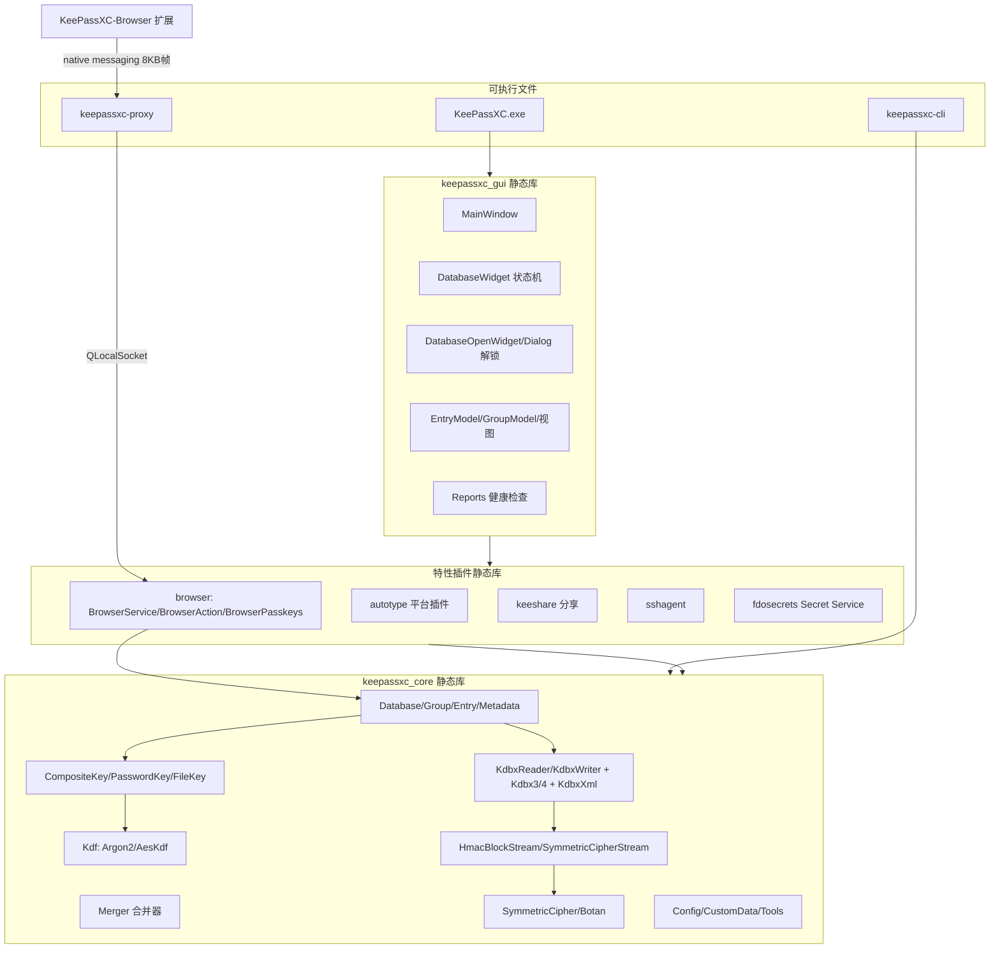

# KeePassXC（develop 分支，2.8.0-snapshot）架构分析

> 分析对象：`参考项目/keepassxc-develop/`（KeePassXC develop 分支，版本号 2.8.0，C++20 / Qt 6.2.4+ / CMake ≥ 3.16，CMakeLists 中声明 `CMAKE_CXX_STANDARD 20`）
> 密码学后端：**Botan 2.19.1+ / Botan 3**（`find_package(Botan REQUIRED)`），压缩 zlib，ZIP 读写 Minizip，NFC/USB 硬件密钥 PCSC + LibUSB。
> 本文仅做架构描述与实现思路分析，**不含可编译的项目代码**；类名、文件路径均来自实际源码阅读。
> 用途：为 KeePasskey（Kotlin + Compose + Hilt 的 Android 重实现）提供 kdbx 引擎、冲突合并、浏览器通行密钥协议等模块的参考。

---

## 目录

1. [架构总览](#1-架构总览)
2. [CMake 构建与模块划分](#2-cmake-构建与模块划分)
3. [core 模块：领域模型](#3-core-模块领域模型)
4. [format 模块：KDBX 序列化管线](#4-format-模块kdbx-序列化管线)
5. [crypto 与 keys 模块（重点）](#5-crypto-与-keys-模块重点)
6. [streams 模块：分层流管线](#6-streams-模块分层流管线)
7. [gui 模块](#7-gui-模块)
8. [browser 与 proxy 模块（重点）：KeePassXC-Browser 集成与通行密钥](#8-browser-与-proxy-模块重点keepassxc-browser-集成与通行密钥)
9. [外围模块：quickunlock / autotype / sshagent / keeshare / fdosecrets / networking / qrcode / cli](#9-外围模块)
10. [安全实践](#10-安全实践)
11. [测试体系](#11-测试体系)
12. [对 KeePasskey 项目的借鉴要点](#12-对-keepasskey-项目的借鉴要点)
13. [关键文件索引表](#13-关键文件索引表)

---

## 1. 架构总览

KeePassXC 是**单仓库、单进程桌面应用**形态：源码全部位于 `src/` 之下，最终编译为 **3 个静态库 + 4 个可执行文件**：

| 目标 | 形态 | 内容 |
|---|---|---|
| `keepassxc_core` | 静态库 | core / format / crypto / keys / streams / cli 工具 + 各平台 quickunlock |
| `keepassxc_gui` | 静态库 | gui 全量 + 依赖 browser / autotype / keeshare / sshagent / fdosecrets / qrcode |
| `KeePassXC`（keepassxc） | 可执行 | `src/main.cpp` 入口，链 `keepassxc_gui` |
| `keepassxc-cli` | 可执行 | 命令行界面，仅依赖 core |
| `keepassxc-proxy` | 可执行 | 浏览器 Native Messaging 代理进程，独立编译于 `src/proxy/`，**不链接主程序** |
| `autotype` 等外围 | 静态库 | 按 `KPXC_FEATURE_*` 开关可选链接进 gui |

### 1.1 分层依赖方向（静态）

```
                        main.cpp (KeePassXC.exe)
                              │
                        keepassxc_gui  ──────────────┐
             ┌───────────┼───────────────┐            │
        browser      autotype       keeshare        fdosecrets / sshagent / qrcode
             │          (平台插件:                (仅 Linux, D-Bus Secret Service)
             │          xcb/wayland/windows/mac) 
             └────────────┬──────────────────────────┘
                          ▼
                   keepassxc_core
      ┌─────────┬──────────┼───────────┬────────────┐
     core     format    crypto/keys   streams    cli/Utils
      │        │           │            │
   (Qt Core)  (依赖 core) (Botan)     (Qt Core + crypto)
```

- **core** 只依赖 Qt Core（+ Linux 上 Qt::DBus 用于 portal/quickunlock），是纯粹领域层；
- **format / keys** 单向依赖 core 与 crypto；
- **crypto** 是最底层，只依赖 Qt Core + Botan；
- **browser** 依赖 core + gui（弹 UI 询问用户），通过 `BrowserHost`（QLocalSocket 服务端）与独立进程 `keepassxc-proxy` 通信；
- proxy 进程只依赖 Qt Core + Network（stdin/stdout ↔ QLocalSocket 双向搬运），与主程序解耦——保证浏览器扩展崩溃面不触及密码库进程。

### 1.2 Mermaid 总览图



---

## 2. CMake 构建与模块划分

### 2.1 顶层 CMakeLists.txt 要点

- **版本与构建类型**：`KEEPASSXC_VERSION 2.8.0`；`Snapshot`/`Release` 由 git tag 或 `.version` 文件自动判定。
- **编译开关**（`option`）：
  - 全局：`WITH_TESTS`、`WITH_GUI_TESTS`、`WITH_ASAN`、`WITH_COVERAGE`、`WITH_CCACHE`、`WITH_X11`、`WITH_APP_BUNDLE`（macOS）。
  - 特性三级开关：`KPXC_MINIMAL`（一键关闭下列全部）、`KPXC_FEATURE_BROWSER`、`KPXC_FEATURE_SSHAGENT`、`KPXC_FEATURE_FDOSECRETS`（仅 Linux）。
  - 次级开关：`KPXC_FEATURE_NETWORK`（联网代码总闸）、`KPXC_FEATURE_UPDATES`（自动更新检查，受 NETWORK 约束）、`KPXC_FEATURE_DOCS`。
- **安全加固编译选项**：
  - `-fstack-protector-strong`、`-fvisibility=hidden`、`-fvisibility-inlines-hidden`；
  - Release 加 `_FORTIFY_SOURCE=2`、`/guard:cf`（MSVC）、`-fsized-deallocation`（探测后启用，与 core/Alloc.cpp 的 sized delete 配合）；
  - Linux 链接 `-z relro -z now -pie`；Windows 高熵 ASLR（`/HIGHENTROPYVA /DYNAMICBASE`）；
  - 平台能力编译期探测：`HAVE_PR_SET_DUMPABLE`、`HAVE_RLIMIT_CORE`、`HAVE_MALLOC_USABLE_SIZE`（供禁 core dump 与 sized delete 用）；macOS 探测 biometry/TouchID/Watch 编译支持。
- **第三方依赖**：Qt6（Core/Network/Concurrent/Gui/Svg/Widgets/Test/LinguistTools，Linux 加 DBus）、Botan（2.19.1+ 或 3.x，`WITH_BOTAN3` 宏区分）、zlib、Minizip、PCSC、LibUSB、keyutils（Linux Polkit 快速解锁）、zxcvbn（系统库或 `src/thirdparty/zxcvbn` 内置）、`src/thirdparty/ykcore`（YubiKey USB 协议）。
- **Qt 环境定义**：`QT_NO_EXCEPTIONS`（KeePassXC 自身全用返回值/`Result` 风格错误处理）、`QT_NO_CAST_TO_ASCII`、Release 下 `QT_NO_DEBUG_OUTPUT`。
- **桌面集成**：CPack 打包（Windows WiX/NSIS、macOS DMG + 公证 + 签名脚本 `cmake/MacOSCodesign.cmake.in`）、windeployqt/macdeployqt、`share/` 安装资源。

### 2.2 src/CMakeLists.txt：两大静态库

- `keepassxc_core`（`add_library(keepassxc_core STATIC ...)`）源集包含：`core/*`（注意 `cli/Utils.cpp` 也被并进 core，供 CLI 与 GUI 复用终端/文件工具）、`crypto/*`（含 `crypto/kdf/{Kdf,AesKdf,Argon2Kdf}.cpp`）、`format/*`（KDBX 全管线 + Bitwarden/1Password/KeePass1/ProtonPass 导入器）、`keys/*`（含 `keys/drivers/YubiKey*.cpp`）、`streams/*`；Linux 上追加 `quickunlock/Polkit*.cpp` 并用 `qt6_add_dbus_interface` 生成 polkit / xdg-portal 接口代理。
- `keepassxc_gui` 源集包含 `gui/**`、`quickunlock/QuickUnlockInterface.cpp`，并按平台追加 `gui/osutils/{macutils,nixutils,winutils}` 与对应 quickunlock 后端（`TouchID.mm` / `WindowsHello.cpp`）。按开关追加 browser 相关 GUI（`gui/passkeys/*` 导入导出、`gui/reports/ReportsPagePasskeys.cpp` 等）。
- 外围子目录各自 `add_subdirectory` 产出静态库变量（`browser_LIB`、`autotype_LIB`、`qrcode_LIB`、`keeshare_LIB`、`sshagent_LIB`、`fdosecrets_LIB`），**统一由 gui 链接**；开关关闭时变量为空即等于裁剪。
- `qt6_add_dbus_adaptor` 把 `gui/org.keepassxc.KeePassXC.MainWindow.xml` 绑定到 MainWindow（Linux D-Bus 激活/打开库/全局自动输入入口）。

### 2.3 单一大库形态的取舍

**优点**：
1. 模块间调用是普通 C++ 函数调用，无跨动态库 ABI/符号导出负担（配合 `-fvisibility=hidden` 所有符号隐藏，仅主程序使用）；
2. 特性裁剪只需在 CMake 变量层处理，无需插件运行时发现机制（autotype 的平台后端是编译期选择而非运行期插件）；
3. 编译期可整体 LTO/PGO，发布简单（3 个二进制：GUI、CLI、proxy）。

**代价**：
1. 依赖边界靠纪律维持（`core` 里混入了 `cli/Utils.cpp`，`gui` 与 `browser` 相互调用 `BrowserService::instance()` 单例），没有链接器强制隔离；
2. `DatabaseWidget.cpp` 2846 行、`BrowserService.cpp` 1777 行等巨型类是单库"方便"的直接产物；
3. 无法单独替换某个模块（例如想给 Android 只复用 format+crypto，就要把 core/format/crypto/keys/streams 五个目录源码级搬运——这正是 KeePasskey 项目自研分模块的理由）。

---

## 3. core 模块：领域模型

### 3.1 对象图与信号链

```
Database (ModifiableObject)
 ├─ Metadata（图标/回收站位置/HistoryMaxItems/自定义图标表）
 │    └─ CustomData（键值 + lastModified 时间戳 + 保护/自动生成标记）
 ├─ Group* rootGroup（树）
 │    ├─ GroupData{name,notes,icon,autoType*,mergeMode,tags,previousParentGroupUuid}
 │    └─ QList<Entry*>（Entry 内含 TimeInfo + EntryAttributes + EntryAttachments + 历史快照）
 ├─ QList<DeletedObject>{uuid, deletionTime}   ← 删除墓碑，同步合并的关键
 ├─ CompositeKey / Kdf / cipher / compression   ← 加密参数
 └─ FileWatcher + fileBlockHash(首 1KiB MD5)     ← 外部修改检测
```

`src/core/Database.h`：`Database : public ModifiableObject`，内部 `DatabaseData` 结构持有 `formatVersion / filePath / cipher(默认 AES256) / compressionAlgorithm(默认 GZip) / masterSeed / transformedDatabaseKey / challengeResponseKey / key / kdf(默认 AesKdf(true))`。`SaveAction` 枚举 `Atomic | TempFile | DirectWrite` 直接编码在领域层（详见 §10）。

`src/core/ModifiableObject.h`：提供 `modified()`/`markAsModified()`/信号风暴控制（`setEmitModified`），是 Entry/Group/Database 共同基类，所有修改追踪由此统一。

### 3.2 Entry

`src/core/Entry.h/.cpp`（1619 行）核心能力：
- `TimeInfo`（`src/core/TimeInfo.h`）：creation/modification/access/locationChanged/expires 五个 UTC 时间戳；**locationChanged 是合并时判定"移动"的唯一依据**。
- `EntryAttributes`（`src/core/EntryAttributes.h`）：字符串属性表，`protect()` 将属性加密存储（由 format 层注入的随机流加密）；定义了浏览器集成与通行密钥的全部保留键：`KPEX_PASSKEY_USERNAME / CREDENTIAL_ID / GENERATED_USER_ID / PRIVATE_KEY_PEM / RELYING_PARTY / USER_HANDLE / PRIVATE_KEY_START / PRIVATE_KEY_END / FLAG_BE / FLAG_BS`，以及 TOTP、KeeAgent、KeeShare 相关键。`hasPasskey()` 直接查询这组键。
- `EntryAttachments`：附件表；KDBX4 下附件二进制走 inner header binary pool（见 §4.3）。
- `clone(CloneFlag)`：`CloneNewUuid / CloneResetTimeInfo / CloneIncludeEntries / CloneIncludeHistory` 等位标志，合并器大量依赖 `clone(Entry::CloneIncludeHistory)`。
- **历史快照**：`addHistoryItem / removeHistoryItems / truncateHistory`（上限来自 `Metadata::historyMaxItems()`），`calculateDifference(other)` 输出差异字段名列表（Merger 用它生成人类可读变更说明）；`equals(other, CompareItemOptions)` 支持忽略毫秒/历史/位置等比较位（`src/core/Compare.h`）。
- 占位符展开 `EntryPlaceholders`（`{TITLE}`、`{PASSWORD}` 等）、`EntrySearcher`（`src/core/EntrySearcher.cpp`，独立查询表达式解析器）。

### 3.3 Group

`src/core/Group.h/.cpp`（1325 行）：
- 树结构 + `GroupData` 值对象（name/notes/icon/`autoTypeEnabled`/`autoTypeAssociations` 继承标志/`searchingEnabled` 继承标志/`mergeMode`/tags/`previousParentGroupUuid`）。
- **MergeMode 枚举（合并策略挂树）**：

```cpp
enum MergeMode
{
    Default,     // Determine merge strategy from parent or fallback (Synchronize)
    KeepNewer,   // merge history
    Synchronize, // merge history keeping most recent as top entry and applying deletions
};
```

  即合并策略是**每个 Group 可覆盖的持久化属性**（写入 XML），只有 `Synchronize` 才应用删除（见 §3.5）。
- 回收站：`Database::recycleBin()` 由 `Metadata` 持有 UUID，`recycleEntry/recycleGroup` 移动到回收站而非删除；`emptyRecycleBin()` 才真正删除。
- `isShared()`（KeeShare 标记，参与 KDBX4 附件去重命名空间隔离，见 §4.3）。

### 3.4 Metadata 与 CustomData

- `src/core/Metadata.cpp`（537 行）：数据库名/描述、默认用户名、自定义图标表（`customIconsOrder()` 有序遍历供合并）、回收站/模板组 UUID、`historyMaxItems/MaxSize`、`maintainRecycleBin`、`protect*` 系列。
- `src/core/CustomData.cpp`（255 行）：每个键值对带 **`lastModified` 时间戳**（`CustomDataItem`），`LastModified` 特殊键记录整表最后修改时间；`isProtected(key)`（浏览器关联密钥等标记为受保护、合并时不删除）、`isAutoGenerated(key)`（合并时跳过）。这是 KeePassXC 版本的"带时间戳的 CRDT 式字典"——同步冲突合并按时间戳判定覆盖方向（Merger::mergeMetadata 直接消费）。

### 3.5 Merger（合并器，`src/core/Merger.cpp` 765 行）

`Merger(const Database* sourceDb, Database* targetDb)` 或 (sourceGroup, targetGroup)；支持 `dryRun`（先算 ChangeList 给用户预览，`MergeDialog` 消费）。总体流程（注释明确说明顺序重要——先建后删）：

```
merge(dryRun)
 ├─ mergeGroup(context)      递归：条目层 + 组树层
 ├─ mergeDeletions(context)  仅 Synchronize 模式
 └─ mergeMetadata(context)   自定义图标 + CustomData
```

**mergeGroup 逐条目**：
1. 目标库按 UUID 找不到 → `Change(Added)`，`sourceEntry->clone(Entry::CloneIncludeHistory)` 后 `moveEntry`（moveEntry/moveGroup 均临时关闭 `updateTimeinfo` 防止污染时间戳）；
2. 找到 → 先比 `timeInfo().locationChanged()` 判定是否 Moved（"位置 newer 者胜"，并回写 source 的 locationChanged）；再进 `resolveEntryConflict`。

**resolveEntryConflict → resolveEntryConflict_MergeHistories**（时间戳先经 `Clock::serialized` 截断毫秒，注释说明：持久格式只有秒精度，远端可能比本地"新几毫秒"，不截断会造成无意义翻转）：
- 比较 `lastModificationTime`：
  - **source 更新**（alien on top）：`clone(CloneIncludeHistory)` 一份新条目放入目标组，把旧目标条目整体并入新条目历史，然后 `eraseEntry(target)`；
  - **target 更新/相等**（local on top）：调用 `mergeHistory(sourceEntry, targetEntry, mergeMode, maxItems)` 把 source 历史并入 target。
- `mergeHistory` 是核心：按 `lastModificationTime`（截断毫秒）为键把双方历史快照归并进一个 `QMap<QDateTime, Entry*>`；同时间戳内容不同 → `qWarning("... conflicting changes - conflict resolution may lose data!")`（**Last-Writer-Wins 按秒、同秒冲突丢数据并告警**，与 KeePass2 官方行为一致）；`preferRemote`（source 更新）时强制用远端同刻快照覆盖本地；最后若新条目比目标旧，还把目标条目自身也作为历史快照插入；写回前 `blockSignals(true)` + `setUpdateTimeinfo(false)` 保证不产生额外修改噪声；随后 `truncateHistory()` 应用 `historyMaxItems` 截断。
- 冲突检测细节：target/source **自身内容**在相同 modificationTime 下不同 → qWarning 冲突。

**mergeDeletions（仅 Synchronize）**：合并双方 `DeletedObject` 墓碑（同 UUID 取更早 deletionTime）；对目标库中仍存在的条目/组：`lastModificationTime > deletionTime` → **删除后又被修改 → 复活保留**；组还要等所有子项处理完（重新入队），且组内还有未删内容 → 不删；结果统一回写 `setDeletedObjects`。

**mergeMetadata**：按 `customIconsOrder()` 补齐缺失图标；`m_skipCustomData` 可跳过；CustomData 表合并条件是"目标无 LastModified 键或目标表时间戳更旧"：先删除目标中 source 缺失的键（受保护键除外），再搬入 source 新/异值键（`isAutoGenerated` 跳过）。

`ChangeList`（Type = Added/Modified/Moved/Deleted/Metadata/Unspecified + group/title/uuid/details）驱动 GUI 的合并预览与报告。

### 3.6 其他 core 要件

- `src/core/Config.cpp`：`Config::ConfigKey` 枚举注册表式配置（含默认值/类型），GUI 与 CLI 共用。
- `src/core/Bootstrap.h/.cpp`：`bootstrap()` 一次性装配 Config、Translator、Resources、字体、样式等全局环境（等效于 Android 的 Application#onCreate 职责）。
- `src/core/FileWatcher.cpp`：QFileSystemWatcher 封装 + 防抖 + `pause()/resume()`（保存期间静默），配合 `Database::fileBlockHash`（首 1KiB MD5）区分"自己写的"与"外部改动"。
- `src/core/Totp.cpp`：RFC 6238 TOTP（EntryAttributes 内 `TOTP` 键的 KeyUri 解析与算法参数）。
- `src/core/PasswordHealth.cpp` / `HibpOffline.cpp`：弱密码/重复审计与离线 HIBP 字典比对（对应 Reports 面板）。
- `src/core/AsyncTask.h`：`runAndWaitForFuture()` 把 QtConcurrent 任务包成同步等待——KDF 派生等重活不阻塞事件循环（其实仍是等待，UI 由调用方负责）。

---

## 4. format 模块：KDBX 序列化管线

### 4.1 常量与协议枚举（`src/format/KeePass2.h/.cpp`）

- 魔数 `SIGNATURE_1 = 0x9AA2D903`、`SIGNATURE_2 = 0xB54BFB67`；版本 `FILE_VERSION_2/3/3_1/4/4_1` + `FILE_VERSION_CRITICAL_MASK = 0xFFFF0000`（主版本判兼容）。
- Cipher UUID：`CIPHER_AES128/AES256/TWOFISH/CHACHA20`；KDF UUID：`KDF_AES_KDBX3/KDF_AES_KDBX4/KDF_ARGON2D/ARGON2ID`；`INNER_STREAM_SALSA20_IV` 固定 IV。
- `HeaderFieldID`（外层 1~12）、`InnerHeaderFieldID`（0~3，含 `Binary = 3`）、`ProtectedStreamAlgo{Salsa20=2, ChaCha20=3}`、`VariantMapFieldType`（KDBX4 KdfParameters 序列化类型系统）。
- 关键工具函数：

```cpp
QByteArray hmacKey(const QByteArray& masterSeed, const QByteArray& transformedMasterKey)
{
    CryptoHash hmacKeyHash(CryptoHash::Sha512);
    hmacKeyHash.addData(masterSeed);
    hmacKeyHash.addData(transformedMasterKey);
    hmacKeyHash.addData(QByteArray(1, '\x01'));
    return hmacKeyHash.result();
}
```

- `kdfFromParameters/kdfToParameters/uuidToKdf`：VariantMap ↔ Kdf 对象工厂。

### 4.2 读取管线（KdbxReader 抽象层）

`src/format/KdbxReader.cpp`（264 行）负责**版本无关的公共部分**：

```
readDatabase(device, key, db):
  1. StoreDataStream(device)  ← 缓存原始 header 字节供后续校验
  2. readMagicNumbers → sig1/sig2/version  → db->setFormatVersion
  3. while(readHeaderField(...))  循环解析外层 header 字段（Kdbx3Reader/Kdbx4Reader 各自实现）
  4. key 为空 → 只读 header 即返回（用于"预扫描"数据库参数，DatabaseOpenWidget 靠它显示 KDF 参数）
  5. readDatabaseImpl(device, headerStream.storedData(), key, db) → 虚函数分派到 Kdbx3/Kdbx4
```

`StoreDataStream`（src/streams/StoreDataStream.h）记录 `storedData()` —— 正是 KDBX4 校验 header SHA-256/HMAC、KDBX3 校验 XML 内嵌 headerHash 所必需的。

### 4.3 KDBX4 读取（`src/format/Kdbx4Reader.cpp`，444 行）

完整解密链路（自外向内）：

```
file → [header | SHA256(header) | HMAC(header) | payload]
payload = HmacBlockStream( blockIndex 递增, 每 block: [len|HMAC-SHA256(blockData|blockKey)] [data] )
        → SymmetricCipherStream(AES256-CBC / Twofish-CBC / ChaCha20, key = SHA256(masterSeed‖transformedKey), IV)
        → QtIOCompressor(Gzip) （可选，CompressionGZip）
        → inner header 字段循环（InnerRandomStreamID / InnerRandomStreamKey / Binary 附件池）
        → KeePass2RandomStream(ChaCha20, protectedStreamKey) ← 保护字段随机流
        → KdbxXmlReader(FILE_VERSION_4, binaryPool).readDatabase(xmlDevice, db, &randomStream)
```

要点：
- 派生数据库密钥在 `AsyncTask::runAndWaitForFuture` 中执行（不冻结事件循环）；
- `finalKey = SHA256(masterSeed ‖ db->transformedDatabaseKey())`；
- **凭据校验前移**：先比对 header SHA256，再比对 `HMAC(headerData, HmacBlockStream::getHmacKey(UINT64_MAX, hmacKey))`——错误密码在解析任何 XML 前即被拒绝，错误信息明确 "(HMAC mismatch)"；
- KDF 参数通过 `readVariantMap`（版本掩码 `VARIANTMAP_CRITICAL_MASK`）解析，`KeePass2::kdfFromParameters` 实例化 Argon2/AES-KDF；旧式字段（TransformSeed 等）在 KDBX4 中显式报错 "Legacy header fields found in KDBX4 file."；
- **附件池**：`InnerHeaderFieldID::Binary` 逐条读入 `m_binaryPool`（键为序号字符串），交给 KdbxXmlReader 把 `Ref` 引用解析成实际数据。

### 4.4 KDBX4 写入（`src/format/Kdbx4Writer.cpp`，327 行）

对称流程：随机生成 `masterSeed(32B)` / `encryptionIV(按 cipher)` / `protectedStreamKey(64B)`；`db->setKey(key, false, true)` 强制重算 KDF（`updateTransformSalt=true` 换新 salt）；写 header → headerHash/headerHMAC → HmacBlockStream → SymmetricCipherStream → (gzip) → inner header（ChaCha20 固定为内层随机流）→ `writeAttachments` → `KdbxXmlWriter::writeDatabase(device, db, &randomStream, headerHash)`。

`writeAttachments` 细节：遍历 `entriesRecursive(true)`（含历史条目附件），每条附件前置 `\x01` 标志字节后 SHA-256 去重（**KeeShare 共享组用 group UUID 参与哈希做命名空间隔离**，注释明确说明防"文件大小侧信道"）；同一二进制只写一次 inner header，XML 中以 `Ref` 索引引用（`KdbxXmlWriter::BinaryIdxMap`）。

### 4.5 KDBX3（`src/format/Kdbx3Reader.cpp`）与差异总结

| 维度 | KDBX3 (v3/3.1) | KDBX4 (v4/4.1) |
|---|---|---|
| header 长度字段 | quint16 | quint32 |
| 完整性 | XML 内嵌 headerHash + payload 前 32B `StreamStartBytes` 明文对照 | header SHA-256 + 分块 HMAC（凭据错误秒拒） |
| 变换后密钥参与 | challenge-response 在 `transform` 之后哈希（`CompositeKey::transform` 对 KDF_AES_KDBX3 走 legacy 分支） | KDF 变换整个含 CR 的 rawKey |
| 随机流 | Salsa20（固定 IV） | ChaCha20 |
| 附件 | XML Base64 内联 | inner header Binary 池 + Ref 去重 |
| KDF | AES-KDF（rounds） | AES-KDF / Argon2d / Argon2id（VariantMap 参数） |
| 公共自定义数据 | 无 | HeaderFieldID::PublicCustomData（VariantMap） |

KDBX3 解密链：`SymmetricCipherStream → 读 32B 比对 StreamStartBytes → HashedBlockStream → (gzip) → KdbxXmlReader(Salsa20 随机流)`，CR 组件经 `db->challengeMasterSeed(m_masterSeed)` 在 finalKey 计算时注入（`SHA256(masterSeed ‖ challengeResponseKey ‖ transformedKey)`）。

### 4.6 XML 层（`src/format/KdbxXmlReader.cpp` 1224 行 / `KdbxXmlWriter.cpp` 670 行）

- Reader 逐元素流式读（QXmlStreamReader），`readString(bool& isProtected, bool& protectInMemory)` 遇 `Protected="True"` 时从 `KeePass2RandomStream` 解密随机流得到明文并立刻注入 EntryAttributes 的受保护属性；支持 v4 的 `Value Ref`（附件池引用）与历史条目、DeletedObject、自定义图标 Base64。
- Writer 镜像生成：`writeMetadata → writeGroup(rootGroup 递归) → writeEntry(含 writeEntryHistory)`；受保护属性写 `Protected="True"` 并由调用方传入的 randomStream 加密；二进制按 idxMap 写 `Ref`。
- 二者均与 `Kdbx3Reader/Writer`、`Kdbx4Reader/Writer` 解耦——同一套 XML 编解码服务两个二进制版本，只差"保护流算法 + 附件池 + headerHash 语义"。

### 4.7 导入器与自动读取

- `KeePass2Reader/KeePass2Writer`（`src/format/KeePass2Reader.h`）：老入口薄封装（选择 Kdbx3/4 实现）。
- `KeePass1Reader`（KeePass 1.x .kdb）、`OpVaultReader + OpData01 + OPUXReader`（1Password）、`BitwardenReader`（JSON 导出）、`ProtonPassReader`、`CsvParser/CsvExporter/HtmlExporter`：全部在 format 层，产出到 `Database` 领域对象（`gui/wizard/ImportWizard` 驱动 UI）。
- `KdbxReader::readDatabase(device, null key, db)` 支持**无密钥只读 header**——DatabaseOpenDialog 用它预先显示加密参数与是否需要 CR 组件。

---

## 5. crypto 与 keys 模块（重点）

### 5.1 crypto 基础设施（`src/crypto/`）

| 文件 | 职责 |
|---|---|
| `Crypto.h/.cpp`（277 行） | `initCrypto()` 全局初始化：校验 Botan 版本（主版本/最低次版本匹配）、关闭异常处理路径、记录自检结果；`Crypto::error()` 供上层报错 |
| `CryptoHash.h/.cpp` | SHA-256/SHA-512 摘要与 **HMAC-SHA256**（`CryptoHash::hmac(data, key, mode)`），KDBX4 header/块校验全靠它 |
| `Random.h/.cpp` | `randomGen()` 单例，底层 `Botan::AutoSeeded_RNG`；`randomArray/randomUIntRange`；密码生成器复用同一 RNG |
| `SymmetricCipher.h/.cpp`（294 行） | 统一 **Botan::Cipher_Mode** 封装：Mode 枚举 `Aes128/256_CBC、Aes128/256_CTR、Twofish_CBC、ChaCha20、Salsa20、Aes256_GCM`；`init(mode, direction, key, iv) / process / finish`；静态 `aesKdf(key, rounds, data)`（AES-KDF 用 ECB 式循环 AES-256 加密实现）；`cipherUuidToMode` 做 UUID→Mode 映射；**全部错误以 bool+errorString 返回**（QT_NO_EXCEPTIONS） |

**Botan 集成边界**：crypto 模块是唯一直接 include Botan 头的地方（Kdf、FileKey、Keeshare、BrowserPasskeys 也 include，但都是叶子）。上层（core/format/keys）只见 `SymmetricCipher/Kdf/CryptoHash/Random` 四个门面。Botan 的 `secure_vector`/`secure_scrub_memory`/`sodium` 兼容层（浏览器消息加密 `crypto_box` 也经 `botan/sodium.h` 使用，见 §8.3）被直接复用。

### 5.2 Kdf 体系（`src/crypto/kdf/`）

`Kdf`（`src/crypto/kdf/Kdf.h`）抽象基类：

```cpp
virtual bool processParameters(const QVariantMap& p) = 0;   // KDBX4 VariantMap → 参数
virtual QVariantMap writeParameters() = 0;                  // 参数 → VariantMap
virtual bool transform(const QByteArray& raw, QByteArray& result) const = 0;
virtual QSharedPointer<Kdf> clone() const = 0;
virtual int benchmark(int msec) const = 0;                  // 按目标毫秒数自动校准
static const int DEFAULT_ENCRYPTION_TIME = 1000;            // 100ms~5000ms 基准区间
```

- `AesKdf.cpp`（108 行）：`transform` 调 `SymmetricCipher::aesKdf`（种子为 key、data 为被加密数据、rounds 次循环）；KDBX3 UUID 语义（CR 后置）由 CompositeKey 区分。
- `Argon2Kdf.cpp`（211 行）：Argon2d / Argon2id 双 UUID；参数 `memory(KiB)/iterations/parallelism/version/salt`；`transform` 用 Botan `PasswordHashFamily::create_or_throw("Argon2d")` → `from_params(memory, rounds, parallelism)` → `derive_key`；`benchmark(msec)` 用二分逼近目标耗时。
- 派生参数在文件中是 **KDBX4 VariantMap**（`KDFPARAM_*` 常量键名），读取时 `KeePass2::kdfFromParameters` 按 UUID 工厂化——KeePasskey 需实现同构的参数编解码。

### 5.3 CompositeKey 与 Key 组件（`src/keys/`）

`Key` 基类（`src/keys/Key.h`）：`uuid() + rawKey() + serialize()/deserialize()`。每个组件有固定 UUID（如 `PasswordKey::UUID`），`CompositeKey::serialize/deserialize` 用 `[复合UUID][组件UUID][组件数据]*` 流式自描述编码——**这是 QuickUnlock 落盘"完整钥匙"的格式**（§9.1）。

`CompositeKey`（`src/keys/CompositeKey.cpp`，287 行）核心算法：

```cpp
QByteArray rawKey(const QByteArray* transformSeed, bool* ok, ...) const
{
    CryptoHash cryptoHash(CryptoHash::Sha256);
    for (auto const& key : m_keys) {
        cryptoHash.addData(key->rawKey());        // 静态组件依次哈希
    }
    if (transformSeed) {                           // KDBX4: 挑战响应参与变换前哈希
        challenge(*transformSeed, challengeResult, error);
        cryptoHash.addData(challengeResult);
    }
    return cryptoHash.result();
}

bool transform(const Kdf& kdf, QByteArray& result, ...) const
{
    if (kdf.uuid() == KeePass2::KDF_AES_KDBX3) {
        return kdf.transform(rawKey(), result);    // legacy: CR 在变换后注入
    }
    QByteArray seed = kdf.seed();
    return kdf.transform(rawKey(&seed, &ok, error), result) && ok;
}
```

- `PasswordKey`：密码 UTF-8 → SHA-256。
- `FileKey`（`src/keys/FileKey.h/.cpp`，463 行）：五种类型自适应加载 `None/Hashed(纯文件 SHA-256)/KeePass2XML/KeePass2XMLv2/FixedBinary(前 32B)/FixedBinaryHex`；内部 `Botan::secure_vector<char> m_key`；可生成随机 128B 二进制或 32B XMLv2 密钥文件。
- `ChallengeResponseKey`（`src/keys/ChallengeResponseKey.h/.cpp`）：接口 `challenge(seed)`，唯一实现是 `keys/drivers/YubiKey*`（`YubiKeyInterfaceUSB`（ykcore HID）/`YubiKeyInterfacePCSC`（NFC），HMAC-SHA1 槽位挑战应答；支持多次重试与滑动超时）。
- **hash 次序即规范**：静态组件按添加顺序、CR 组件在静态组件之后——KeePasskey 必须保持同一顺序才能互操作。

### 5.4 数据库密钥装配全链路（open 时）

```
CompositeKey → db->setKey(key)
  1. rawKey（含可选 CR）
  2. kdf->transform → transformedDatabaseKey(32B)
  3. KDBX3: challengeMasterSeed(masterSeed) → challengeResponseKey 独立保存
  4. Kdbx4Reader: finalKey = SHA256(masterSeed ‖ transformedDatabaseKey)
     Kdbx3Reader: finalKey = SHA256(masterSeed ‖ challengeResponseKey ‖ transformedDatabaseKey)
  5. finalKey + encryptionIV 驱动 SymmetricCipherStream；hmacKey = SHA512(masterSeed ‖ transformedKey ‖ 0x01) 驱动 HmacBlockStream
```

---

## 6. streams 模块：分层流管线

`src/streams/` 是 KDBX 二进制层的"洋葱"，全部基于 QIODevice 组合：

| 流 | 职责 | 用于 |
|---|---|---|
| `LayeredStream` | 基类：close/reset 语义、错误转发 | 其余各流基类 |
| `HmacBlockStream` | KDBX4 payload 分块 HMAC-SHA256（块密钥 `SHA512(blockIndex(8B LE) ‖ hmacKey ‖ 0xFF..)`，`getHmacKey(UINT64_MAX, key)` 特殊用于整库 header HMAC）；块索引严格递增防重排 | KDBX4 读写 |
| `SymmetricCipherStream` | CBC（自动 padding）或流式（CTR/ChaCha20/Salsa20）加密层 | KDBX3/4 主载荷 |
| `HashedBlockStream` | KDBX3 分块 SHA-256 校验（无密钥参与） | KDBX3 |
| `HashingStream` | 透明计算 MD5（保存时喂 `fileBlockHash` 首 1KiB） | 原子保存 |
| `QtIOCompressor`（第三方移植） | zlib gzip | 可选压缩层 |
| `StoreDataStream` | 记录已读 header 原始字节 `storedData()` | KdbxReader |
| `KeePass2RandomStream`（format 层） | Salsa20/ChaCha20 保护字段随机流 | XML 保护属性 |

设计要点：**每层职责单一、构造即组合**（`SymmetricCipherStream(&hmacStream)`），读路径逐层校验失败立即 `raiseError` 中断；写路径统一在 `reset()`/`close()` 冲刷并报告错误（Kdbx4Writer 显式 `cipherStream->reset()` + `hmacBlockStream->reset()` 以捕获写盘错误）。KeePasskey 用 Kotlin `java.io.FilterOutputStream` 链或 Okio `Sink` 包装可以一比一还原这套洋葱结构。

---

## 7. gui 模块

### 7.1 窗口与状态机

- `src/gui/MainWindow.h/.cpp`：主窗口；Linux 上挂 D-Bus adaptor（打开库/激活/全局自动类型）；`SignalMultiplexer`（src/core/SignalMultiplexer.cpp）把当前激活 DatabaseWidget 的信号动态路由到主窗口菜单。
- `src/gui/DatabaseWidget.h/.cpp`（2846 行，**单库形态的巨型类典型**）：每个打开的数据库一个实例，枚举状态机：

```cpp
enum class Mode
{
    None, ViewMode, EditEntryMode, EditGroupMode,
    LockedMode, ReportsMode, DatabaseSettingsMode
};
```

  职责涵盖：条目/组 CRUD、搜索（`search/endSearch/sortFilter`）、剪贴板复制、TOTP 展示/二维码、自动输入触发、锁定（`lock()` 用 `QSharedPointer<Database>` 副本保住解密数据被丢弃前的清理）、远程同步（`syncWithRemote(RemoteParams*)` 调 `gui/remote/RemoteHandler`——外部命令式 WebDAV/SFTP 同步）、Reports（Healthcheck/HIBP/浏览器统计/Passkeys 列表）、passkey 导入导出入口（`showImportPasskeyDialog`）。
- `DatabaseTabWidget`：多标签页容器；`DatabaseOpenDialog`（模态、可跨标签解锁第二个库）与内嵌 `DatabaseOpenWidget` 组成解锁 UI：输入 CompositeKey 组件（密码/密钥文件/YubiKey），显示从 header 预读的 KDF 参数，成功后 `DatabaseWidget::performUnlockDatabase`；解锁期间的锁定副本与"新库"通过 `databaseReplaced` 信号整体替换（QSharedPointer 交换，避免中途状态）。
- 向导：`gui/wizard/NewDatabaseWizard*`（建库：元数据页/加密页(选 Kdf+benchmark)/密钥页）；`ImportWizard*`（多格式导入）。
- 数据库设置：`gui/dbsettings/`（常规/加密策略 `DatabaseSettingsWidgetEncryption`——直接调 `db->changeKdf()` 并行 benchmark；密钥变更 `gui/databasekey/KeyComponentWidget` 组件化 UI）。

### 7.2 模型/视图与条目编辑

- `gui/entry/EntryModel.cpp` + `gui/entry/EntryView.cpp`（QTreeView）、`gui/group/GroupModel/GroupView`、`gui/tag/TagModel/TagsEdit`、`SortFilterHideProxyModel` 过滤代理——标准 Qt Model/View。
- `EditEntryWidget`（`gui/entry/`，多页：条目/高级(自定义属性)/图标/自动输入/SSH Agent/浏览器(Browser)/附件/历史）；`EntryHistoryModel` 历史快照浏览/回滚（对应 KeePasskey 的 HistoryManager）。
- `EntryPreviewWidget`：右侧预览面板（条目/组双模式）。

### 7.3 设置体系

- `ApplicationSettingsWidget`（常规/安全/浏览器/SSH Agent/KeeShare/Secret Service 分页，每个模块自带 SettingsPage 注册：`gui/ShortcutSettingsPage`、`browser/BrowserSettingsPage` 等）；底层是 `Config` 枚举键 + QVariant。
- `DatabaseWidgetStateSync`：视图状态（列宽/分割条/排序）跨会话持久化。

### 7.4 解锁后敏感操作支撑

- `gui/Clipboard.cpp`：单例；`setText(text, clear=true)` 启动倒计时（用户可配置秒数），到点 `clearCopiedText()` 只清"自己复制的那份"（比对剪贴板内容），发 `updateCountdown` 供托盘提示；macOS 用自定义 `MacPasteboard`。
- `gui/PasswordWidget.cpp`：密码框（ CapsLock 提示/显隐/生成器联动/质量条）。
- `gui/Font.cpp`、`gui/GuiTools.cpp`：通用 UI 工具。
- Reports 体系（`gui/reports/`）：Healthcheck（`PasswordHealth`）、HIBP（在线 `networking/HibpDownloader` k-匿名 SHA-1 前缀查询 + 离线 `HibpOffline`）、Statistics、BrowserStatistics、**Passkeys 页**（列出/删除库内全部通行密钥凭据）。

### 7.5 quickunlock（快速解锁，`src/quickunlock/`）

- `QuickUnlockInterface.h`：五方法纯虚接口——`isAvailable / setKey(dbUuid, key) / getKey / hasKey / reset`；`NoQuickUnlock` 为不可用兜底；编译期 `getQuickUnlock()` 工厂选择平台实现。**接口语义：把"复合钥匙序列化字节"交给 OS 硬件凭据包裹存储**。
- `WindowsHello.cpp`（Windows）：`WindowsApp.lib` CNG/`KeyCredentialManager` API 包裹 AES 密钥后存入注册表，解锁时经 Hello 生物验证解封。
- `TouchID.mm`（macOS）：Keychain + LocalAuthentication。
- `Polkit.cpp/.h` + `PolkitDbusTypes.*`（Linux）：polkit D-Bus 认证通过后，用 **kernel keyring**（`add_key("user", ...)` / `keyctl_read_alloc`）保存 `iv/key` 对——主密钥用 OS 保存的随机 key AES 加密后落盘文件，解锁时从 keyring 取 key 解密。这个"OS 信封 + 文件密文"的双层结构对 Android Keystore 实现有直接映射（KeePasskey 阶段 3 已同构实现）。

---

## 8. browser 与 proxy 模块（重点）：KeePassXC-Browser 集成与通行密钥

### 8.1 总体架构：三段式

```
浏览器扩展(KeePassXC-Browser, JS)
   ↕ Native Messaging（stdin/stdout，4 字节小端长度前缀帧，上限 16KB，org.keepassxc.keepassxc_browser）
keepassxc-proxy（独立进程，src/proxy/）
   ↕ QLocalSocket（命名管道路径 BrowserShared::localServerPath()，帧上限 NATIVEMSG_MAX_LENGTH）
KeePassXC 主进程 BrowserHost(QLocalServer) → BrowserService/BrowserAction
```

- `src/proxy/keepassxc-proxy.cpp` + `NativeMessagingProxy.cpp`（124 行）：`QtConcurrent::run` 阻塞读 stdin（4 字节长度 + UTF-16 消息）→ QueuedConnection 转发到本地套接字；反向 `transferSocketMessage` 写回 stdout（同样 4 字节长度前缀）。**为何需要独立代理**：浏览器 NM 宿主进程生命周期由浏览器控制（浏览器一关 stdin EOF 就退），若直接把主密码库进程当宿主，浏览器异常会拖死密码库；proxy 完全无敏感数据（只转发**已加密**的 JSON）。
- `src/browser/NativeMessageInstaller.cpp`：注册各浏览器 NM 清单——Windows 写注册表 `HKEY_CURRENT_USER\Software\...\NativeMessagingHosts\org.keepassxc.keepassxc_browser`，macOS 写 `~/Library/Application Support/<Browser>/NativeMessagingHosts`，Linux 写 `/.config/google-chrome/NativeMessagingHosts` 等；生成 manifest JSON 指向 proxy 二进制并授予允许的扩展 ID。

### 8.2 会话加密与关联（`BrowserAction` / `BrowserMessageBuilder`）

- 每个浏览器客户端一个 `BrowserAction` 实例（`BrowserService::m_browserClients` QHash）。握手：
  1. 扩展发 `change-public-keys`（其 libsodium X25519 公钥）→ 主程序生成自身 `crypto_box_keypair`（`BrowserMessageBuilder::getKeyPair()`，经 `botan/sodium.h`），返回自己的公钥；
  2. 之后所有消息 JSON 的 `message` 字段是 **`crypto_box_easy`（X25519+XSalsa20-Poly1305）密文 + 递增 nonce**（每次 `sodium_increment`），解密失败即 ERROR 4。
- `BrowserAction::processClientMessage` 分派动作：`get-database-hash / associate / test-associate / get-logins / generate-password / set-login / lock-database / get-database-groups / get-database-entries / create-new-group / get-totp / delete-entry / global-autotype / passkeys-get / passkeys-register`。错误码集中在 `BrowserMessageBuilder.h` 匿名 enum（1~34，含 20~33 全部为 passkeys 专用错误：ATTESTATION_NOT_SUPPORTED、CREDENTIAL_IS_EXCLUDED、INVALID_USER_VERIFICATION、ORIGIN_NOT_ALLOWED、DOMAIN_RPID_MISMATCH、NO_SUPPORTED_ALGORITHMS、WAIT_FOR_LIFETIMER……）。
- **关联密钥持久化**：`BrowserService::storeKey/getKey`（BrowserService.cpp 604~630 行）把扩展提供的 128 位 ID→key 对存进 `db->metadata()->customData()`，键为 `CustomData::BrowserKeyPrefix + id` 并标记 protected + 记录 `Created` 时间——即关联凭据跟着数据库文件走（可同步），不是本机全局。

### 8.3 BrowserService（业务层，1777 行）

- 单例（`Q_GLOBAL_STATIC`风格 instance），持有 `BrowserHost`；监听 `DatabaseWidget::databaseLocked/Unlocked/activeDatabaseChanged`，库锁定时对浏览器回复"库未解锁"并可弹解锁（`openDatabase(triggerUnlock=true)` → `requestUnlock` 信号 → MainWindow 弹 DatabaseOpenDialog，解锁后自动重放挂起请求）。
- 条目匹配：`searchEntries(siteUrl, formUrl, keyList, passkey)` 按 `shouldIncludeEntry / handleURL / handleURLWithWildcards`（支持 `https://*.example.com` 通配与 www 省略选项）+ `checkAccess`（BrowserEntryConfig 的 Allow/Deny 主机表 + realm，存于条目 CustomData `KeePassXC-Browser Settings`，`BrowserEntryConfig.h` Q_PROPERTY 序列化）。
- 用户确认：`confirmEntries` 弹 `BrowserAccessControlDialog`（记住本次/永久）；`BrowserEntrySaveDialog` 处理多库同名条目保存选择。
- **通行密钥（passkey）业务**：
  - 注册：`showPasskeysRegisterPrompt(publicKeyOptions, origin, groupName, keyList)` 弹 `BrowserPasskeysConfirmationDialog`（显示 rpId/用户名/用户验证要求），用户批准后 `buildRegisterPublicKeyCredential` 生成凭据，`addPasskeyToEntry/addPasskeyToGroup` 写入条目属性（含可选新建 "Passkeys" 组）。
  - 认证：`showPasskeysAuthenticationPrompt` → `getPasskeyEntries(rpId, keyList)` / `getPasskeyEntriesWithUserHandle` 过滤（`entry->hasPasskey() && KPEX_PASSKEY_RELYING_PARTY == rpId`），`getPasskeyAllowedEntries` 再按 assertion 的 `allowCredentials` 收敛，`isPasskeyCredentialExcluded` 实现 WebAuthn 的 excludeCredentials 查重（注册时同 rpId+credentialId 已存在 → 返回 ERROR_PASSKEYS_CREDENTIAL_IS_EXCLUDED）。

### 8.4 通行密钥凭据数据模型（存进普通 Entry）

`EntryAttributes` 的 KPEX_PASSKEY_* 键（§3.2）即完整 schema；`BrowserService::addPasskeyToEntry` 的写法：

```cpp
entry->attributes()->set(EntryAttributes::KPEX_PASSKEY_USERNAME, username);
entry->attributes()->set(EntryAttributes::KPEX_PASSKEY_CREDENTIAL_ID, credentialId, true);   // true=保护
entry->attributes()->set(EntryAttributes::KPEX_PASSKEY_PRIVATE_KEY_PEM, privateKey, true);   // 保护
entry->attributes()->set(EntryAttributes::KPEX_PASSKEY_RELYING_PARTY, rpId);
entry->attributes()->set(EntryAttributes::KPEX_PASSKEY_USER_HANDLE, userHandle, true);       // 保护
entry->attributes()->set(EntryAttributes::KPEX_PASSKEY_FLAG_BE, "1");
entry->attributes()->set(EntryAttributes::KPEX_PASSKEY_FLAG_BS, "1");
```

即：**通行密钥 = 一个普通条目 + 7 个保留属性；私钥 PEM(ES256/Ed25519/RSA) 与 userHandle 走受保护属性，在 KDBX4 内经 ChaCha20 随机流加密**。条目 URL 字段存 rpId 域名供浏览器匹配。GUI 侧有独立导入/导出向导（`gui/passkeys/PasskeyImporter/PasskeyExporter + Dialog`，支持从外部 .json 批量导入）与 Reports 的 Passkeys 页。

### 8.5 WebAuthn 协议实现（`BrowserPasskeys` / `PasskeyUtils` / `BrowserCbor`）

`BrowserPasskeys.cpp`（485 行）是"软件认证器"：
- 常量：**AAGUID = fdb141b2-5d84-443e-8a35-4698c205a502**（KeePassXC 固定标识）、支持算法 ES256/EDDSA(Ed25519)/RS256（`BrowserCbor.h` 的 `WebAuthnAlgorithms` 与 COSE key/curve 枚举）、`SUPPORT_RESIDENT_KEYS=true`、签名计数器恒 0（注释明确 not supported）。
- `buildRegisterPublicKeyCredential`：校验选项（`PasskeyUtils::checkCredentialCreationOptions` → 检查 rp.id 与 origin 可注册域后缀关系 `isRegistrableDomainSuffix`、user.id 长度、timeout 默认 300000ms、authenticatorSelection/UV/residentKey 合法性）→ 生成 credentialId（32B 随机 Base64URL）→ `buildCredentialPrivateKey`（Botan 生成 P-256/Ed25519/RSA 私钥并 **COSE/CBOR 编码公钥**）→ `buildAttestationObject`（rpIdHash ‖ flags(UP/UV/AT/BE/BS/ED) ‖ sigCounter=0 ‖ AAGUID ‖ L2 ‖ credentialId ‖ COSE 公钥 ‖ 扩展）→ 组装 PublicKeyCredential JSON（attestationObject/clientDataJSON 均 Base64）。
- `buildGetPublicKeyCredential`（断言）：`buildAuthenticatorData(rpId, extensions, beFlag, bsFlag)` → `buildSignature(authenticatorData ‖ SHA256(clientDataJson))` 用条目 PEM 私钥签名 → response{authenticatorData, clientDataJSON, signature, userHandle}。
- `PasskeyUtils.cpp`（405 行）：域校验（effective domain、rpId 匹配、public suffix 判定）、`buildClientDataJson`（type=webauthn.create/get + origin + challenge）、extension（largerBlob 等 BE/BS）数据构造、错误码映射 `getPasskeyError`。
- **注意架构位置**：KeePassXC 把 WebAuthn 协议栈（CBOR/COSE/attestation/断言签名）完全放在 browser 插件内，core 不感知；凭据存储复用 Entry 属性；签名原语复用 Botan。KeePasskey 的对应物是 `PasskeyCryptoEngine`（ES256/RFC6979）+ `PasskeyData`，协议栈放到 crypto/app 层由 CredentialProviderService 消费——分层思路一致。

### 8.6 端到端流程示例（浏览器登录自动填充）

```
1. 扩展在页面加载时校验 origin → 若 NM 未连接则启动 keepassxc-proxy
2. get-logins（密文）→ proxy → BrowserHost → BrowserService::findEntries
3. 若无已解锁库：回复需解锁/触发 DatabaseOpenDialog → 解锁后重放
4. 命中多条件：confirmEntries 弹确认；checkAccess 检查 Allow/Deny
5. 返回条目集合（password 经会话密文回传扩展，由扩展注入表单）
6. passkeys-get（WebAuthn 断言）：PasskeyUtils 校验 origin/rpId → 过滤凭据 → 用户确认 →
   BrowserPasskeys::buildGetPublicKeyCredential 签名 → 密文回传 → 扩展交给页面 navigator.credentials
```

---

## 9. 外围模块

### 9.1 autotype（`src/autotype/`）

- `AutoType.h/.cpp`：全局自动输入调度器（窗口标题匹配 `AutoTypeAssociations`、序列解析 `AutoTypeAction`（占位符→延迟/按键动作）、选择对话框 `AutoTypeSelectDialog`、逐字符确认 `PickcharsDialog`）。
- 平台抽象 `AutoTypePlatformInterface`（`AutoTypePlatform.h`）+ 编译期平台实现：`windows/`（SendInput）、`xcb/`（XSendEvent+XKB）、`wayland/`（xdg RemoteDesktop portal，源码目录 wayland/）、`mac/`（CGEvent）、`test/`（单元测试桩）。这是典型的"平台接口 + 编译期插件"结构；Android 上无对应物（KeePasskey 用系统 Autofill 替代）。

### 9.2 sshagent（`src/sshagent/`）

- `OpenSSHKey`（解析 PEM/新格式 OpenSSH 私钥、指纹、comment）、`ASN1Key`、`BinaryStream`（agent 协议帧）、`SSHAgent`（Unix 命名管道/named pipe 客户端：add/remove/list keys）、`KeeAgentSettings`（兼容 KeeAgent 条目属性）、`OpenSSHKeyGen`。对 KeePasskey 无直接价值（可参考其"条目附件→密钥对象→系统服务"的桥接方式）。

### 9.3 keeshare（`src/keeshare/`）

- 数据库/组级别的"分享"：`ShareObserver` 监听组内文件变化；`ShareExport.cpp` 用 **Botan RSA `PK_Signer(EMSA3(SHA-256))` 对导出库签名**（`signData`，输出 `rsa|<hex>` 签名 + 签名者证书链）；`ShareImport` 验签导入；`KeeShareSettings` 管理信任的签名证书。组级元数据存于 CustomData（`isShared()` 参与 KDBX4 附件去重隔离）。

### 9.4 fdosecrets（`src/fdosecrets/`，仅 Linux）

- 实现 freedesktop.org Secret Service API（替代 GNOME Keyring）：`FdoSecretsPlugin` 挂接主窗口；`dbus/`（DBusMgr/DBusObject/DBusDispatch——手写 D-Bus 对象注册）；`objects/`：Service/Collection(=Database)/Item(=Entry)/Session/**SessionCipher（DH-AES 会话加密，协议要求）**/Prompt；`widgets/` 授权对话框。每个打开的库映射为一个 Collection、每个条目一个 Item——展示了"密码库领域对象到系统 API 的适配器"写法，KeePasskey 的 `CredentialProviderService`（Android 16+）是同角色实现。

### 9.5 networking / qrcode / cli / thirdparty

- `networking/`：`NetworkManager`（全局 QNetworkAccessManager 单例，严格限定在 KPXC_FEATURE_NETWORK 内）、`HibpDownloader`（k-匿名区间查询）、`UpdateChecker`。
- `qrcode/`：`QrCode.cpp` 包装 `nayuki/QR-Code-generator`（QrCode_p.h PIMPL），供 TOTP 二维码与密钥文件导出。
- `cli/`：每个子命令一个类（`Add/Edit/Clip/Merge/Export/Show/Analyze...`，基类 `DatabaseCommand`），`TextStream` 处理终端编码；`keepassxc-cli.cpp` 组装。`Merge` 命令就是 Merger 的 CLI 暴露。
- `thirdparty/`：`ykcore`（YubiKey HID 协议 C 库）、`zxcvbn`（密码强度估计）。

---

## 10. 安全实践

### 10.1 内存清零

`src/core/Alloc.cpp`（96 行，**全局 sized delete 覆写**）：

```cpp
void operator delete(void* ptr, std::size_t size) noexcept
{
    Botan::secure_scrub_memory(ptr, size);
    std::free(ptr);
}
```

- 依赖 C++14 sized deallocation（CMake 探测 `-fsized-deallocation`，NDEBUG 下缺失即 #warning）；任何 `new/delete` 的对象析构后内存先清零再释放——**数据库所有领域对象（含 Entry 属性）自动获得释放前擦除**；
- 无 sized delete 可用时回退 `_msize/malloc_size/malloc_usable_size` 取实际大小清零；
- 提供 `operator delete(ptr, bool)` 逃生舱口（跳过清零换性能，仅用于非敏感大块）；
- 敏感字节容器直接用 `Botan::secure_vector<char>`（FileKey、YubiKey）与 `QScopedPointer` 包裹的密钥对象（DatabaseData 三把中间密钥）；
- CMake 层配合 `HAVE_PR_SET_DUMPABLE`（prctl 禁 ptrace dump）与 `setrlimit(RLIMIT_CORE, 0)`（禁 core dump）。
- Android 对照：无法覆写全局 delete，等效做法是所有敏感数据 CharArray/ByteArray + 显式 `fill(0)`（KeePasskey 硬约束一致）。

### 10.2 原子保存（Database::performSave）

`SaveAction` 三态（Database.h）：

1. **Atomic（默认）**：`QSaveFile` → `HashingStream(MD5, 首 1KiB)` → `writeDatabase` → `setFileTime` 保住创建时间 → `commit()` 原子 rename；同时把首 1KiB 的 MD5 存为 `m_fileBlockHash` 供下次外部改动检测；
2. **TempFile**：因 Qt bug（QTBUG-57299，Dropbox/Drive/OneDrive 下 QSaveFile rename 失败）而存在——写 QTemporaryFile → 删原文件 → `QFile::rename` 跨文件系统 → 失败时 `restoreDatabase` 从 `<name>.old.<ext>` 备份回滚；
3. **DirectWrite**：危险直写（仅备份导出场景）。

保存前检查 `m_fileBlockHash != md5(文件首 1KiB)` → 拒绝保存并报 "Database file has unmerged changes."（**外部改动检测在写路径强制**）；保存中往 `CustomData::RandomSlug` 写入 64~512B 随机十六进制（注释：防"数据去重侧信道"——防止云盘以内容相同块去重推断两次保存差异）；`m_saveMutex` 防并发保存；保存用 `AsyncTask::runAndWaitForFuture` 移出 UI 线程。

### 10.3 修改追踪与锁定

- `ModifiableObject::modified()` 信号 + `Database::m_modified/m_hasNonDataChange`；`markAsModified` 延迟定时器（`m_modifiedTimer`）合并风暴；
- `InactivityTimer`（src/core/InactivityTimer.h，84 行实现）：QTimer + 全应用 eventFilter 监听用户输入事件重置计时，超时发 `inactivityDetected()` → MainWindow 锁库；配合 `gui/osutils/ScreenLockListener*`（平台：Windows WTS、macOS distribute notification、Linux D-Bus/portal）在**系统锁屏时立即锁定**；
- `FileWatcher` + `fileBlockHash` 处理外部修改（含"保存期间 pause，保存后 resume，直到落盘前忽略自身改动"的 `ignoreFileChangesUntilSaved` 状态机）。

### 10.4 剪贴板

`gui/Clipboard::setText(text, clear=true)`：默认倒计时自动清除（仅当剪贴板内容仍是自己复制的那份时才清，不吞用户后续复制内容）；macOS 换用 `MacPasteboard` 私有剪贴板。桌面版没有"敏感标记"概念——Android 的 `EXTRA_IS_SENSITIVE` 是移动平台增强（KeePasskey 已实现）。

### 10.5 编译/链接期加固（汇总）

见 §2.1：栈保护、FORTIFY、CFG/ASLR/RELRO、符号隐藏、QT_NO_EXCEPTIONS、-Werror(debug)、ASAN 开关、Sized deallocation、dumpable/core 禁用、Windows 安装包 preinstall Taskkill 旧进程等。

---

## 11. 测试体系（`tests/`）

- 组织：**每个被测模块一对 `TestXxx.cpp/.h`**，单一 `tests/CMakeLists.txt` 把全部测试编成一个或多个 `keepassxc-test` 可执行目标（QtTest 框架）；`WITH_TESTS=ON` 默认开启。辅助设施：`FailDevice`（注入 IO 失败测错误路径）、`mock/`（MockYubiKey 等）、`gui/`（GUI 测试）、`modeltest`（Qt 模型契约检查）、`util/`、`data/`（固定样本 kdbx 文件）。
- 覆盖面清单（50+ 测试类，按域分组）：
  - **格式**：TestKdbx2 / TestKdbx3 / TestKdbx4 / TestKeePass2Format / TestKeePass2RandomStream / TestKeePass1Reader / TestImports（Bitwarden/1Password/OPUX）/ TestCsvParser / TestCsvExporter；
  - **密码学**：TestCryptoHash / TestSymmetricCipher / TestHmacBlockStream / TestHashedBlockStream / TestRandomGenerator / TestKeys（含密钥文件）/ TestYkChallengeResponseKey；
  - **领域**：TestDatabase / TestEntry / TestGroup / TestDeletedObjects / TestMerge / TestModified / TestEntrySearcher / TestBase32 / TestTools / TestTotp / TestConfig；
  - **特性**：TestBrowser / **TestPasskeys** / TestFdoSecrets / TestSSHAgent / TestOpenSSHKey / TestSharing / TestAutoType / TestIconDownloader / TestHibp / TestUpdateCheck / TestUrlTools；
  - **UI/生成器**：TestEntryModel / TestGroupModel / TestPasswordGenerator / TestPassphraseGenerator / TestPasswordHealth / TestCli（CLI 端到端）。
- 与 `friend class TestBrowser/TestPasskeys`（BrowserService/BrowserAction/PasskeyUtils 头文件中显式声明）配合做白盒测试。
- 对 KeePasskey 的参考：**当前 114 个单测应优先对标 TestKdbx3/4（往返 round-trip + 官方样本库）、TestMerge（三方冲突场景矩阵）、TestPasskeys（断言/attestation 构造）三类**。

---

## 12. 对 KeePasskey 项目的借鉴要点

> KeePasskey 形态：Android，Kotlin + Compose + Hilt，模块 `app → database → crypto → core`，kdbx v4 优先，WebDAV/S3 同步，Credential Manager 通行密钥。

### 12.1 KDBX 读写管线对照（database 模块）

| KeePassXC | KeePasskey 建议映射 |
|---|---|
| `KeePass2.h` 常量/枚举（HeaderFieldID、VariantMapFieldType、hmacKey()） | `core` 或 `database` 内单文件常量层；`hmacKey = SHA512(masterSeed ‖ transformedKey ‖ 0x01)` 必须逐字节一致 |
| `KdbxReader.readDatabase` + `StoreDataStream.storedData()` | 流式读 header 前缓存原始字节（如 ByteArray 截取），供 SHA-256/HMAC 校验；支持"无密钥预读 header"驱动解锁 UI 显示 KDF 参数 |
| `Kdbx4Reader` 六层洋葱：HmacBlockStream → SymmetricCipherStream → Gzip → inner header(含 Binary 池) → RandomStream → XML reader | Okio `ForwardingSource`/`Buffer` 链或 `FilterInputStream` 链逐一实现；HMAC 块密钥推导（blockIndex LE64 + 0xFF…）是精确性关键 |
| `Kdbx4Reader::readVariantMap` | KDF 参数/公共自定义数据共用的小型类型化编解码器（版本掩码 0xFF00），可独立单测 |
| `Kdbx4Writer::writeAttachments` 去重 + KeeShare 组 UUID 命名空间 | 附件池写回时按 `SHA256(dbUuid‖0x01‖data)` 去重；KeePasskey 无 KeeShare，可直接用 dbUuid 单一命名空间 |
| `CompositeKey::rawKey/transform` 的 KDBX3/KDBX4 分支（CR 前置/后置） | KeePasskey 主打 v4：CR 前置进 KDF；若要读 v3 库必须同时实现后置分支 |
| header 校验先于 XML 解析（"Invalid credentials (HMAC mismatch)"） | 错误密码在解压/XML 前即失败——快速失败 + 明确错误分类（对应 `Result` 错误处理规范） |

### 12.2 Merger → KdbxMerger 直接参考（sync 模块）

1. **结构照搬**：`mergeGroup() → mergeDeletions() → mergeMetadata()` 三段式；先建后删的顺序约束；dryRun 产出 ChangeList 供 UI 冲突对话框（KeePasskey 可在同步结果页展示同构变更列表）。
2. **合并语义精确复制**：
   - 条目身份 = UUID；移动判定 = `locationChanged` 时间戳且"位置更新者胜"；
   - 内容冲突 = `lastModificationTime` 秒级比较（**必须 `Clock::serialized` 式截断毫秒**，否则远端毫秒差导致永久震荡）；
   - 历史合并 = 双方快照按修改时间归并 + 同秒冲突告警 + `historyMaxItems` 截断——KeePasskey 的 `HistoryManager` 快照天然就是合并缓冲；
   - 删除 = DeletedObject 墓碑（KDBX XML 的 `<DeletedObjects>`），仅 Synchronize 模式应用，且"删除后修改 → 复活"规则要保留（防丢数据）；
   - CustomData/浏览器关联键按 lastModified 时间戳 LWR（较新整表覆盖较旧 + 受保护键不删 + 自动生成键跳过）——KeePasskey 的浏览器关联/Credential Provider 元数据可复用同一机制。
3. **三方合并**：KeePassXC 的 `Merge(localDb, remoteDb)` 本质是"本地为目标、远端为源"的两方合并，配合 DeletedObjects 已实现三方效果；KeePasskey 的 `KdbxMerger` 三方场景（base/remote/local）可以继续用同一比较规则，base 仅用于减少冗余变更。
4. **外部改动防覆盖**：保存前对文件首 1KiB 做 MD5 与上次保存比对（`HashingStream` + `fileBlockHash`）→ KeePasskey 在 WebDAV(ETag 412)/S3 之外再加一层本地快照校验。

### 12.3 浏览器协议 → Android Credential Provider 启发（app 模块）

1. **协议层与存储层分离**：KeePassXC 的 WebAuthn 栈（`BrowserPasskeys`/`PasskeyUtils`/`BrowserCbor`）不触碰 Database 内部，只读写 `EntryAttributes` 的 7 个 KPEX_PASSKEY_* 键。KeePasskey 的 `PasskeyData`/`PasskeyCryptoEngine` 同样保持"纯协议对象 ↔ 领域模型"单向映射。
2. **凭据存储 schema 可互操作**：private key PEM（受保护属性）+ credentialId + userHandle + rpId + BE/BS 标志 + username——KeePasskey 若采用兼容键名（或至少兼容字段语义），未来可实现与 KeePassXC 库文件的通行密钥互通。
3. **attestation 对象构造**（rpIdHash ‖ flags ‖ counter=0 ‖ AAGUID ‖ credId ‖ COSE 公钥）与 **断言签名**（authenticatorData ‖ SHA256(clientDataJSON)）的精确字节布局是 `PasskeyCryptoEngine` 的现成对照；ES256 之外需注意 Ed25519/RSA 的 COSE 编码分支。
4. **rpId/origin 校验**（`PasskeyUtils::isRegistrableDomainSuffix` 等）必须实现——Android CredentialProviderService 收到的 request 同样需要 origin 一致性防御（对应 `BeginGetPublicKeyCredentialOption` 的 origin 校验）。
5. **excludeCredentials 查重**（同 rpId 已有凭据即拒绝注册）与 **UV/BE/BS 标志语义**（BE=true 表示凭据可导出/备份——KeePassXC 把它存为条目属性 FLAG_BE）应照搬到 PasskeyData 模型。
6. **错误码体系**：BrowserMessageBuilder 的 20~33 号 passkeys 错误码可直接翻译为 CredentialProvider 的 `NoCredentialException`/`CreatePublicKeyCredentialException` 类型。
7. **会话安全**：浏览器通道全程密文（crypto_box + nonce 递增）；Android 进程内调用无此需求，但**确认对话框（rpId/用户名/UV 要求三要素展示）+ 凭据选择器**的 UX 语义在 `BrowserPasskeysConfirmationDialog` 中有现成范式。
8. **不适用项**：Native Messaging/proxy 进程、桌面全局自动输入（autotype）、SSH Agent、fdosecrets（已有 OS Secret Service 对应物是 Credential Manager/Autofill）、KeeShare。

### 12.4 其他可迁移设计

- **修改追踪**：`ModifiableObject` 统一 modified 信号 → 对应 KeePasskey 的 DatabaseSession 脏标记；`m_modifiedTimer` 防抖。
- **原子写盘**：QSaveFile + HashingStream + 原子 rename + 失败回滚（TempFile/backup `.old`）——对应工程规则的"原子写盘"约束，注意 Android 上用 `File` 同目录临时文件 + `rename`，并处理云盘同步 App 的 rename 兼容问题（QTBUG-57299 教训）。
- **文件监视**：FileWatcher + ignoreFileChangesUntilSaved 状态机 → Android 用 FileObserver/WebDAV ETag 轮询替代。
- **快速解锁**：QuickUnlockInterface 五方法接口 = KeePasskey 阶段 3 已实现的 Keystore AES-256-GCM 信封；Polkit 的"OS keyring 存对称密钥 + 文件存密文"双信封结构验证了该方案的桌面同构性。
- **QuickUnlock 序列化格式**：`CompositeKey::serialize()`（UUID 分帧的自描述流）值得直接采用——Quick Unlock 落盘的"完整钥匙"必须能无损重建 CompositeKey。
- **CustomData 带 lastModified 字典**：任何需要"跟库同步的派生数据"（浏览器关联、TOTP 设置、同步水位）都用这个模式，而不是另开存储。

### 12.5 明确不迁移的桌面特性

- 全局 operator delete 清零（Android 用显式清零 + `CharArray` 约束替代）；
- autotype 键鼠模拟、D-Bus/X11 portal 集成、macOS AppKit 桥；
- 单体静态库结构（KeePasskey 已按 `app→database→crypto→core` 模块化，避免了 §2.3 的巨型类问题——但要注意 KeePassXC 的教训同样适用于 Kotlin：DatabaseWidget 式的"万能 ViewModel"应拆分）。

---

## 13. 关键文件索引表

| 领域 | 文件（src/ 下） | 说明 |
|---|---|---|
| 构建 | `CMakeLists.txt`、`src/CMakeLists.txt` | 特性开关、两大静态库、平台条件编译 |
| 领域 | `core/Database.h/.cpp` | 数据库聚合根、SaveAction、fileBlockHash 外部改动检测 |
| 领域 | `core/Entry.h/.cpp`、`core/EntryAttributes.h` | 条目/历史/保护属性；KPEX_PASSKEY_* 通行密钥 schema |
| 领域 | `core/Group.h/.cpp` | 组树、MergeMode、CloneFlag |
| 领域 | `core/Metadata.h/.cpp`、`core/CustomData.h/.cpp` | 库级元数据、带时间戳键值字典 |
| 合并 | `core/Merger.h/.cpp` | 三段式合并、历史归并、墓碑删除、ChangeList |
| 格式 | `format/KeePass2.h/.cpp` | 协议常量、UUID、hmacKey、Kdf 工厂 |
| 格式 | `format/KdbxReader.cpp`、`format/KdbxWriter.cpp` | 版本无关公共层 |
| 格式 | `format/Kdbx4Reader.cpp/.cpp`、`format/Kdbx4Writer.cpp` | v4 管线（HMAC→Cipher→gzip→inner header→XML）、附件池去重 |
| 格式 | `format/Kdbx3Reader.cpp`、`format/Kdbx3Writer.cpp` | v3 管线（StreamStartBytes、HashedBlockStream） |
| 格式 | `format/KdbxXmlReader.cpp`、`format/KdbxXmlWriter.cpp` | XML 编解码、保护属性随机流 |
| 密钥 | `keys/CompositeKey.cpp`、`keys/PasswordKey.h/.cpp`、`keys/FileKey.cpp`、`keys/ChallengeResponseKey.h/.cpp`、`keys/drivers/YubiKey*` | 复合密钥与组件 |
| KDF | `crypto/kdf/Kdf.h`、`crypto/kdf/Argon2Kdf.cpp`、`crypto/kdf/AesKdf.cpp` | 派生函数与 benchmark |
| 加密 | `crypto/Crypto.cpp`、`crypto/CryptoHash.cpp`、`crypto/Random.cpp`、`crypto/SymmetricCipher.cpp` | Botan 门面 |
| 流 | `streams/HmacBlockStream.*`、`streams/SymmetricCipherStream.*`、`streams/HashedBlockStream.*`、`streams/StoreDataStream.*`、`streams/HashingStream.*` | 分层流洋葱 |
| 内存 | `core/Alloc.cpp` | 全局 sized delete 清零 |
| UI | `gui/MainWindow.*`、`gui/DatabaseWidget.*`、`gui/DatabaseOpenDialog.*`、`gui/DatabaseOpenWidget.*` | 主界面与状态机/解锁 |
| UI | `gui/Clipboard.*`、`core/InactivityTimer.*`、`gui/osutils/ScreenLockListener*` | 剪贴板擦除与闲置锁 |
| 快速解锁 | `quickunlock/QuickUnlockInterface.*`、`quickunlock/Polkit.cpp`、`quickunlock/WindowsHello.cpp`、`quickunlock/TouchID.mm` | 平台信封接口 |
| 浏览器 | `browser/BrowserHost.*`、`browser/BrowserAction.*`、`browser/BrowserService.*`、`browser/BrowserMessageBuilder.*` | NM 宿主/协议分派/业务/会话加密 |
| 通行密钥 | `browser/BrowserPasskeys.*`、`browser/PasskeyUtils.*`、`browser/BrowserCbor.*`、`browser/BrowserPasskeysClient.*` | 软件认证器（attestation/断言/COSE） |
| 代理 | `proxy/keepassxc-proxy.cpp`、`proxy/NativeMessagingProxy.*`、`browser/NativeMessageInstaller.*`、`browser/BrowserShared.*` | NM 代理进程与安装器 |
| 插件 | `fdosecrets/objects/Service.cpp` 等、`keeshare/ShareExport.cpp`、`sshagent/SSHAgent.cpp`、`autotype/AutoTypePlatform.h` | 外围插件形态 |
| 测试 | `tests/TestKdbx3.cpp`、`tests/TestKdbx4.cpp`、`tests/TestMerge.cpp`、`tests/TestPasskeys.cpp`、`tests/TestBrowser.cpp`、`tests/TestKeys.cpp` | 与 KeePasskey 114 单测最相关的对照 |

---

*分析基于源码实际阅读（顶层与 src/CMakeLists.txt、Database/Entry/Group/Merger、Kdbx 系列读写器、KeePass2 常量、CompositeKey/Kdf/SymmetricCipher、HmacBlockStream、Alloc、Database 保存路径、QuickUnlockInterface/Polkit、BrowserService/BrowserAction/BrowserPasskeys/PasskeyUtils/BrowserCbor/BrowserMessageBuilder/NativeMessagingProxy/BrowserHost、tests/ 目录结构等），行数与类名以仓库现状为准。*
